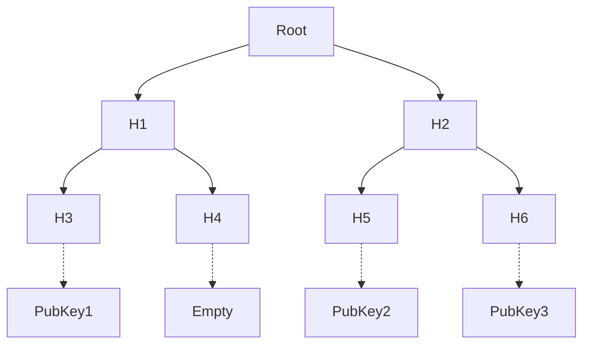
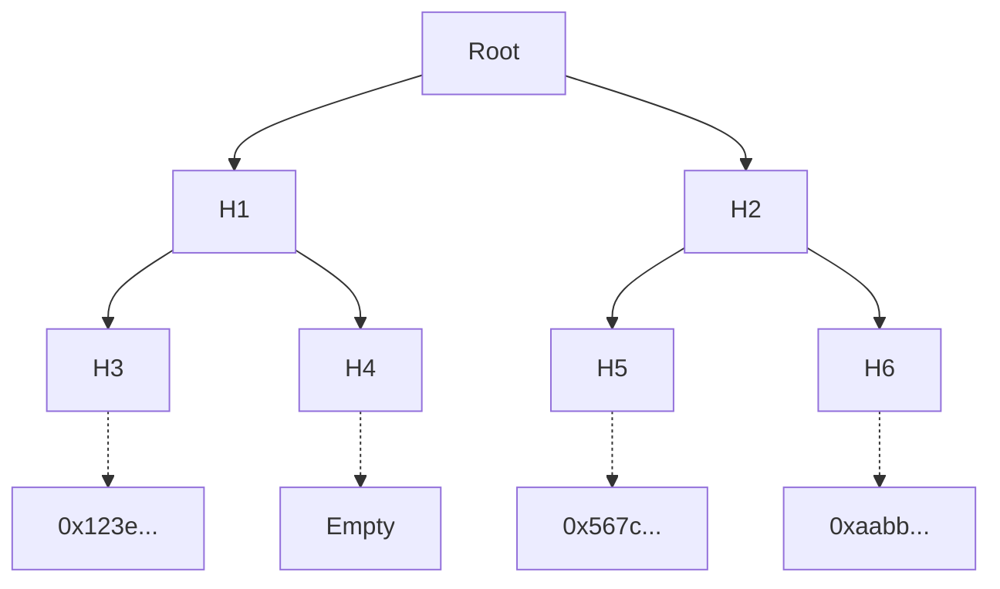

# The Census

The census in Vocdoni is represented as a binary MerkleTree where the content of the leaves are the public keys allowed to participate in a process.

One of the interesting properties of this kind of data structure, is the method for prooving that a specific leaf is part of the structure. In our case, to proof that a specific Public Key is in the tree:

+ __verifier__ only needs to now the Root Hash
+ __proover__ only needs to provide its PubKey and the Siblings

The owner of PubKey1 only needs to provide `PubKey1 + H4 + H1` to anyone to demostrate that his key is part of the census.

The verifier then will compute `hash( hash( hash(PubKey1)+H4 ) + H1` ) and compare the result with the Root which already has.

### Creating the census

Each entity/organization must provide its census before launching any governance process. It is up to the entity to decide the mechanism to add a specific public key to its census.

The __census registry (CR)__ is a private/centralized component used by the entities to manage and create census. Usually the CR has a standard database containing the private details of the memebrs/users of the entity and their public keys. Somethig like the following example:

| id | name | age | country | pubkey
| --- | --- | --- | --- | ---
| 0 | John | 27 | Winterfell | 0x123e...
| 1 | Tyrion | 36 | Lannisport | 0x567c...
| 2 | Daenerys | 22 | Dragonstone | 0xaabb...
| 3 | Jorah | 65 | Bear Island | 0xcc11...

Once the entity wants to create a governance process (such as elections), the entity Administrator will access the CR and select the group of users allowed to participate. For instance `age < 40`. The CR backend will select users `0,1,2` and create a new Merkle tree with their public keys.

### Exporting the census

The CR (usually via the Entity Manager) will:

+ publish the Root Hash of the new Merkle tree into the Voting Process Smart Contract
+ export the Merkle tree hashes (not the public keys) and make them available in IPFS or some other file store
+ publish the URI of the exported Merkle tree to the Voting Process SC

The exported serialized Merkle tree will look like: `Root,H1,H2,H3,H4,H5,H6`

In addition, to create a process, the Entity Manager will publish the rest of details needed (such as the voting options or duration).

### Using the census

The Gateways deployed by Vocdoni and third parties will be monitorizing the Voting Process SC. Once they see there is a new open process and a new census, they will download and import the Merkle Tree. So at this point the users can use any available Gatrway to query if they are eligible for voting and to fetch their Merkle Proof.

With the Merkle Proof, the user will be able to demostrate his inclusion into the census thus she will be able to participate.