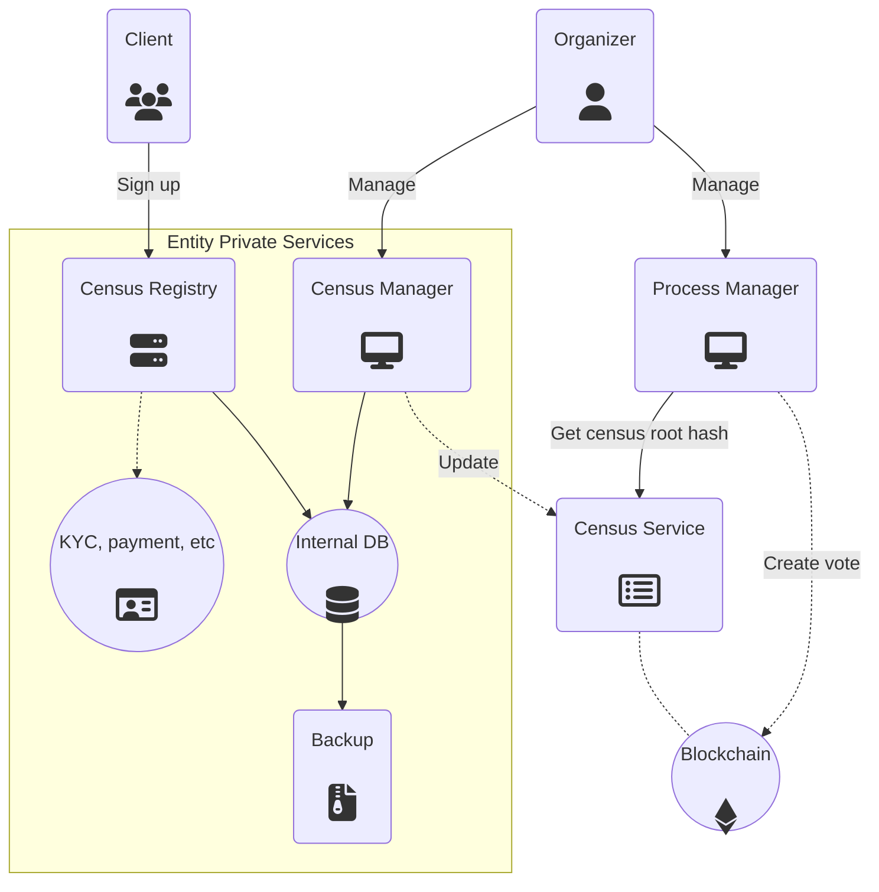

# Component Overview

### Smart Contracts

Voting ecosystems will need to interact with two different Smart Contracts on the Blockchain:
* **Entity Resolver**
    * Decentralized registry of entities and their corresponding metatada
* **Voting Process**
    * Registry of voting processes created by the entities defined above

##### Entity Metadata

An Entity is an aggregate of data living on the Entity Resolver smart contract and on Swarm/IPFS.

For a complete explanation, read the [Entity section](/architecture/components/entity).

##### Process Metadata

A Voting Process is also an aggregate of data living on the Voting Process smart contract and on Swarm/IPFS.

For a complete explanation, read the [Voting Process section](/architecture/components/process).

### Vochain Miner

The Vochain miner/validator is a trusted component able to generate new blocks of the voting blockchain. At least four nodes of this kind are required.

The validator public keys are stored in the Voting smart contract.

### Vochain Oracle

The Vochain oracle(s) is a trusted component who is able to modify some parameters of the Vochain (such as the validator public keys), add new voting processes or cancel an existing one via a set of special transactions. The Oracle must be a neutral component with the only aim of take the information from the Ethereum voting contract and add it to the Vochain Blockchain.

The oracle public keys are stored in the Voting smart contract.

### Gateway

Gateways provide an entry point to reach decentralized services like Census Services, Ethereum, IPFS, voting blockchain and more, using HTTP(s) WebSockets.

Gateways are neutral and they only aim is to provide access to the APP clients. Anyone can add a Gateway to the network.

### Census Service

A server handling the public census of an Entity. It stores Merkle trees with user claims, it allows an Entity to trigger updates (using asymmetric key signature authentication) and allows clients to ask for data on a particular Merkle tree.

The Census Service is a critical piece of the overall platform, so its real IP/location should be hidden as much as possible. Ideally, it should only be reachable through the P2P messaging protocol.

Census Service's have to be started with a predefined Entity Resolver instance address, as well as an Entity Address so they know what configuration they need to apply.

### Client app

A mobile APP able to generate and store a cryptographic user identity and interact with the Gateways to participate in the Vocdoni ecosystem.

## Entity Manager

A private service providing the Entity administrators a web site to manage voting processes on the blockchain. The service does not interact with any kind of users, it only needs to relay transactions to the blockchain.

### Census Registry

A custom web site provided by the Entity typically used to validate a user before adding him/her to a Census. This web site is loaded on a webview from the client app, once the user decides to register to an Entity. The required steps to pass a validation are dependent on every Entity and need a custom integration.

Vocdoni will provide a very basic census registry which can be used by any entity (as an example or in production).

### Census Manager

A private server allowing Entity administrators to manage the attributes (age, payment status, etc.) of users registered to it. Data from this service typically lives on a private database that will produce updated versions of specific census on demand.

The web site also allows to create new census and define the requirements that users have to accomplish to be included.

---

## Public vs Private relationship

Below is the relationship between publicly accessible and private services that interact within a voting process.

