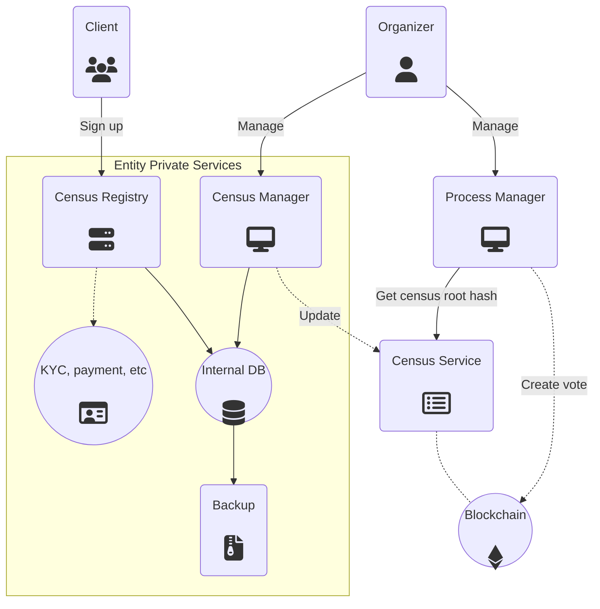

# Component Overview

## Public components

### Blockchain

Voting ecosystems will need to interact with two different Smart Contracts on the Blockchain:
* **Entity Resolver**
    * Decentralized registry of entities and their corresponding metatada
* **Voting Process**
    * Registry of voting processes created by the entities defined above

#### Entity Metadata

An Entity is an aggregate of data living on the Entity Resolver smart contract and on Swarm/IPFS.

For a complete explanation, read the [Entity section](/architecture/components/entity).

#### Process Metadata

A Voting Process is also an aggregate of data living on the Voting Process smart contract and on Swarm/IPFS.

For a complete explanation, read the [Voting Process section](/architecture/components/process).

### Relay

The Relay pool is a group of nodes which are responsible for handling votes, validating their content, pinning them on P2P filesystems and registering them on the Blockchain. At the moment, only relays whitelisted by the organizer will be able to add valid votes. 

### Gateway/Web3
Gateways provide an entry point to reach decentralized services like Relays, Census Services, Blockchains and more, using HTTP and WebSockets.

### Census Service
A server handling the public census of an Entity. It stores Merkle trees with user claims, it allows an Entity to trigger updates (using asymmetric key signature authentication) and allows clients to ask for data on a particular Merkle tree.

The Census Service is a critical piece of the overall platform, so its real IP/location should be hidden as much as possible. Ideally, it should only be reachable through the P2P messaging protocol.

Census Service's have to be started with a predefined Entity Resolver instance address, as well as an Entity Address so they know what configuration they need to apply.

### Client app
Any mobile app or web site with access to Web3 libraries and cryptographic primitives to compute signatures and blockchain transactions.

### Scrutinizer
Any participant on the system can fetch the scrutiny script and compute the voting process results on his/her own.

---

## Private services

### Census Registry
A custom web site provided by the Entity typically used to validate a user before adding him/her to a Census. This web site is loaded on a webview from the client app, once the user decides to register to an Entity. The required steps to pass a validation are dependent on every Entity and need a custom integration.

### Census Manager
A private server allowing Entity administrators to manage the attributes (age, payment status, etc.) of users registered to it. Data from this service typically lives on a private database that will produce updated versions of specific census on demand.

The web site also allows to create new census and define the requirements that users have to accomplish to be included.

### Process Manager
A private service providing the Entity administrators a web site to manage voting processes on the blockchain. The service does not interact with any kind of users, it only needs to relay transactions to the blockchain.

## Public vs Private relationship

Below is the relationship between publicly accessible and private services that interact within a voting process.

