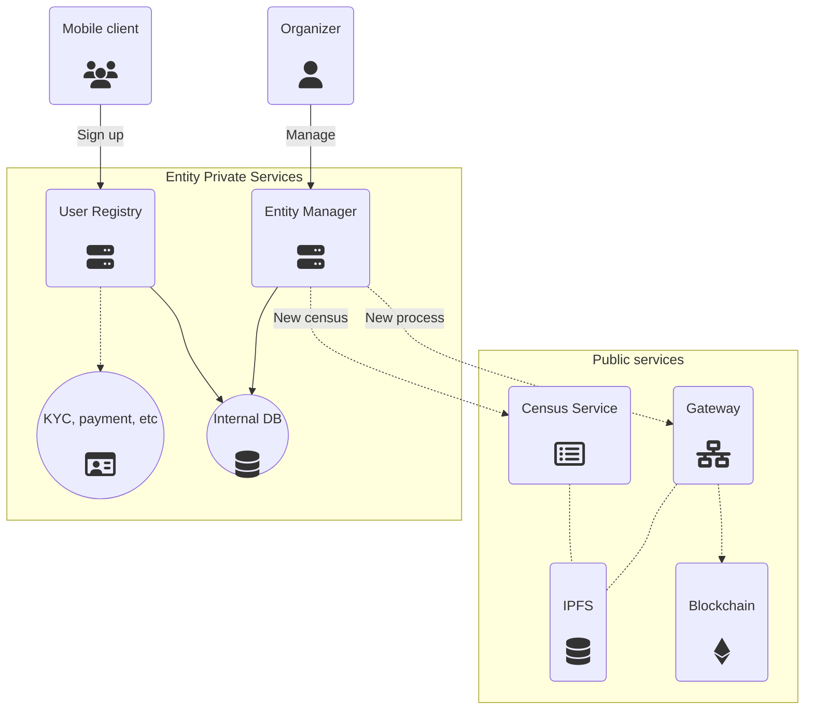

# Component Overview

The voting ecosystem is built on top of three kind of components:
- Decentralized blockchains
- Decentralized file storage
- Private services

They serve different purposes and they enable to have the following components.

### Smart Contracts

Smart contracts are a piece of immutable code running on a decentralized blockchain. Transactions sent to them run in a trustless fashion and serve as the permanent source of trust from the perspective of Vocdoni.

General purpose blockchains are slow and hard to scale, so they are only used to signal and declare parameters of organizations and governance processes. The following contracts are used:

* **ENS Resolver**
	* Simmilarly to DNS Text Records, the ENS Resolver is used as a global key-value store for entities
    * Organizations can declare the origin to their metadata, among other values
* **Process**
    * Global registry of governance processes created by entities
	* Defines the parameters of all processes available
* **Namespace**
	* Global registry to parameterize the different voting blockchains available
	* Each namespace defines the validators, oracles and settings of a certain Vochain

##### Entity Metadata

An Entity is an aggregate of data living on the Entity Resolver smart contract and on IPFS.

For a complete explanation, read the [Entities section](/architecture/smart-contracts/entities).

##### Process Metadata

A Voting Process is also an aggregate of data living on the Voting Process smart contract and on IPFS.

For a complete explanation, read the [Processes section](/architecture/smart-contracts/process).

### Vochain

The Vochain is a specific purpose [PoA](https://en.wikipedia.org/wiki/Proof_of_authority) blockchain made on top of [Tendermint](https://tendermint.com/), which creates a chain of blocks containing governance processes and votes.

A Vochain miner is a node of the PoA that can generate new blocks and validate the blocks proposed by other miners. At least four nodes of this kind are required.

The validator public keys are defined on the Namespace smart contract.

### Oracle

An oracle is a trustless component that can relay Ethereum transactions (process creation or status update) and signal events within the own Vochain (ended process). 

On the Ethereum side, it can also compute the results and submit them to the process smart contract, along with a ZK Rollup.

Oracles are a neutral and their role effectively allows for a Layer 2 governance that eventually triggers binding results on the Layer 1.

### Gateway

Gateways provide an entry point to decentralized services like Ethereum, IPFS, the Vochain and more, using HTTP or WebSockets.

Gateways are neutral and their goal is to provide P2P access to web and app clients. Anyone can start a Gateway and expand the network.

### Census Service

A server handling the public census of an Entity. It stores Merkle trees with user claims, it allows entities to trigger updates (using asymmetric key signature authentication) and allows clients to ask for data on a particular Merkle tree.

### Mobile client

A mobile App that generates and manages cryptographic self-sovereign identities. It interacts with network Gateways to participate in the Vocdoni ecosystem.

It allows to visit entities, browse their content, see governance processes, cast votes and see the results.

## Manager

A private service providing organizations with a UI to manage their community and public content. This includes a news feed, voting processes, assemblies, events, etc.

It also allows to manage the members and their attributes (age, payment status, etc.). Such data typically lives on a private database that will compute updated snapshots of the census at a given point in time.

The manager also allows to export new census and define the requirements that users have to accomplish for a user to be in a census. These requirements depend on each organization's policies.

### User Registry

A custom private service used to handle registrations and validate them before adding a user to a Census. 

The Vocdoni manager features a user registry out of the box.

---

## Public vs Private relationship

Below is the relationship between publicly accessible and private services that interact within a voting process.

### Coming next

See the [User stories](/architecture/user-stories) section.
