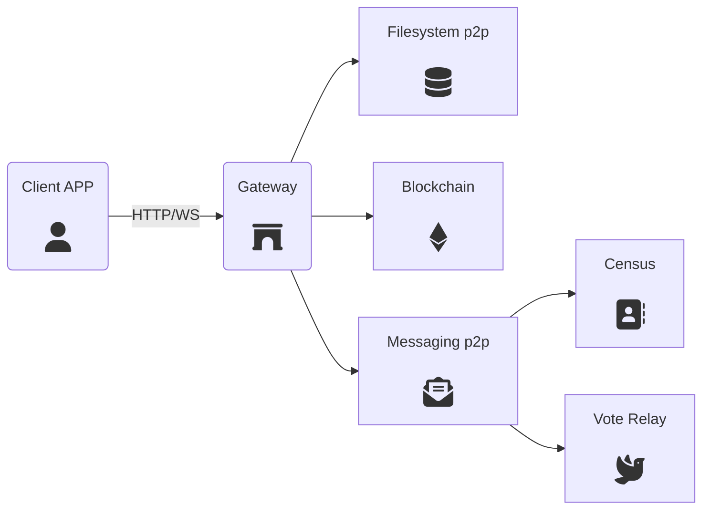
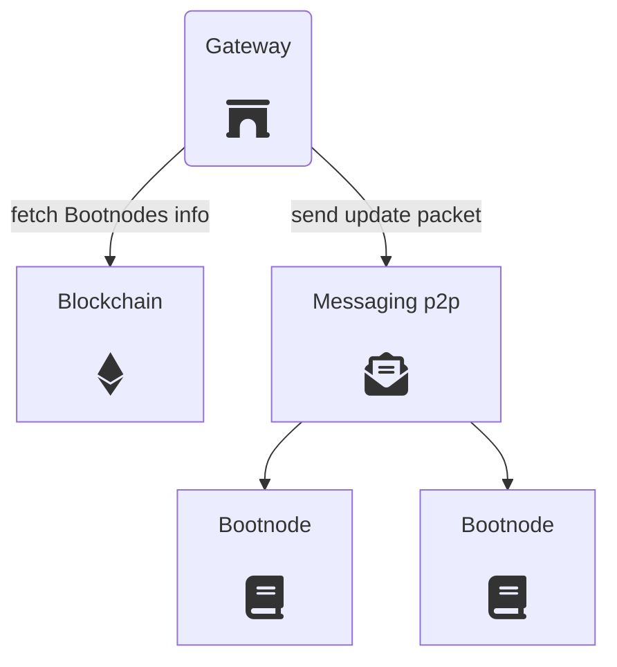

# Gateway

Gateways provide an entry point to the P2P networks. They allow clients to reach decentralized services (census, relays, blockchain, etc.) through a WebSocket or an HTTP API interface.



### Discovery mechanism

A Gateway is a neutral piece of the whole ecosystem which can be contributed by any third party. Communities, neighbourhoods or any kind of organization might add new Gateways to provide access to the network and resilence against possible censorship attacks.

To this end, Gateways participate in an automathic discovery mechanism through a p2p messaging network to make Bootnodes know of their existence. Clients make requests to Bootnodes to fetch a fresh list of working Gateways.


---

## API definition

A Gateway provides access to one or several APIs to allow access to one or several peer-to-peer networks. The currently possible API schemes are the following:

+ `vote API` access to specific vocdoni platform methods for voting
+ `census API` access to the census service API
+ `file API` access to specific vocdoni platform methods for administration
+ `web3 API` access to the Ethereum compatible blockchain

For example, the Gateway can be executed as follows, letting the user choose which APIs should be enabled:

`./gateway --port=8001 --vote --census --web3`

Then the APIs ara available to the client via HTTP/WS using the API name as route/path, for instance `http://gatewayIP:8001/web3`.

In general, if `error` is `true`, then `response` contains the error message.

## Census API

The census API is inherited from the [Census Service API](/docs/#/architecture/components/census-service). 

To only extra field is the specific `uri` used to reach the census service. Example for `getRoot` method:

```json
{
  "censusUri": "<uri>",
  "requestId": "hexString",   // Arbitrary value given by the client, so that it can match incoming responses to the originating request. Ideally a hash of the timestamp.
  "method": "getRoot",
  "censusId": "string"
}
```

## Vote API

### Get Voting Ring

Get the public key list for creating a ring signature for a specific election process id.

```json
{
  "method": "getVotingRing",
  "requestId": "hexString",   // Arbitrary value given by the client, so that it can match incoming responses to the originating request. Ideally a hash of the timestamp.
  "processId": "hexString",
  "publicKeyModulus": int
}
```
```json
{
  "error": bool,
  "requestId": "hexString",      // The requestId that the client sent
  "response": ["pubKey1", "pubKey2", ...]
}
```
**Used in:**
- [Voting with LRS](https://vocdoni.io/docs/#/architecture/sequence-diagrams?id=casting-a-vote-with-linkable-ring-signatures)

### Submit Vote Envelope

Send a vote envelope for an election process to the relay pool. The `voteEnvelope` content might be encrypted with a specific relay public key. The `relayAddress` might be provided or leave empty (`0x`) depending on the privacy decision of the client.

```json
{
  "method": "submitVoteEnvelope",
  "requestId": "hexString",   // Arbitrary value given by the client, so that it can match incoming responses to the originating request. Ideally a hash of the timestamp.
  "type": "zk-snarks|lrs",
  "processId": "hexString",
  "encryptedEnvelope": "voteEnvelope",
  "relayAddress": "hexString"
}
```
```json
{
  "error": bool,
  "requestId": "hexString",      // The requestId that the client sent
  "response": []
}
```

**Used in:**
- [Voting with zksnarks](https://vocdoni.io/docs/#/architecture/sequence-diagrams?id=casting-a-vote-with-zk-snarks)
- [Voting with LRS](https://vocdoni.io/docs/#/architecture/sequence-diagrams?id=casting-a-vote-with-linkable-ring-signatures)

### Get Vote Status

Check the status of an already submited vote envelope. 

```json
{
  "method": "getVoteStatus",
  "requestId": "hexString",   // Arbitrary value given by the client, so that it can match incoming responses to the originating request. Ideally a hash of the timestamp.
  "processId": "hexString",
  "nullifier": "hexString"
}
```

```json
{
  "error": bool,
  "requestId": "hexString",      // The requestId that the client sent
  "response": ["status"]
}
```
**Used in:**
- [Checking a submitted vote](https://vocdoni.io/docs/#/architecture/sequence-diagrams?id=checking-a-submitted-vote)

## File API

### Fetch File

Fetch a file from the p2p network (currently ipfs or swarm/bzz).

```json
{
  "method": "fetchFile",
  "requestId": "hexString",   // Arbitrary value given by the client, so that it can match incoming responses to the originating request. Ideally a hash of the timestamp.
  "uri": "<content uri>"
}
```

```json
{
  "error": bool,
  "requestId": "hexString",      // The requestId that the client sent
  "response": ["base64Payload"]
}
```
**Used in:**
- [Entity subscription](https://vocdoni.io/docs/#/architecture/sequence-diagrams?id=entity-subscription)
- [Voting process retrieval](https://vocdoni.io/docs/#/architecture/sequence-diagrams?id=voting-process-retrieval)
- [Checking a submitted vote](https://vocdoni.io/docs/#/architecture/sequence-diagrams?id=checking-a-submitted-vote)
- [Vote scrutiny](https://vocdoni.io/docs/#/architecture/sequence-diagrams?id=vote-scrutiny)

**Related:**
- [Content URI](/architecture/protocol/data-origins?id=content-uri)


### Add File

This method is aimed to be used by the election organizer. Usually the Gateway running this API is a private server which is only used by the administrators of the organization entity. This method is only available if option `--allow-private` is enabled.


```json
{
  "method": "addFile",
  "requestId": "hexString",   // Arbitrary value given by the client, so that it can match incoming responses to the originating request. Ideally a hash of the timestamp.
  "type": "swarm|ipfs",
  "content": "base64Payload",
  "name": "string",           // Human readable name to help identify the content in the future
  "address": "hexAddress",    // Address of the user signing the message
  "signature": "hexString"    // Signature of the base64 content with the sender's private key
}
```
```json
{
  "error": bool,
  "requestId": "hexString",      // The requestId that the client sent
  "response": ["<content uri>"]
}
```
**Used in:**
- [Set Entity metadata](https://vocdoni.io/docs/#/architecture/sequence-diagrams?id=set-entity-metadata)
- [Voting process creation](https://vocdoni.io/docs/#/architecture/sequence-diagrams?id=voting-process-creation)
- [Vote scrutiny](https://vocdoni.io/docs/#/architecture/sequence-diagrams?id=vote-scrutiny)

**Related:**
- [Content URI](/architecture/protocol/data-origins?id=content-uri)

### List pinned files

This method provides administrators of a Gateway with a list of resources that have been uploaded and are still pinned on Swarm or IPFS.

```json
{
  "method": "pinList",
  "requestId": "hexString",   // Arbitrary value given by the client, so that it can match incoming responses to the originating request. Ideally a hash of the timestamp.
  "address": "hexAddress",    // Address of the user signing the message
  "signature": "hexString"    // Signature of the base64 content with the sender's private key
}
```
```json
{
  "error": bool,
  "requestId": "hexString",      // The requestId that the client sent
  "response": ["{\"name\": \"string\", \"uri\": \"<content uri>\"}"]
}
```

**Related:**
- [Content URI](/architecture/protocol/data-origins?id=content-uri)

### Unpin File

This method is the counterpart of `addFile`. It allows administrators to unpin content from a Gateway so it doesn't eventually run out of space.


```json
{
  "method": "unpinFile",
  "requestId": "hexString",   // Arbitrary value given by the client, so that it can match incoming responses to the originating request. Ideally a hash of the timestamp.
  "uri": "<content uri>",     // Multiple origins can be unpinned at once
  "address": "hexAddress",    // Address of the user signing the message
  "signature": "hexString"    // Signature of the base64 content with the sender's private key
}
```
```json
{
  "error": bool,
  "requestId": "hexString",      // The requestId that the client sent
  "response": ["<content uri>"]
}
```

**Related:**
- [Content URI](/architecture/protocol/data-origins?id=content-uri)
