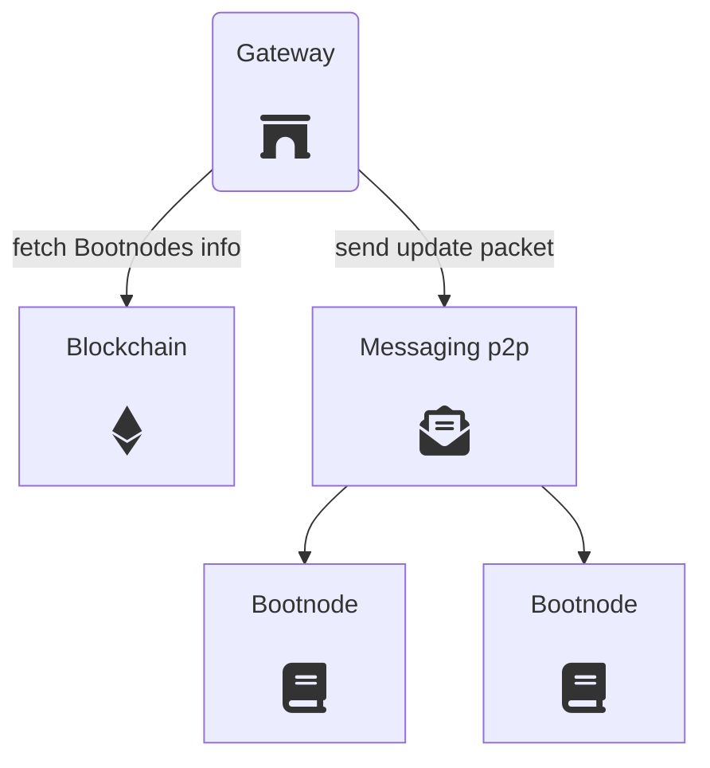

# Gateway

Gateways provide an entry point to the P2P networks. They allow clients to reach decentralized services through a WebSocket or an HTTP API interface.

The Gateway code can be found inside the [go-dvote](https://gitlab.com/vocdoni/go-dvote) repository.

The following diagram shows the gateway internal overall architecture and its components.

<div style="padding: 20px;">
	
</div>

One of the main rules applied on the Gateway development is to have a single system process. To this end all existing components such as Geth, IPFS or Tendermint are imported and executed as golang-libraries.

### Discovery mechanism

A Gateway is a neutral piece of the whole ecosystem which can be contributed by any third party. Communities, neighbourhoods or any kind of organization might add new Gateways to provide access to the network and resilence against possible censorship attacks.

To this end, Gateways participate in an automatic discovery mechanism through a p2p messaging network to make Bootnodes know of their existence. Clients make requests to Bootnodes to fetch a fresh list of working Gateways.


---

## API definition

A Gateway provides access to one or several APIs to allow access to one or several peer-to-peer networks. The currently possible API schemes are the following:

+ `Info API` access to information about the gateway
+ `Census API` access to the census service API
+ `Vote API` access to specific vocdoni platform methods for voting (vochain)
+ `File API` access to the p2p file network (ipfs)
+ `Web3 API` access to the Ethereum compatible blockchain

For example, the Gateway can be executed as follows, letting the user choose which APIs should be enabled:

`./gateway --listenPort 9090 --listenHost 0.0.0.0 --apiRoute /dvote --dvoteApi --web3Api --censusApi`

The APIs ara available to the client via HTTP/WS using two possible endpoints:

+ HTTP(s) `/web3` for the raw web3 API
+ WebSocket(s) `/dvote` for the Info, Vote, File and Census API's

## Info API

### Get Gateway Info
Get overview of gateway info - which APIs are enabled, and whether the gateway allows private methods.


```json
{
  "id": "req-2345679",
  "request": {
    "method": "getGatewayInfo",
    "timestamp": 1556110671 // optional, not required
  },
  "signature": "hexString" // optional, not required
}
```

```json
{
  "id": "req-2345679",
  "response": {
	"apiList": ["census","file","vote", "results"],
    "health": 65,  // A number between 1 and 100 that indicates the health of the gateway (resource consumption, network status, etc.)
    "ok": true,
    "request": "req-2345679", // Request ID here as well, to check its integrity
    "timestamp": 1556110672
  },
  "signature": "hexString"
}
```

## Census API

The Census API inherits directly from the methods defined in the [Census Service API](/architecture/components/census-service). 

## Vote API

### Submit Envelope

Send a vote envelope for an election process to the Vochain mempool. The `payload` content might be encrypted with one ore more specific Vochain node public key. 

```json
{
  "id": "req-2345679",
  "request": {
    "method": "submitEnvelope",
    "payload": { <VoteEnvelope> },   // See Vote Envelope from "Voting Process"
    "timestamp": 1556110671
  },
  "signature": ""  // Might be empty
}
```

```json
{
  "id": "req-2345679",
  "response": {
    "ok": true,
    "request": "req-2345679", // Request ID here as well, to check its integrity
    "timestamp": 1556110672
  },
  "signature": "hexString"
}
```

**Used in:**
- [Voting with zksnarks](https://vocdoni.io/docs/#/architecture/sequence-diagrams?id=casting-a-vote-with-zk-snarks)

- [Voting with LRS](https://vocdoni.io/docs/#/architecture/sequence-diagrams?id=casting-a-vote-with-linkable-ring-signatures)

### Get Envelope Status

Check the status of an already submited vote envelope. 

```json
{
  "id": "req-2345679",
  "request": {
    "method": "getEnvelopeStatus",
    "processId": "hexString",
    "nullifier": "hexString",
    "timestamp": 1556110671
  },
  "signature": ""  // Might be empty
}
```

```json
{
  "id": "req-2345679",
  "response": {
    "blockTimestamp": 1556110672, // if registered == true
    "height": 1234, // if registered == true
    "registered": true,  // Whether the vote is registered in a vote batch on the Blockchain
    "request": "req-2345679",
    "timestamp": 1556110672
  },
  "signature": "hexString"
}
```
**Used in:**
- [Checking a submitted vote](https://vocdoni.io/docs/#/architecture/sequence-diagrams?id=checking-a-submitted-vote)

### Get Envelope

Get the content of an already submited envelope.

```json
{
  "id": "req-2345679",
  "request": {
    "method": "getEnvelope",
    "processId": "hexString",
    "nullifier": "hexString",
    "timestamp": 1556110671
  },
  "signature": ""  // Might be empty
}
```

```json
{
  "id": "req-2345679",
  "response": {
    "payload": "base64-data", // Payload of the enveolope in base64
    "request": "req-2345679", 
    "timestamp": 1556110672
  },
  "signature": "hexString"
}
```

**Used in:**
- [Checking a submitted vote](https://vocdoni.io/docs/#/architecture/sequence-diagrams?id=checking-a-submitted-vote)

### Get Envelope Height

Get the number of envelopes registered for a process ID.

```json
{
  "id": "req-2345679",
  "request": {
    "method": "getEnvelopeHeight",
    "processId": "hexString",
    "timestamp": 1556110671
  },
  "signature": ""  // Might be empty
}
```

```json
{
  "id": "req-2345679",
  "response": {
    "ok": true,
    "height": int, // Height of envelopes for the process ID
    "request": "req-2345679",
    "timestamp": 1556110672
  },
  "signature": "hexString"
}
```
**Used in:**
- [Checking a submitted vote](https://vocdoni.io/docs/#/architecture/sequence-diagrams?id=checking-a-submitted-vote)

### Get Block Status

Request info about the last mined block and the average block time for the last 1m, 10m, 1h, 6h and 24h.

```json
{
  "id": "req-12345678",
  "request": {
    "method": "getBlockStatus",
    "timestamp": 1556110671
  },
  "signature": ""  // Might be empty
}
```

```json
{
  "id": "req-2345679",
  "response": {
    "blockTime": [10000, 12000, 12200, 12500, 12600], // In milliseconds, average for 1 minute, 10m, 1h, 6h, 24h
                                                      // If there is no average yet, values are 0
    "blockTimestamp": 1556110672, // in seconds
    "height": 12345,
    "ok": true,
    "request": "req-2345679", // Request ID here as well, to check its integrity
    "timestamp": 1556110672
  },
  "signature": "hexString"
}
```

### Get Block Height

Request the number of blocks that are currently on the blockchain. 

```json
{
  "id": "req-12345678",
  "request": {
    "method": "getBlockHeight",
    "timestamp": 1556110671
  },
  "signature": ""  // Might be empty
}
```

```json
{
  "id": "req-2345679",
  "response": {
    "blockTimestamp": 1556110672,
    "ok": true,
    "height": 12345,
    "request": "req-2345679", // Request ID here as well, to check its integrity
    "timestamp": 1556110672
  },
  "signature": "hexString"
}
```

### Get Process List

Get a list of processes from the Vochain for a specific entityId. There is a hardcoded maximum size of 64 for the process list. The starting process id to look at, can be specified using the field `fromId`. If `fromId` is empty, the first 64 process ids will be returned.

The `fromId` field can be used to seek an specific position and start from it. So if the first call with `fromId` empty returns 64 values, a second call may be done using `fromId`=`lastProcIdReceived` to get the next 64 values.


```json
{
  "id": "req-2345679",
  "request": {
    "method": "getProcessList",
	  "entityId": "hexString",
    "fromId": "hexString",
    "timestamp": 1556110671
  },
  "signature": ""  // Might be empty
}
```

```json
{
  "id": "req-2345679",
  "response": {
    "processIds": ["hexString1","hexString2", ...], // List of processes of the blockchain
    "request": "req-2345679",
    "timestamp": 1556110672
  },
  "signature": "hexString"
}
```

### Get Envelope List

Get a list of registered vote envelopes for a specific process ID (maximum of 64 per call).  See `Get Process List`  to see how `fromId` works.

```json
{
  "id": "req-2345679",
  "request": {
    "method": "getEnvelopeList",
    "processId": "hexString",
    "fromId": "hexString",
    "timestamp": 1556110671
  },
  "signature": ""  // Might be empty
}
```

```json
{
  "id": "req-2345679",
  "response": {
    "nullifiers": ["hexString1","hexString2", ...], // List of nullifiers already processed by the blockchain
    "request": "req-2345679",
    "timestamp": 1556110672
  },
  "signature": "hexString"
}
```

### Get Process Keys

Get a list encryption public keys, private keys and commitment/reveal keys for a specific process ID.

The response will have all known keys. If the process is on-going, usually `encryptionPubkeys` and `commitmentKeys` will be available.
Once the process is finished, `encryptionPrivKeys` and `revealKeys` will be also added to the response.

When encrypting and decrypting a vote payload it is expected to use the keys ordered by their indexes. It's important to note that the indexes might not be consecutive, however the smaller index goes first.

```json
{
  "id": "req-2345679",
  "request": {
    "method": "getProcessKeys",
    "processId": "hexString",
    "timestamp": 1556110671
  },
  "signature": ""  // Might be empty
}
```

```json
{
  "id": "req-2345679",
  "response": {
    "encryptionPubKeys": [ {"idx": 1, "key": "1234567890..."}, {"idx": 6, "key": "2345678901..."}, ... ], 
    "commitmentKeys": [ {"idx": 1, "key": "1234567890..."}, {"idx": 6, "key": "2345678901..."}, ... ],
    "encryptionPrivKeys": [ {"idx": 1, "key": "1234567890..."}, {"idx": 6, "key": "2345678901..."}, ... ],
    "revealKeys": [ {"idx": 1, "key": "1234567890..."}, {"idx": 6, "key": "2345678901..."}, ... ],
    "request": "req-2345679",
    "timestamp": 1556110672
  },
  "signature": "hexString"
}
```
**Used in:**
- [Checking a submitted vote](https://vocdoni.io/docs/#/architecture/sequence-diagrams?id=checking-a-submitted-vote)

### Get Process Result List

**only available if scrutinizer enabled on the gateway** - scrutinizer is enabled if `results` API is enabled.  
Get a list of the processes indexed by the scrutinizer with **final results**. Currently this method returns a non-deterministic set of maximum 64 process ids. 

The `fromId` field can be used to seek an specific position and start from it. So if the first call with `fromId` empty returns 64 values, a second call may be done using `fromId`=`lastProcIdReceived` to get the next 64 values.

```json
{
  "id": "req-2345679",
  "request": {
    "method": "getProcListResults",
    "fromId": "hexString",
    "timestamp": 1556110671
  },
  "signature": ""  // Might be empty
}
```

```json
{
  "id": "req-2345679",
  "response": {
    "processIds": ["hexString1","hexString2", ...],
    "request": "req-2345679",
    "timestamp": 1556110672
  },
  "signature": "hexString"
}
```

### Get Live Process Result List

**only available if scrutinizer enabled on the gateway** - scrutinizer is enabled if `results` API is enabled.  
Get a list of the processes indexed by the scrutinizer with **partial results**. Only those vote types with a non-encrypted payload can be partialy scrutinized.

The `fromId` field can be used to seek an specific position and start from it. So if the first call with `fromId` empty returns 64 values, a second call may be done using `fromId`=`lastProcIdReceived` to get the next 64 values.

```json
{
  "id": "req-2345679",
  "request": {
    "method": "getProcListLiveResults",
    "fromId": "hexString",
    "timestamp": 1556110671
  },
  "signature": ""  // Might be empty
}
```

```json
{
  "id": "req-2345679",
  "response": {
    "processIds": ["hexString1","hexString2", ...],
    "request": "req-2345679",
    "timestamp": 1556110672
  },
  "signature": "hexString"
}
```

### Get Process Results

**only available if scrutinizer enabled on the gateway** - scrutinizer is enabled if `results` API is enabled.  
Get the results of the processIds indexed by the scrutinizer. If the process is not yet finished and the votes are not encrypted, returns the **partial result**.
The results are represented in a two-dimension array: `Question1[Option1,Option2,...], Question2[Option1,Option2,...], ...`

```json
{
  "id": "req-2345679",
  "request": {
    "method": "getResults",
    "processId": "hexString",
    "timestamp": 1556110671
  },
  "signature": ""  // Might be empty
}
```

```json
{
  "id": "req-2345679",
  "response": {
    "request": "req-2345679",
    "type": "poll-vote",
    "state": "active",     // "scheduled|active|paused|finished|canceled"
    "results": [ [12, 2], [3, 11, 24], [0, 43] ],
    "timestamp": 1556110672
  },
  "signature": "hexString"
}
```
- [GitLab issue regarding this feature](https://gitlab.com/vocdoni/go-dvote/issues/106)

### Get Scrutinizer Entities

**only available if scrutinizer enabled on the gateway** - scrutinizer is enabled if `results` API is enabled.  
Get a list of the entities indexed by the scrutinizer. Currently this method returns a non-deterministic set of maximum 64 entity ids. 

The `fromId` field can be used to seek an specific position and start from it. So if the first call with `fromId` empty returns 64 values, a second call may be done using `fromId`=`lastEntityIdReceived` to get the next 64 values.

```json
{
  "id": "req-2345679",
  "request": {
    "method": "getScrutinizerEntities",
    "fromId": "hexString",
    "timestamp": 1556110671
  },
  "signature": ""  // Might be empty
}
```

```json
{
  "id": "req-2345679",
  "response": {
    "entityIds": ["hexString1","hexString2", ...],
    "request": "req-2345679",
    "timestamp": 1556110672
  },
  "signature": "hexString"
}
```

## File API

### Fetch File

Fetch a file from the P2P network (currently IPFS or Swarm/BZZ).

```json
{
  "id": "req-2345679",
  "request": {
    "method": "fetchFile",
    "uri": "<content uri>",
    "timestamp": 1556110671
  },
  "signature": "hexString"
}
```

```json
{
  "id": "req-2345679",
  "response": {
    "content": "base64Payload",  // The contents of the file
    "request": "req-2345679",      // Request ID here as well, to check its integrity
    "timestamp": 1556110672
  },
  "signature": "hexString"
  
}
```
**Used in:**
- [Entity subscription](https://vocdoni.io/docs/#/architecture/sequence-diagrams?id=entity-subscription)
- [Voting process retrieval](https://vocdoni.io/docs/#/architecture/sequence-diagrams?id=voting-process-retrieval)
- [Checking a submitted vote](https://vocdoni.io/docs/#/architecture/sequence-diagrams?id=checking-a-submitted-vote)
- [Vote scrutiny](https://vocdoni.io/docs/#/architecture/sequence-diagrams?id=vote-scrutiny)

**Related:**
- [Content URI](/architecture/protocol/data-origins?id=content-uri)


### Add File

This method is aimed to be used by the election organizer. Usually the Gateway running this API is a private server which is only used by the administrators of the organization entity. This method is only available if option `--allow-private` is enabled.

Ideally, this methods require authentication following the rules described [in the API standard page](/architecture/protocol/json-api?id=Authentication).


```json
{
  "id": "req-2345679",
  "request": {
    "method": "addFile",
    "type": "swarm|ipfs",
    "content": "base64Payload",  // File contents
    "name": "string",            // Human readable name to help identify the content in the future
    "timestamp": 1556110671
  },
  "signature": "hexString"
}
```

```json
{
  "id": "req-2345679",
  "response": {
    "uri": "<content uri>",
    "request": "req-2345679",    // Request ID here as well, to check its integrity
    "timestamp": 1556110672
  },
  "signature": "hexString"
  
}
```

**Used in:**
- [Set Entity metadata](https://vocdoni.io/docs/#/architecture/sequence-diagrams?id=set-entity-metadata)
- [Voting process creation](https://vocdoni.io/docs/#/architecture/sequence-diagrams?id=voting-process-creation)
- [Vote scrutiny](https://vocdoni.io/docs/#/architecture/sequence-diagrams?id=vote-scrutiny)

**Related:**
- [Content URI](/architecture/protocol/data-origins?id=content-uri)

### List pinned files

This method provides administrators of a Gateway with a list of resources that have been uploaded and or pinned remotely and are still available on Swarm or IPFS.

```json
{
  "id": "req-2345679",
  "request": {
    "method": "pinList",
    "timestamp": 1556110671
  },
  "signature": "hexString"
}
```

```json
{
  "id": "req-2345679",
  "response": {
    "files": [
      { "name": "file1.txt", "uri": "<content-uri>" },
      { "name": "file2.png", "uri": "<content-uri>" },
      { "name": "file3.bin", "uri": "<content-uri>" },
      ...
    ],
    "request": "req-2345679",
    "timestamp": 1556110672
  },
  "signature": "hexString"
}
```

**Related:**
- [Content URI](/architecture/protocol/data-origins?id=content-uri)

### Pin a file

This method allows administrators to pin already existing remote content, so it is available through the Gateway itself. 

```json
{
  "id": "req-2345679",
  "request": {
    "method": "pinFile",
    "uri": "<content-uri>", // Multiple origins can be pinned at once
    "timestamp": 1556110671
  },
  "signature": "hexString"
}
```
```json
{
  "id": "req-2345679",
  "response": {
    "ok": true,
    "request": "req-2345679",
    "timestamp": 1556110672
  },
  "signature": "hexString"
}
```


### Unpin a file

This method is the counterpart of `pin` and `addFile`. It allows administrators to unpin and drop content from a Gateway so it doesn't eventually run out of space.


```json
{
  "id": "req-2345679",
  "request": {
    "method": "unpinFile",
    "uri": "<content-uri>",  // Multiple origins can be unpinned at once
    "timestamp": 1556110671
  },
  "signature": "hexString"
}
```
```json
{
  "id": "req-2345679",
  "response": {
    "ok": true,
    "request": "req-2345679",
    "timestamp": 1556110672
  },
  "signature": "hexString"
}
```

**Related:**
- [Content URI](/architecture/protocol/data-origins?id=content-uri)

## Health Status

The health of a DVote Gateway can be checked quite simply:

- Request:
  - `HTTP GET https://<host-name>/ping`
- Response:
  - `HTTP 200` with the text `"pong"` in the body

Example:

```sh
$ curl https://my.gateway.net/ping
pong
```

Clients should check the status before attempting to use a certain Gateway. 
