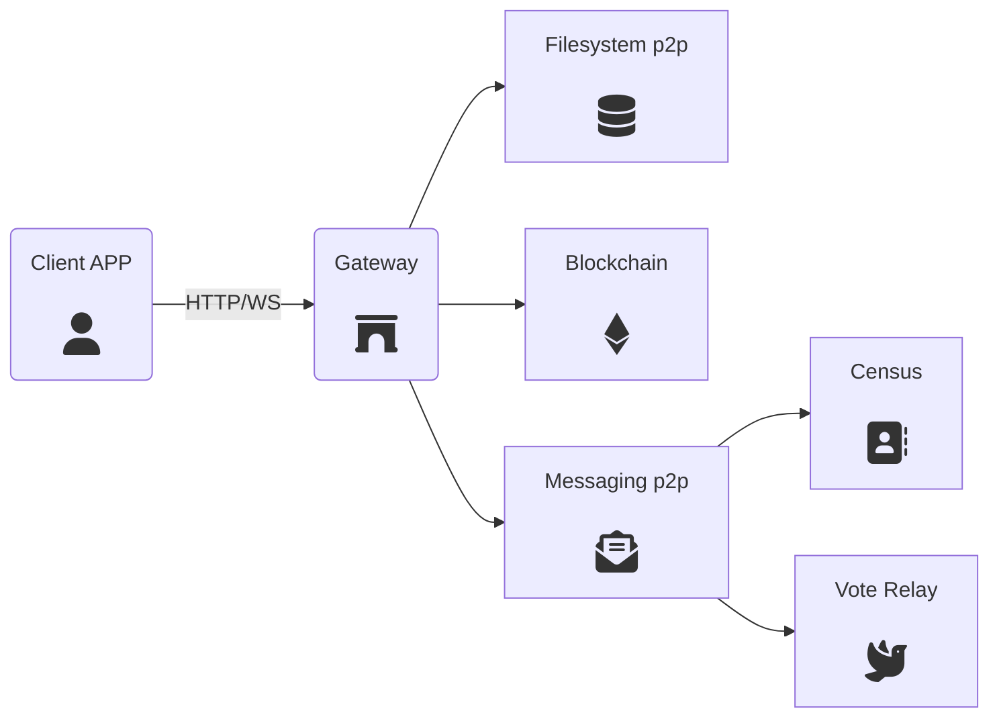
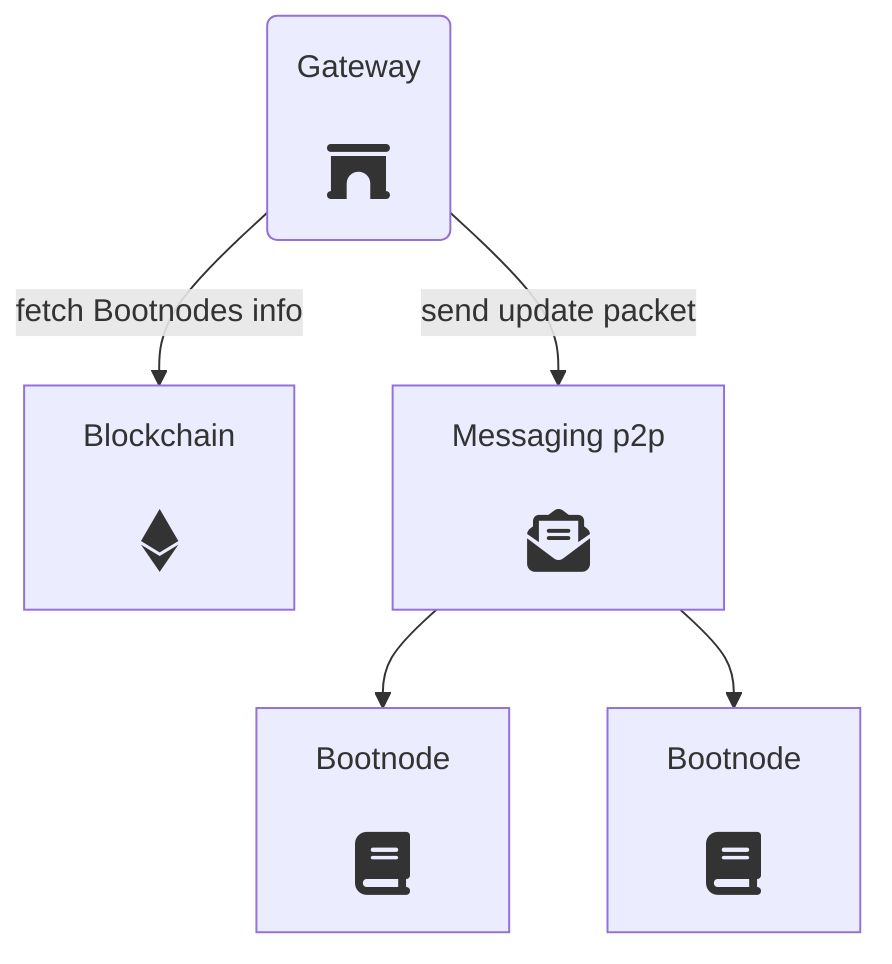

# Gateway

Gateways provide an entry point to the P2P networks. They allow clients to reach decentralized services (census, relays, blockchain, etc.) through a WebSocket or an HTTP API interface.




### Discovery mechanism

A Gateway is a neutral piece of the whole ecosystem which can be contributed by any third party. Communities, neighbourhoods or any kind of organization might add new Gateways to provide access to the network and resilence against possible censorship attacks.

To this end, Gateways participate in an automathic discovery mechanism through a p2p messaging network to make Bootnodes know of their existence. Clients make requests to Bootnodes to fetch a fresh list of working Gateways.


---

## API definition

A Gateway provides access to one or several APIs to allow access to one or several peer-to-peer networks. The currently possible API schemes are the following:

+ `vocdoniVote API` access to specific vocdoni platform methods for voting
+ `vocdoniAdmin API` access to specific vocdoni platform methods for administration
+ `web3 API` access to the Ethereum compatible blockchain
+ `ipfs API` access to the Interplanetary FileSystem
+ `pss API` access to the distributed PSS messagning network
+ `swarm API` access to the distributed Ethereum Filesystem

All APIs, in exception of the `vocdoni`'s one, have their own specification. The Gateway just implement a bridge to them.

For example, the Gateway binary can be executed as follows, letting the Gateway choose which APIs should be enabled:

`./gateway --port=8001 --vocdoni --web3 --ipfs`

Then the APIs ara available to the client via HTTP/WS using the API name as route/path, for instance `http://gatewayIP:8001/web3`.

## VocdoniVote's API

In general, if `error` is `true`, then `response` contains the error message.

### Get Census Root

Get the census merkleTree root hash of a given `censusId`.

```json
{
  "method": "getCensusRoot",
  "censusId": "hexString"
}
```
```json
{
  "error": bool,
  "response": ["rootHashHexString"]
}
```

**Used in:**
- [Voting process creation](http://vocdoni.io/docs/#/architecture/sequence-diagrams?id=voting-process-creation)


### Get Census Proof

Get the census merkle proof of a leaf publicKey for a given root hash. The proof can be used to demostrate the pubkey is part of the census merkle tree.
This method is mainly used for a ZK-snarks based election process.

```json
{
  "method": "getCensusProof",
  "censusRootHash": "hexString",
  "publicKey": "hexString"
}
```

```json
{
  "error": bool,
  "response": ["mkProofHexString"]
}
```

**Used in:**
- [Voting with zksnarks](https://vocdoni.io/docs/#/architecture/sequence-diagrams?id=casting-a-vote-with-zk-snarks)

### Get Census Ring

Get the public key list for creating a ring signature.

```json
{
  "method": "getCensusRing",
  "processId": "hexString",
  "publicKeyModulus": int
}
```
```json
{
  "error": bool,
  "response": ["pubKey1", "pubKey2", ...]
}
```
**Used in:**
- [Voting with LRS](https://vocdoni.io/docs/#/architecture/sequence-diagrams?id=casting-a-vote-with-linkable-ring-signatures)

### Submit Vote Envelope

Send a vote envelope for an election process to the relay pool. The `voteEnvelope` content might be encrypted with a specific relay public key. The `relayAddr` might be provided or leave empty (`0x`) depending on the privacy decision of the client.

```json
{
  "method": "submitVoteEnvelope",
  "type": "zk-snarks|lrs",
  "processId": "hexString",
  "content": "voteEnvelope",
  "relayAddr": "hexString"
}
```
```json
{
  "error": bool,
  "response": []
}
```

**Used in:**
- [Voting with zksnarks](https://vocdoni.io/docs/#/architecture/sequence-diagrams?id=casting-a-vote-with-zk-snarks)
- [Voting with LRS](https://vocdoni.io/docs/#/architecture/sequence-diagrams?id=casting-a-vote-with-linkable-ring-signatures)

### Check Vote Status

Check the status of an already submited vote envelope. The `voteId` can be either the `nullifier` used in Zk-snarks or the hash of the ring signature.

```json
{
  "method": "getVoteStatus",
  "processId": "hexString",
  "voteId": "hexString"
}
```

```json
{
  "error": bool,
  "response": ["status"]
}
```
**Used in:**
- [Checking a submitted vote](https://vocdoni.io/docs/#/architecture/sequence-diagrams?id=checking-a-submitted-vote)

### Fetch File

Fetch a file from the p2p network (ipfs or swarm).

```json
{
  "method": "fetchFile",
  "uri": "<content uri>"
}
```

```json
{
  "error": bool,
  "response": ["base64Payload"]
}
```
**Used in:**
- [Entity subscription](https://vocdoni.io/docs/#/architecture/sequence-diagrams?id=entity-subscription)
- [Voting process retrieval](https://vocdoni.io/docs/#/architecture/sequence-diagrams?id=voting-process-retrieval)
- [Checking a submitted vote](https://vocdoni.io/docs/#/architecture/sequence-diagrams?id=checking-a-submitted-vote)
- [Vote scrutiny](https://vocdoni.io/docs/#/architecture/sequence-diagrams?id=vote-scrutiny)

## VocdoniAdmin's API

This API is aimed to be used by the election organizer. Usually the Gateway running this API is a private server which is only used by the administrators of the organization entity.

### Add Census Claim

```json
{
  "method": "addCensusClaim",
  "censusId": "hexString",
  "censusOrigin": "hexString",
  "claimData": "hexString"
}
```
```json
{
  "error": bool
}
```

### Add Census Claim Bulk

```json
{
  "method": "addCensusClaimBulk",
  "censusId": "hexString",
  "censusOrigin": "hexString",
  "claimData": "hexString"
}
```
```json
{
  "error": bool
}
```

### Census Dump
```json
{
  "method":"censusDump",
  "censusId": "hexString",
  "signature": "hexString"
}
```
```json
{
  "error": bool,
  "merkleTree": "hexString"
}
```
**Used in:**
- [Voting process creation](http://vocdoni.io/docs/#/architecture/sequence-diagrams?id=voting-process-creation)


**Used in:**
- [Adding users to a census](vocdoni.io/docs/#/architecture/sequence-diagrams?id=adding-users-to-a-census)

### Add File

Available only post-auth on trusted gateways
```json
{
  "method": "addFile",
  "type": "swarm",         // Valid: ["ipfs", "swarm"]
  "content": "base64Payload"
}
```
```json
{
  "error": bool,
  "response": ["<content uri>"]
}
```
**Used in:**
- [Set Entity metadata](https://vocdoni.io/docs/#/architecture/sequence-diagrams?id=set-entity-metadata)
- [Voting process creation](https://vocdoni.io/docs/#/architecture/sequence-diagrams?id=voting-process-creation)
- [Vote scrutiny](https://vocdoni.io/docs/#/architecture/sequence-diagrams?id=vote-scrutiny)
