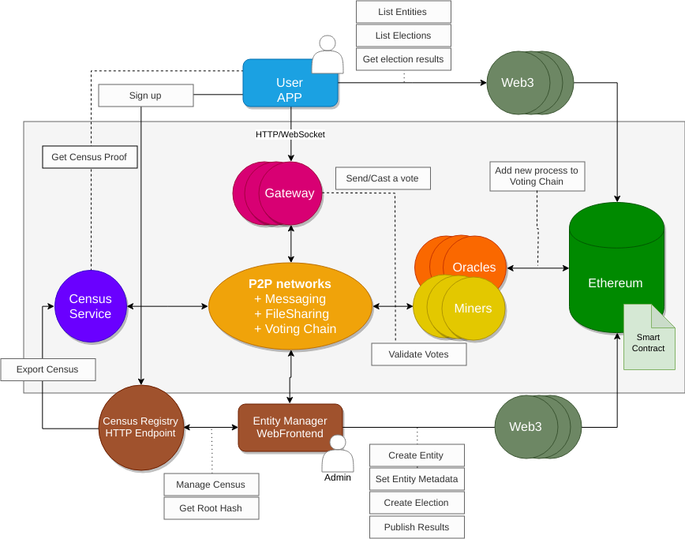

# Global architecture

Electronic voting processes represent a great tech and social challenge. An official binding vote with standard requirements should at least be able to:

+ Enforce vote anonimity
+ Rely on an opensource platform
+ Be 100% transparent, auditable and verifiable
+ Use uncensorable communication channels
+ Ensure that voters from a census can only vote once without revealing anyone's identity

Vocdoni defines an open architechture and the protocols to empower large communities to exercise full democracy with the aforementioned guarantees. 

A fully functional implementation of Vocdoni will typically involve a combination of two types of services. 
- The public blockchain, Gateways, Relays and decentralized storage systems (open and accessible)
- Private custom services so that Entities can maintain a census of users (with personal data that should not be disclosed)

## Service architecture and components

To provide resilence and avoid any kind of censorship, the network architecture should accomplish the following requirements:

+ Do not rely on DNS
+ Do not depend on specific IPs
+ Do not depend on any specific company or cloud infrastructure
+ Use P2P network connections when possible
+ Use static web pages, so they can be replicated
+ Allow third parties to add infrastructure

A Vocdoni voting process makes use of the following components:

+ Data integrity is provided by a public BlockChain such as the Ethereum main net.

+ Data availability is provided by a distributed filesystem such as Swarm or IPFS.

+ Peer messaging is provided by a distributed message protocol such as Whisper, IPFS/PubSub or Swarm/PSS.

+ The client interface (app or webapp) interacts with the P2P network and the Blockchain through Gateways (using WebSockets or HTTP/RPC). 

* Gateways are neutral/agnostic, since the cryptographic layer happens on the peer side. The only intent of a Gateway is about forwarding requests from clients that can't open a socket by themselves (typically web browsers).
