# Sequence diagrams

Traditional systems like API's present simple scenarios, in which a centralized service define how data should be encoded.

However, decentralized ecosystems like a distributed vote system need much stronger work on defining every interaction between any two peers on the network.

- [Prior to voting](#prior-to-voting)
  - [Initial Gateway discovery](#initial-gateway-discovery)
  - [Set Entity metadata](#set-entity-metadata)
  - [Custom requests to an Entity](#custom-requests-to-an-entity)
    - [Sign up](#sign-up)
    - [Submit a picture](#submit-a-picture)
    - [Make a payment](#make-a-payment)
    - [Resolve a captcha](#resolve-a-captcha)
    - [External Entity to make use of Census Service](#external-entity-to-make-use-of-census-service)
    - [Adding users to a census](#adding-users-to-a-census)
- [Voting](#voting)
  - [Voting process creation](#voting-process-creation)
  - [Voting process retrieval](#voting-process-retrieval)
  - [Check census inclusion](#check-census-inclusion)
  - [Casting a vote with ZK Snarks](#casting-a-vote-with-zk-snarks)
  - [Casting a vote with Linkable Ring Signatures](#casting-a-vote-with-linkable-ring-signatures)
  - [Registering a Vote Batch](#registering-a-vote-batch)
- [After voting](#after-voting)
  - [Checking a submitted vote](#checking-a-submitted-vote)
  - [Closing a Voting Process](#closing-a-voting-process)
  - [Vote Scrutiny](#vote-scrutiny)

---

## Prior to voting

---

### Initial Gateway discovery

The app wants to get initial connectivity with the available gateways.

- Using a well-known Ethereum Gateway, we query for an initial boot node on the ENS Resolver. The following is defined:
    - Well-known Ethereum blockchain gateways
    - Entity Resolver contract address
    - Vocdoni's Entity ID
- From one of the boot nodes, we get a list of Gateways provided by Vocdoni

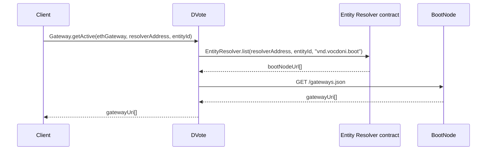

Eventually:

- One of Vocdoni's Gateways is used to query the ENS resolver of a certain Entity

### Set Entity metadata
An Entity starts existing at the moment it has certain metadata stored on the [Entity Resolver](/architecture/components/entities?id=entityresolver) smart contract. 

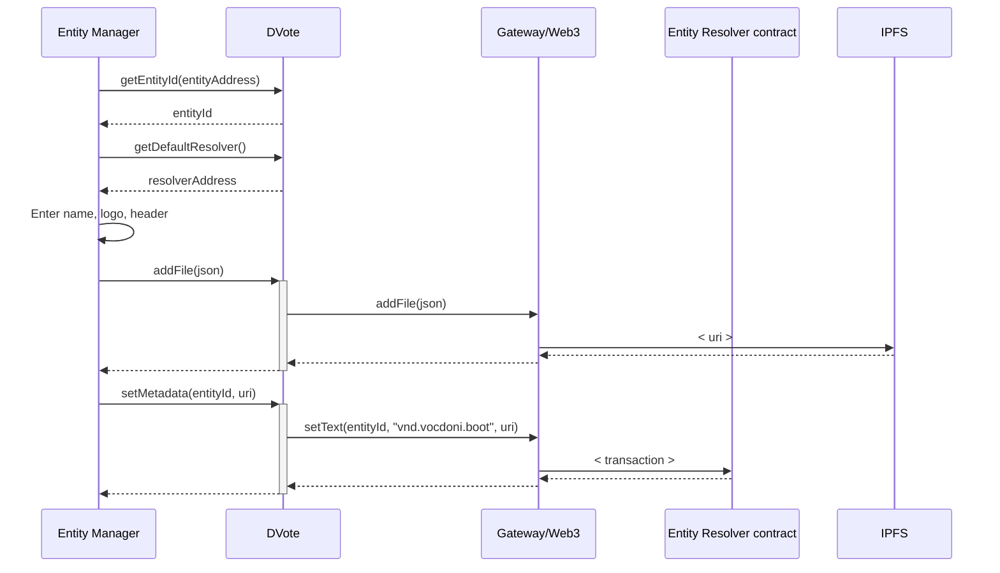

**Used schemas:**

- [Entity metadata](/architecture/components/entities?id=json-schema)

#### Adding users to a census

Depending on the activity of users, an **Entity** may decide to add public keys to one or more census.

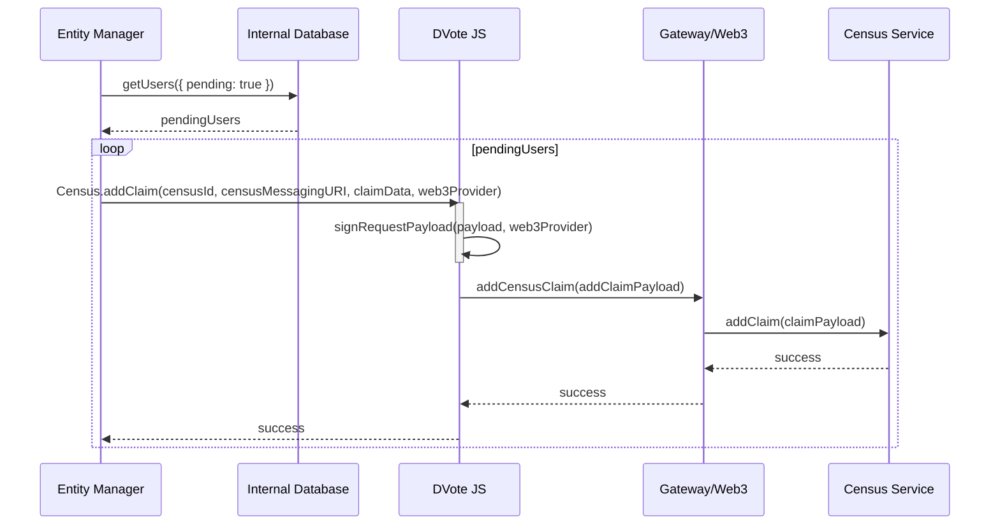

**Used schemas:**

- [Census Service addClaim](/architecture/components/census-service?id=addclaim)
- [Census Service addClaimBulk](/architecture/components/census-service?id=addclaimbulk)

---

## Voting

### Voting process creation

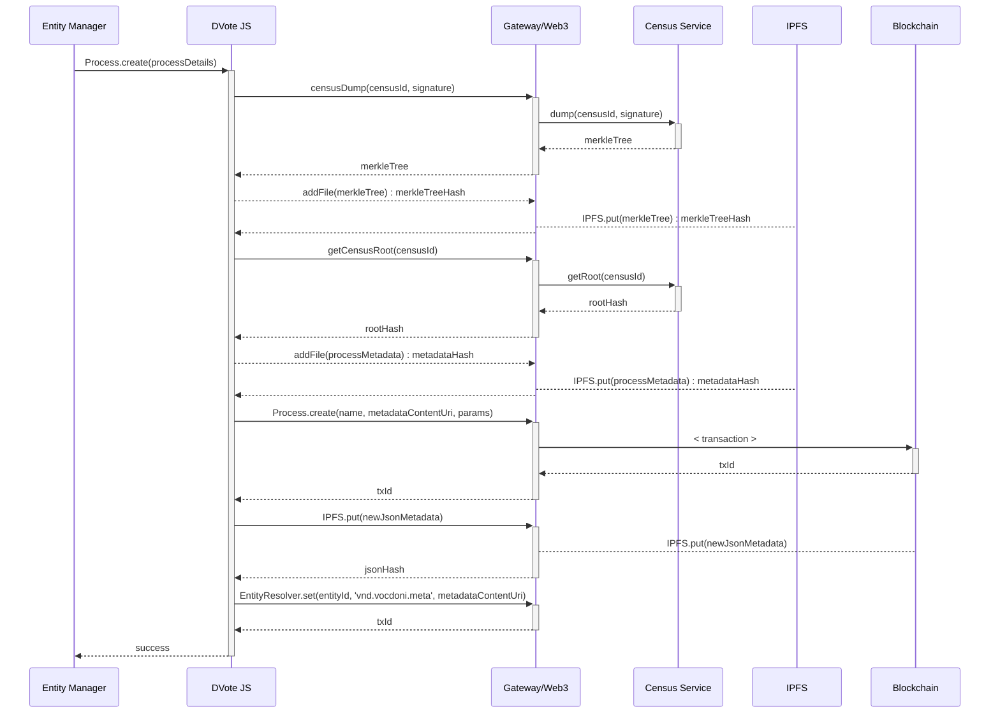

**Used schemas:**

- [Process Metadata](/architecture/components/processes?id=process-metadata-json)
- [Census Service addClaimBulk](/architecture/components/census-service?id=addclaimbulk)
- [Census Service getRoot](/architecture/components/census-service?id=getroot)
- [Census Service dump](/architecture/components/census-service?id=dump)

### Voting process retrieval

A user wants to retrieve the voting processes of a given Entity

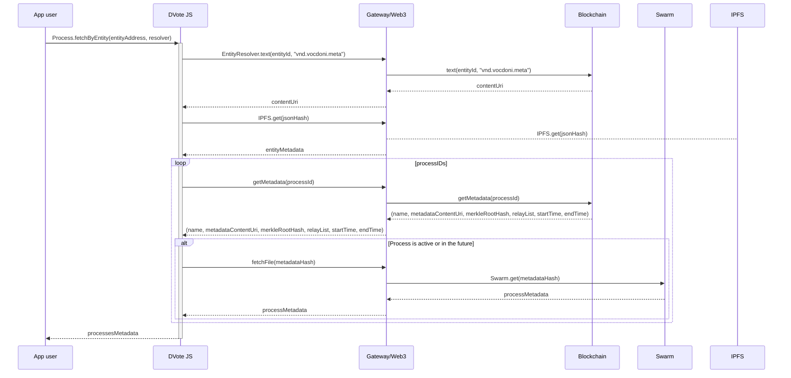

**Used schemas:**

- [Process Metadata](/architecture/components/processes?id=process-metadata-json)

### Check census inclusion

A user wants to know whether he/she belongs in the census of a process or not.

The request can be sent through HTTP/PSS/PubSub. The response may be fetched by subscribing to a topic on PSS/PubSub.

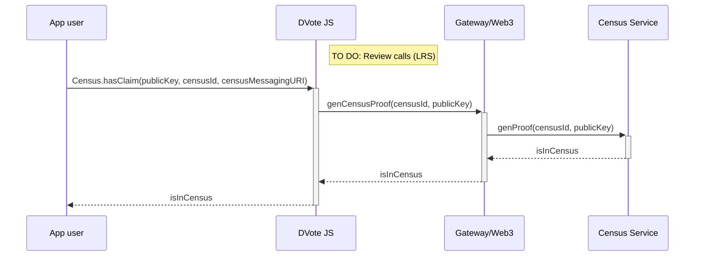

**Used schemas:**

- [Census Service generateProof](/architecture/components/census-service?id=generateproof)

**Notes:**

- `generateProof` may be replaced with a call to `hasClaim`, for efficiency
- The `censusId` and `censusMessagingURI` should have been fetched from the [Process Metadata](/architecture/components/processes)

### Casting a vote with ZK Snarks

Requests can be sent through HTTP/PSS/PubSub. Responses may be fetched by subscribing to a topic on PSS/PubSub.

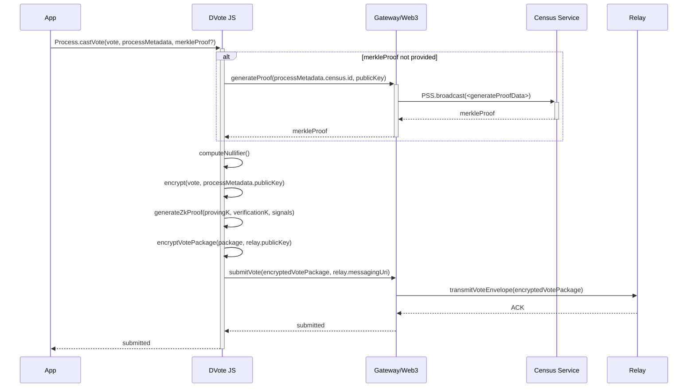

**Used schemas:**

- [Process Metadata](/architecture/components/processes?id=process-metadata-json)
- [Census Service generateProof](/architecture/components/census-service?id=generateproof)
- [Vote Package - ZK Snarks](/architecture/components/relay?id=vote-package-zk-snarks)

**Notes:**

- The Merkle Proof could be retrieved and stored beforehand

### Casting a vote with Linkable Ring Signatures

Requests can be sent through HTTP/PSS/PubSub. Responses may be fetched by subscribing to a topic on PSS/PubSub.

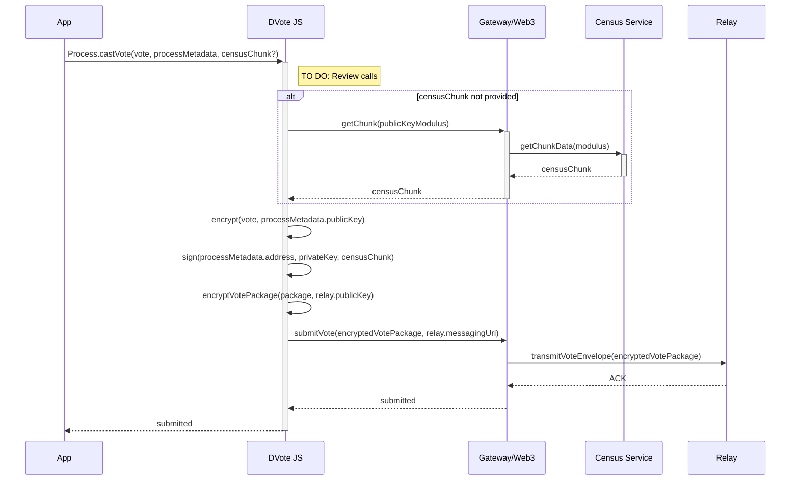

**Used schemas:**

- [Process Metadata](/architecture/components/processes?id=process-metadata-json)
<!-- - [getChunk](/architecture/components/census-service?id=getchunk) -->
- [Vote Package - Ring Signature](/architecture/components/relay?id=vote-package-ring-signature)

**Notes:**

- The `publicKeyModulus` allows to segment the whole census into `N` polling stations. Every public key is assigned to exactly one, depending on the modulus that yields a division by `processMetadata.census.modulusSize`.

### Registering a Vote Batch

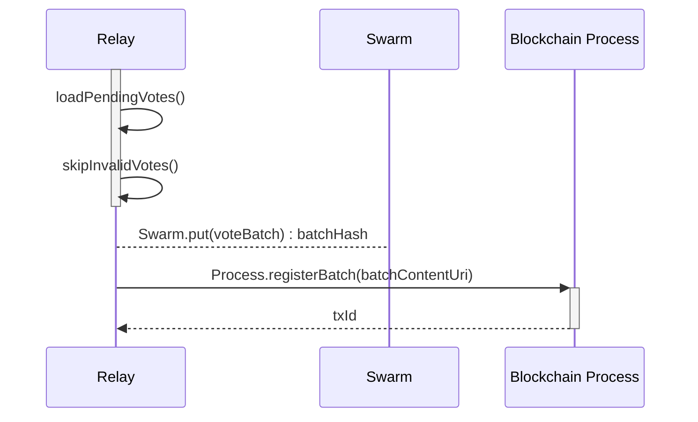

**Used schemas:**

- [Vote Batch](/architecture/components/relay?id=vote-batch)

## After voting

### Checking a submitted vote

The sequence diagram applies to both **ZK Snarks** and **LRS** Vote Packages. `nullifierOrSignature` will be interpreted according to the process' `type` on its metadata.

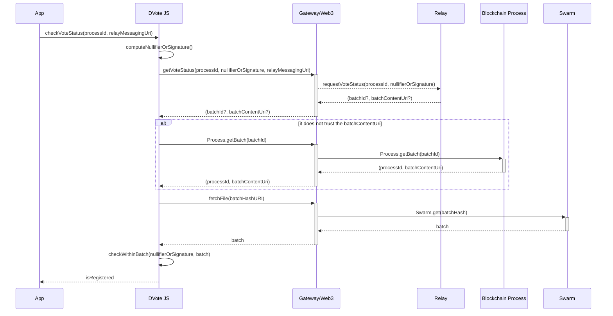
**Used schemas:**

- [Vote Batch](/architecture/components/relay?id=vote-batch)

**Notes:**

- `nullifierOrSignature` is expected to contain a nullifier when the process `type` is `zk-snarks`
- `nullifierOrSignature` is expected to contain a ring signature when the process `type` is `lrs`

### Closing a Voting Process

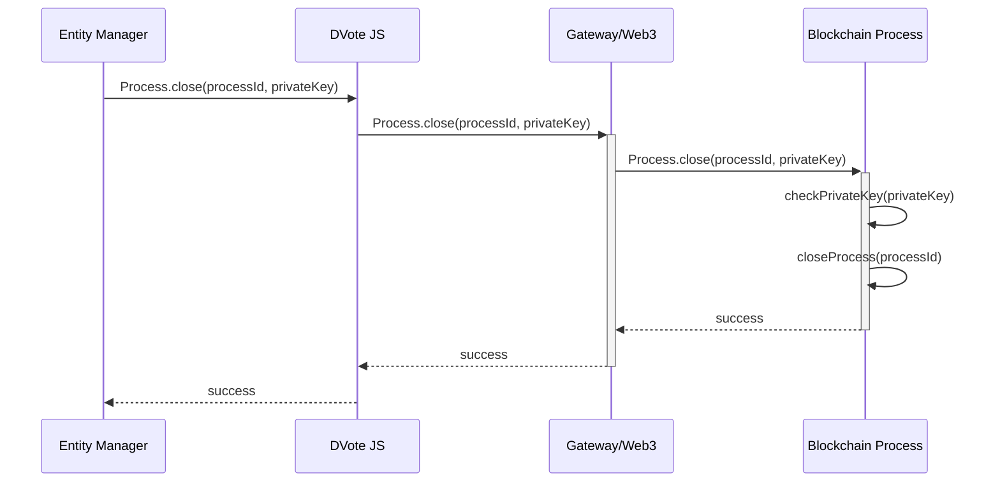

### Vote Scrutiny

Anyone with internet access can compute the scrutiny of a given processId. However, the vote batch data needs to be pinned online for a certain period of time.

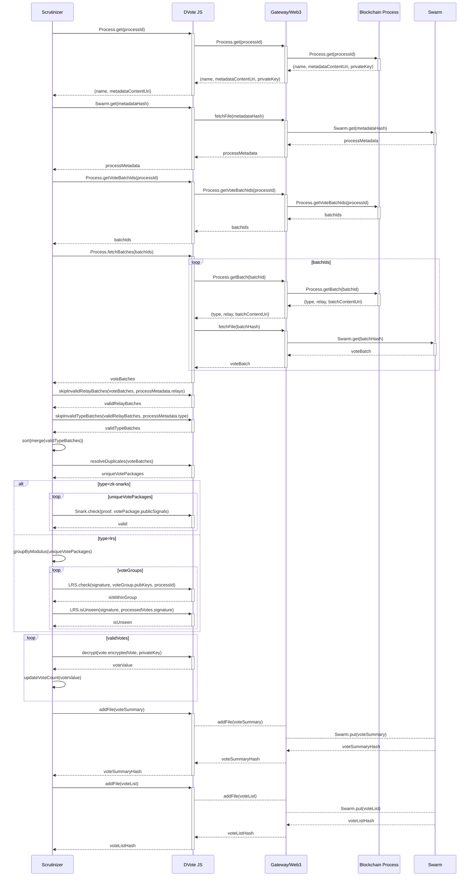

**Used schemas:**

- [Process Metadata](/architecture/components/processes?id=process-metadata-json)
- [Vote Package - ZK Snarks](/architecture/components/relay?id=vote-package-zk-snarks)
- [Vote Package - Ring Signature](/architecture/components/relay?id=vote-package-ring-signature)
- [Vote Batch](/architecture/components/relay?id=vote-batch)
- [Vote Summary](/architecture/components/relay?id=vote-summary)
- [Vote List](/architecture/components/relay?id=vote-list)
