# Sequence diagrams

Traditional systems like API's present simple scenarios, in which a centralized service defined how data should be encoded.

However, decentralized ecosystems like a distributed vote system need much stronger work on defining every interaction between any two peers on the network.

- [Sequence diagrams](#sequence-diagrams)
  - [Prior to voting](#prior-to-voting)
    - [Set Entity metadata](#set-entity-metadata)
    - [Entity subscription](#entity-subscription)
      - [Initial Gateway discovery](#initial-gateway-discovery)
      - [Listing boot entities](#listing-boot-entities)
    - [Custom requests to an Entity](#custom-requests-to-an-entity)
      - [Sign up](#sign-up)
      - [Submit a picture](#submit-a-picture)
      - [Make a payment](#make-a-payment)
      - [Resolve a captcha](#resolve-a-captcha)
      - [External Entity to make use of Census Service](#external-entity-to-make-use-of-census-service)
      - [Adding users to a census](#adding-users-to-a-census)
  - [Voting](#voting)
    - [Voting process creation](#voting-process-creation)
    - [Voting process retrieval](#voting-process-retrieval)
    - [Check census inclusion](#check-census-inclusion)
    - [Casting a vote with ZK Snarks](#casting-a-vote-with-zk-snarks)
    - [Casting a vote with Linkable Ring Signatures](#casting-a-vote-with-linkable-ring-signatures)
    - [Registering a Vote Batch](#registering-a-vote-batch)
  - [After voting](#after-voting)
    - [Checking a submitted vote](#checking-a-submitted-vote)
    - [Closing a Voting Process](#closing-a-voting-process)
    - [Vote Scrutiny](#vote-scrutiny)

---

## Prior to voting

--------------------------------------------------------------------------------

### Set Entity metadata
An Entity starts existing at the moment it has certain metadata stored on the [EntityResolver](/architecture/components/entity?id=entityresolver) smart contract. 

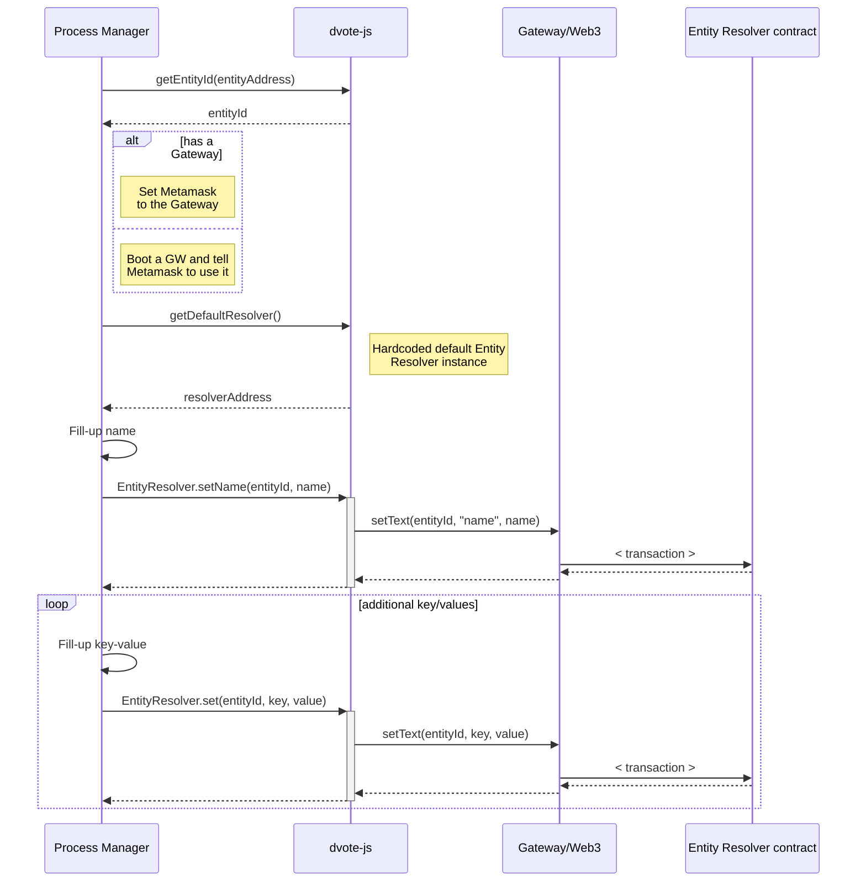

**Used schemas:**

- [Entity metadata](/architecture/components/entity.md)

### Entity subscription

#### Initial Gateway discovery

The app wants to get initial connectivity with the available gateways.

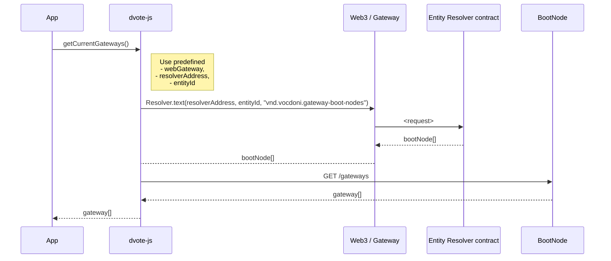

#### Listing boot entities

A user wants to visualize a list of entities so he/she can eventually subscribe to one.

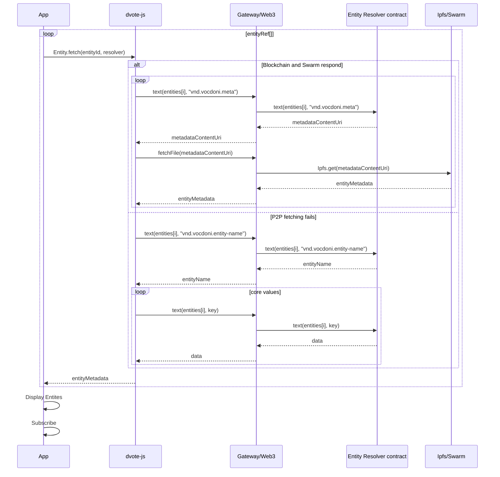

**Used schemas:**

- [Entity metadata](/architecture/components/entity.md)

**Related:**

- [Gateway Boot Nodes](/architecture/components/entity?id=gateway-boot-nodes)

**Notes:**

- In the case of React Native apps, DVote JS will need to run on the [Web Runtime component](/architecture/general?id=web-runtime-for-react-native)

### Custom requests to an Entity

An Entity may have specific requirements on what users have to accomplish in order to join a be part of its user registry.

Some may require filling a simple form. Some others may ask to log in from an existing HTTP service. Uploading ID pictures, selfies or even making payments need custom implementations that decide that a user must eventually be added to a census.

Below are some examples of a user selecting an action from the entityMetadata > actions available.

#### Sign up

The user fills a form with personal data and submits it to the entity.

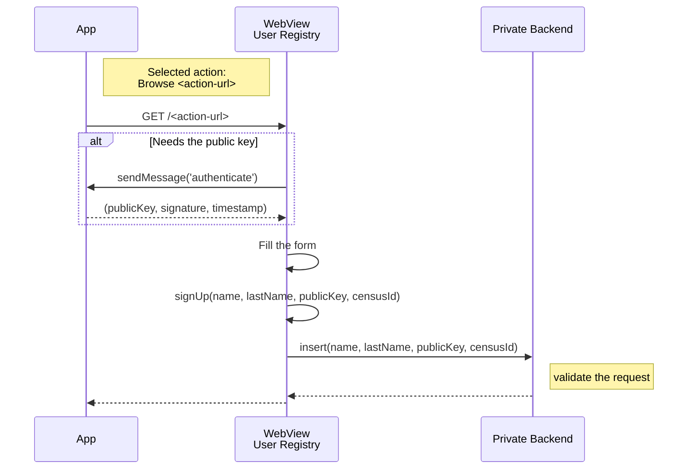

**Used schemas:**

- [Entity metadata](/architecture/components/entity?id=entity-metadata)

**Notes:**

- `ACTION-URL` is defined on the metadata of the contract. It is expected to be a full URL that can be navigated through a traditional HTTP/S request.

#### Submit a picture

#### Make a payment

#### Resolve a captcha

#### External Entity to make use of Census Service

- `Census Service Entity` and `External Entity` can be the same entity
- A request to the `Census Service` must include the <entityReference> in the payload for the `Census Service Entity` to know where i can find if the `censusId` or the `entityId` are valid ones.

>Prefix `ex` and `cs` on `entityId` and `resolverAddress` are used to represent `External Entity` and `Census Service` respectively.

```mermaid

sequenceDiagram
    participant ENTCS as Entity's Census Service
    participant EXENT as External Entity
    participant EMGR as Entity Manager
    participant DV as dvote-js
    participant GW as Gateway/Web3/Swarm
    participant ER as Entity Resolver
    participant CSRV as Census Service
    participant SW as Swarm

    Note right of ENTCS: Agree on using <br/>the Census Service<br/>from an external <br/>channel
    ENTCS-->EXENT: 
    ENTCS->>EMGR: Fill External Entity resolver and externalEntityId
    EMGR->>DV: addCensusServiceSourceEntity(csEntityResolver, csEntityId, exResolver,exEntityId)
    DV->>DV: getEntityReference(exResolverAddress, exEntityId)
    DV->>GW: setListText(csEntityId, "vnd.vocdoni.census-service-source-entities", index, &#60;exEntityReference#62;)
    GW->>ER: #60;transaction#62;

    loop to all census ids
        EXENT->>EMGR:Fill censusId
        EMGR->>DV:addCensusId(exResolverAddress, exEntityId, censusId)
        DV->>GW:setListText(exEntityId, "vnd.vocdoni.census-ids", index,  censusId)
        GW->>ER:#60;transaction#62;
    end

    loop to all keys
        EXENT->>EMGR:Fill the public key that will publish to the Census Service
        EMGR->>DV:addCensusManagerKey(exResolverAddress, exEntityId, publicKey)
        DV->>GW:setListText(exEntityId, "vnd.vocdoni.census-manager-keys", index,  publicKey)
        GW->>ER:#60;transaction#62;
    end

    Note left of CSRV: Eventually, the <br/>Census Service <br/>refreshes its config

    CSRV->>ER: List(csEntityId, "vnd.vocdoni.census-service-source-entities")
    ER-->>CSRV:[#60;entityReference#62;]

    loop source entities
        CSRV->>ER: List(exEntityId, "vnd.vocdoni.census-ids")
        ER-->>CSRV:[#60;census-id#62;, ...]
        CSRV->>ER: List(exEntityId, "vnd.vocdoni.census-manager-keys")
        ER-->>CSRV:[#60;publicKey#62;, ...]
    end

    Note right of EXENT: Finally, an Entity<br/>requests a census<br/>operation
    
    EXENT->>GW: addClaimBulk(censusId, payload)
    GW->>SW: #60;request data#62;
    SW-->>CSRV: #60;request data#62;
    # CSRV->>CSRV: Get its own resolver and entityId
    CSRV->>CSRV: Check exEntityId is within "census-service-source-entities"
    CSRV->>CSRV: Check the censusId belongs to "census-ids"
    CSRV->>CSRV: Check the signer belongs to "census-manager-keys"
    CSRV->>CSRV: addClaimBulk(censusId, payload)

```

**Used schemas:**
- [Entity reference](/architecture/components/census-service?id=entity-reference)

#### Adding users to a census

Depending on the activity of users, an **Entity** may decide to add public keys to one or more census.

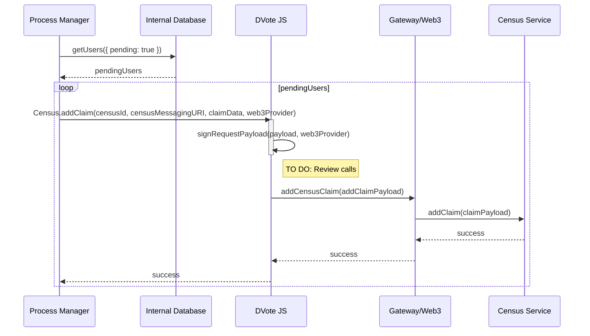

**Used schemas:**

- [Census Service - addClaim](/architecture/components/census-service?id=census-service-addclaim)
- [Census Service - addClaimBulk](/architecture/components/census-service?id=census-service-addclaimbulk)

---

## Voting

### Voting process creation

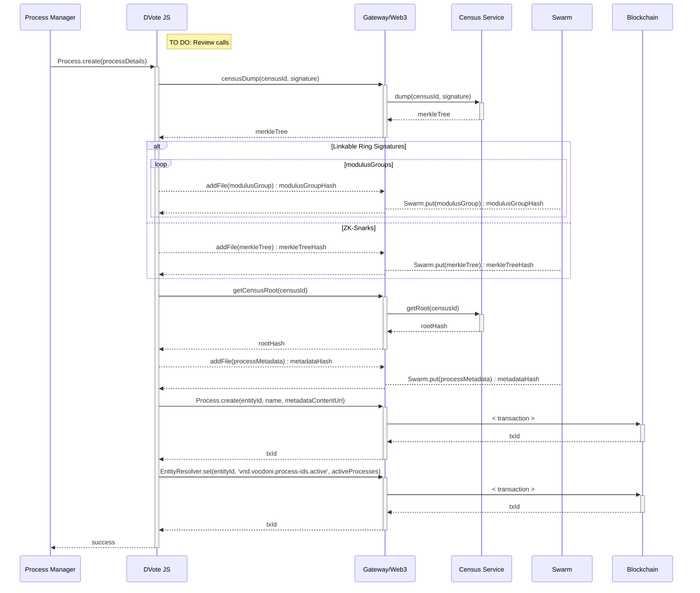

**Used schemas:**

- [Process Metadata](/architecture/components/process?id=process-metadata-json)
- [Modulus group list](/architecture/components/census-service?id=modulus-group-list)
- [Census Service - addClaimBulk](/architecture/components/census-service?id=census-service-addclaimbulk)
- [Census Service - getRoot](/architecture/components/census-service?id=census-service-getroot)
- [Census Service - setParams](/architecture/components/census-service?id=census-service-setparams)
- [Census Service - dump](/architecture/components/census-service?id=census-service-dump)

### Voting process retrieval

A user wants to retrieve the voting processes of a given Entity

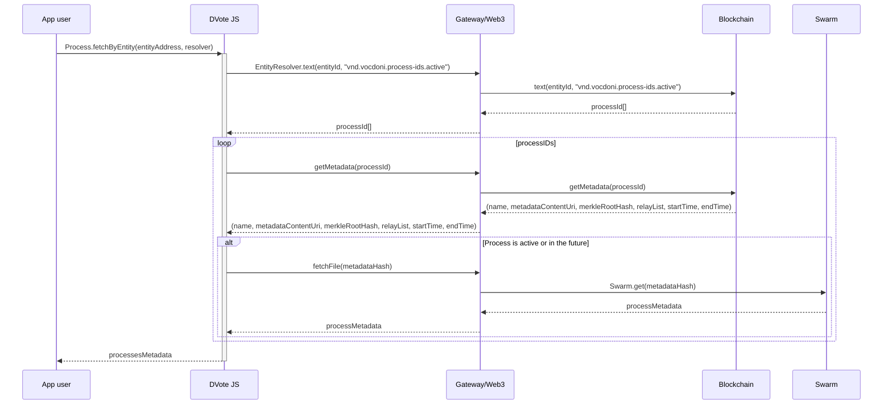

**Used schemas:**

- [Process Metadata](/architecture/components/process?id=process-metadata-json)

### Check census inclusion

A user wants to know whether he/she belongs in the census of a process or not.

The request can be sent through HTTP/PSS/PubSub. The response may be fetched by subscribing to a topic on PSS/PubSub.

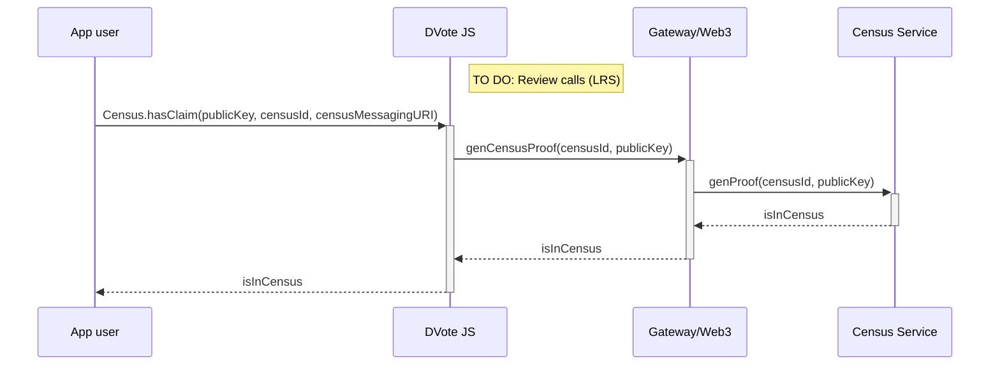

**Used schemas:**

- [Census Service - generateProof](/architecture/components/census-service?id=census-service-generateproof)

**Notes:**

- `generateProof` may be replaced with a call to `hasClaim`, for efficiency
- The `censusId` and `censusMessagingURI` should have been fetched from the [Process Metadata](/architecture/components/process)

### Casting a vote with ZK Snarks

Requests can be sent through HTTP/PSS/PubSub. Responses may be fetched by subscribing to a topic on PSS/PubSub.

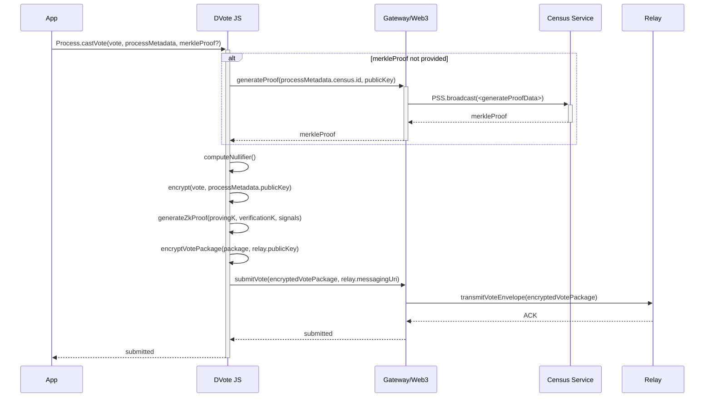

**Used schemas:**

- [Process Metadata](/architecture/components/process?id=process-metadata-json)
- [Census Service - generateProof](/architecture/components/census-service?id=census-service-generateproof)
- [Vote Package - ZK Snarks](/architecture/components/relay?id=vote-package-zk-snarks)

**Notes:**

- The Merkle Proof could be retrieved and stored beforehand

### Casting a vote with Linkable Ring Signatures

Requests can be sent through HTTP/PSS/PubSub. Responses may be fetched by subscribing to a topic on PSS/PubSub.

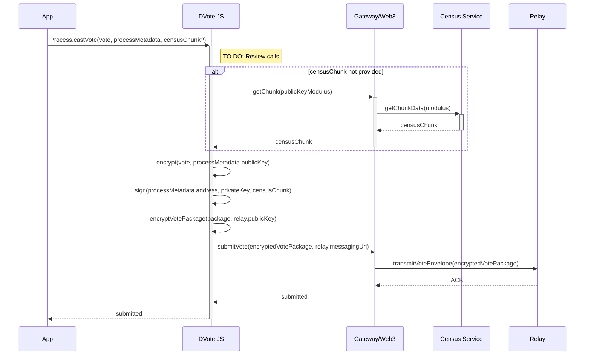

**Used schemas:**

- [Process Metadata](/architecture/components/process?id=process-metadata-json)
<!-- - [getChunk](/architecture/components/census-service?id=census-service-getchunk) -->
- [Vote Package - Ring Signature](/architecture/components/relay?id=vote-package-ring-signature)

**Notes:**

- The `publicKeyModulus` allows to segment the whole census into `N` polling stations. Every public key is assigned to exactly one, depending on the modulus that yields a division by `processMetadata.census.modulusSize`.

### Registering a Vote Batch

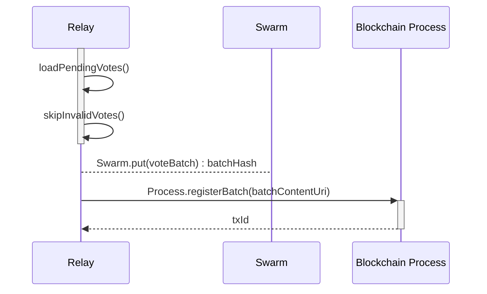

**Used schemas:**

- [Vote Batch](/architecture/components/relay?id=vote-batch)

## After voting

### Checking a submitted vote

The sequence diagram applies to both **ZK Snarks** and **LRS** Vote Packages. `nullifierOrSignature` will be interpreted according to the process' `type` on its metadata.

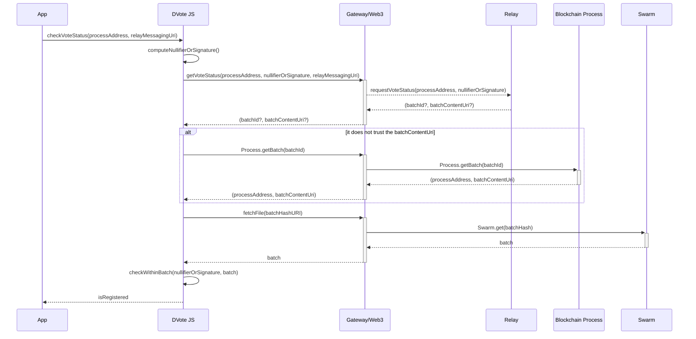
**Used schemas:**

- [Vote Batch](/architecture/components/relay?id=vote-batch)

**Notes:**

- `nullifierOrSignature` is expected to contain a nullifier when the process `type` is `zk-snarks`
- `nullifierOrSignature` is expected to contain a ring signature when the process `type` is `lrs`

### Closing a Voting Process

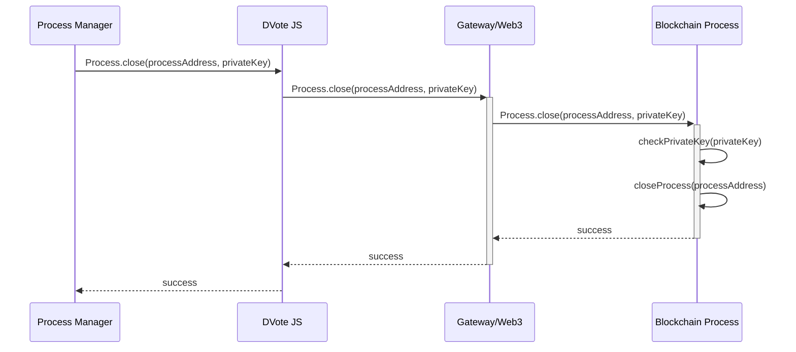

### Vote Scrutiny

Anyone with internet access can compute the scrutiny of a given processAddress. However, the vote batch data needs to be pinned online for a certain period of time.

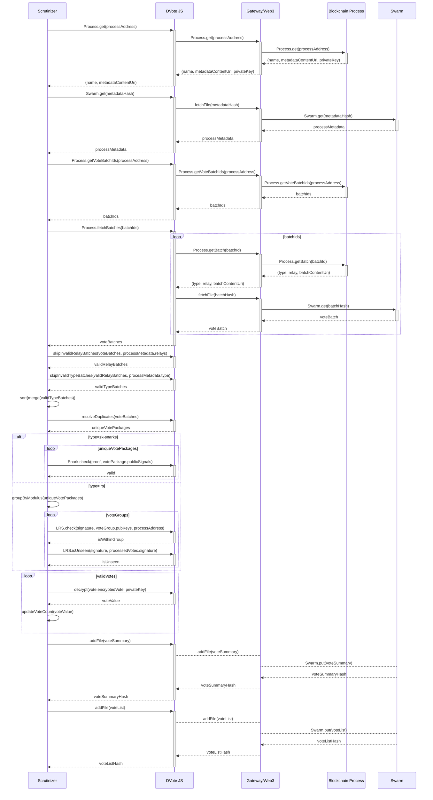

**Used schemas:**

- [Process Metadata](/architecture/components/process?id=process-metadata-json)
- [Vote Package - ZK Snarks](/architecture/components/relay?id=vote-package-zk-snarks)
- [Vote Package - Ring Signature](/architecture/components/relay?id=vote-package-ring-signature)
- [Vote Batch](/architecture/components/relay?id=vote-batch)
- [Vote Summary](/architecture/components/relay?id=vote-summary)
- [Vote List](/architecture/components/relay?id=vote-list)
