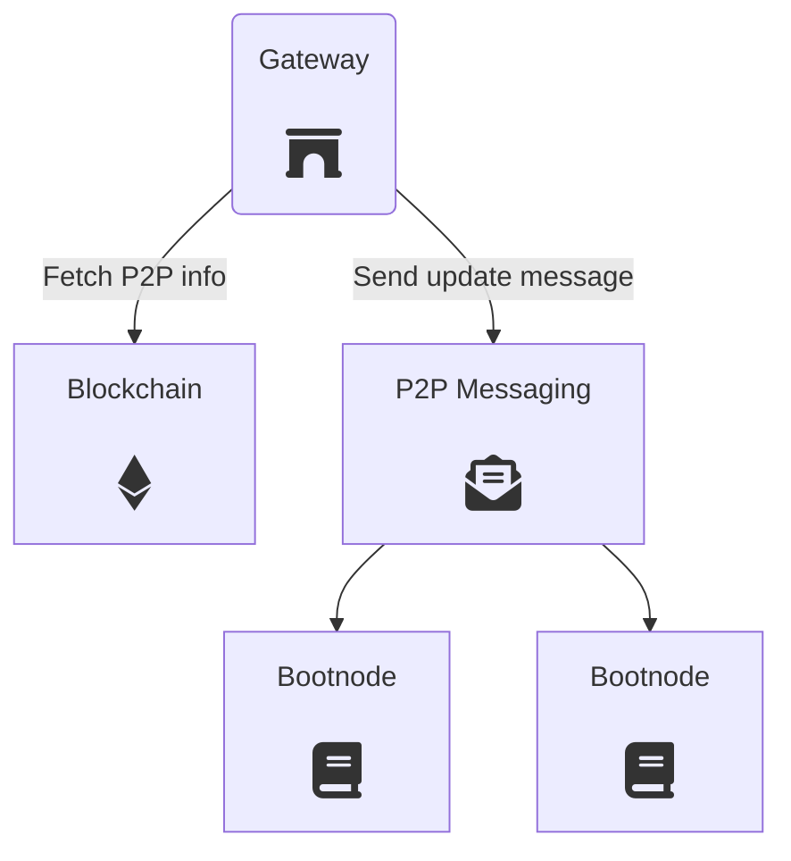

# Gateway

Gateways provide redundant entry points to the P2P networks. They allow clients to reach decentralized services from a simple HTTP/WebSocket endpoint.

The following diagram shows the gateway's overall architecture and components.

<div style="padding: 20px;">
	
</div>

### Discovery mechanism

A Gateway is a neutral piece of the ecosystem which can be contributed by any third party. Any kind of organization might run Gateway instances to improve network access and increase resilence against potential attacks.

To this end, Gateways use an automatic discovery system through a P2P messaging network so that Bootnodes know of their existence. Clients make requests to Bootnodes and fetch a fresh list of working Gateways.


---

## API definition

A Gateway exposes APIs that enable accesing peer-to-peer networks. The currently supported API schemes are the following:

+ `Info API`: details about the gateway
+ `Census API` access to the Census Service
+ `Vote API` access to the Vochain methods for voting
+ `Results API` access to the Vochain methods for computing election results
+ `Indexer API` access to the Indexer methods for analyzing the Vochain
+ `File API` access to P2P file storage methods

These APIs can be used by web and mobile clients using an HTTP/WS endpoint.

The API methods below follow the [JSON API](/architecture/protocol/json-api) specifications.

## Info API

### Get Gateway Info
Get an overview wabout the own gateway: available APIs, health and whether private methods are available or not.

```json
{
  "id": "req-2345679",
  "request": {
    "method": "getInfo",
    "timestamp": 1556110671 // optional, not required
  }
 }
```

```json
{
  "id": "req-2345679",
  "response": {
	"apiList": ["census","file","vote", "results"],
    "health": 65,  // A number between 1 and 100 that indicates the health of the gateway (resource consumption, network status, etc.)
    "ok": true,
    "request": "req-2345679", // Request ID here as well, to check its integrity
    "timestamp": 1556110672
  },
  "signature": "hexString"
}
```

## Census API

The Census API methods can be found on the [Census Service section](/architecture/services/census-service?id=json-api). 

## Vote API

### Submit Raw Vochain Transaction

Send a [Vote Envelope](/architecture/smart-contracts/process?id=vote-envelope) to the mempool of the [Vochain](/architecture/services/vochain).

```json
{
  "id": "req-2345679",
  "request": {
    "method": "submitRawTx",
    "payload": "base64string", // A raw transaction (protobuf encoded) payload in base64
    "timestamp": 1556110671
  }
}
```

```json
{
  "id": "req-2345679",
  "response": {
    "ok": true,
    "request": "req-2345679",
    "timestamp": 1556110672
  },
  "signature": "hexString"
}
```


### Submit Envelope

Send a [Vote Envelope](/architecture/smart-contracts/process?id=vote-envelope) to the mempool of the [Vochain](/architecture/services/vochain).

```json
{
  "id": "req-2345679",
  "request": {
    "method": "submitEnvelope",
    "payload": "base64string", // Vote envelope (protobuf encoded) payload in base64
    "signature": "hexString", // signature of the payload if the process requires it
    "timestamp": 1556110671
  }
}
```

```json
{
  "id": "req-2345679",
  "response": {
    "ok": true,
    "request": "req-2345679",
    "timestamp": 1556110672
  },
  "signature": "hexString"
}
```

**Used in:**
- [Casting a vote](https://docs.vocdoni.io/#/architecture/sequence-diagrams?id=casting-a-vote)

### Get Envelope Status

Check the status of an already submited [Vote Envelope](/architecture/smart-contracts/process?id=vote-envelope). The envelope is identified by the voter's nullifier.

```json
{
  "id": "req-2345679",
  "request": {
    "method": "getEnvelopeStatus",
    "processId": "hexString",
    "nullifier": "hexString",
    "timestamp": 1556110671
  }
}
```

```json
{
  "id": "req-2345679",
  "response": {
    "registered": true,  // Whether the vote is registered or not
    "blockTimestamp": 1556110672, // only if registered == true
    "height": 1234, // only if registered == true
    "request": "req-2345679",
    "timestamp": 1556110672
  },
  "signature": "hexString"
}
```
**Used in:**
- [Checking a Vote Envelope](https://docs.vocdoni.io/#/architecture/sequence-diagrams?id=checking-a-vote-envelope)

### Get Envelope Height

Get the number of envelopes registered on a given process.

```json
{
  "id": "req-2345679",
  "request": {
    "method": "getEnvelopeHeight",
    "processId": "hexString",
    "timestamp": 1556110671
  }
}
```

```json
{
  "id": "req-2345679",
  "response": {
    "ok": true,
    "height": 1234, // Number of envelopes for the process ID
    "request": "req-2345679",
    "timestamp": 1556110672
  },
  "signature": "hexString"
}
```

### Get Block Height

Get the current block number on the [Vochain](/architecture/services/vochain). 

```json
{
  "id": "req-12345678",
  "request": {
    "method": "getBlockHeight",
    "timestamp": 1556110671
  }
}
```

```json
{
  "id": "req-2345679",
  "response": {
    "blockTimestamp": 1556110672,
    "ok": true,
    "height": 12345,
    "request": "req-2345679",
    "timestamp": 1556110672
  },
  "signature": "hexString"
}
```

### Get Process Keys

Get the available encryption keys for the given process ID.

If the process has encrypted votes and it is on-going, `encryptionPubkeys` and `commitmentKeys` should be available. Once the process has ended, `encryptionPrivKeys` and `revealKeys` will be also be available.

[Vote Package](/architecture/smart-contracts/process?id=vote-package) encryption and decryption it is expected to use these keys following the order of their indexes. Smaller indexes are used first and it's important to note that indexes might not be consecutive.

```json
{
  "id": "req-2345679",
  "request": {
    "method": "getProcessKeys",
    "processId": "hexString",
    "timestamp": 1556110671
  }
}
```

```json
{
  "id": "req-2345679",
  "response": {
    "encryptionPubKeys": [ {"idx": 1, "key": "1234567890..."}, {"idx": 6, "key": "2345678901..."}, ... ], 
    "commitmentKeys": [ {"idx": 1, "key": "1234567890..."}, {"idx": 6, "key": "2345678901..."}, ... ],
    "encryptionPrivKeys": [ {"idx": 1, "key": "1234567890..."}, {"idx": 6, "key": "2345678901..."}, ... ],
    "revealKeys": [ {"idx": 1, "key": "1234567890..."}, {"idx": 6, "key": "2345678901..."}, ... ],
    "request": "req-2345679",
    "timestamp": 1556110672
  },
  "signature": "hexString"
}
```

**Used in:**
- [Checking a Vote Envelope](https://docs.vocdoni.io/#/architecture/sequence-diagrams?id=checking-a-vote-envelope)


### Get Block Status

Get details about the current block and the average block time for the last 1m, 10m, 1h, 6h and 24h.

```json
{
  "id": "req-12345678",
  "request": {
    "method": "getBlockStatus",
    "timestamp": 1556110671
  }
}
```

```json
{
  "id": "req-2345679",
  "response": {
    "blockTime": [10000, 12000, 12200, 12500, 12600], // In milliseconds, average for 1 minute, 10m, 1h, 6h, 24h. If no average yet, values are 0
    "blockTimestamp": 1556110672, // in seconds
    "height": 12345,
    "ok": true,
    "request": "req-2345679",
    "timestamp": 1556110672
  },
  "signature": "hexString"
}
```

## Results API

### Get Process List

Get a list of processes for a specific entity or namespace on the [Vochain](/architecture/services/vochain). There is a hardcoded maximum size of 64 per page. 

The results are ordered from process creation date. So processes created recently will appear first on the list.

The following query filters can be used:

+ `entityId` can be used for retreiving the list of processes from a specific entity organization.
+ `from` can be used to seek specific positions and start from them. So if a call without `from` (`from = 0`) returns 64 values, a second call with `from = 64` will get the next 64 values.
+ `namespace` can be used for querying only a specific namespace. The namespace zero (default value) means all existing namespaces.
+ `searchTerm` can be used for querying a specific process ID or partial ID. 
+ `status` can be used for querying processes on a specific status (READY, PAUSED, CANCELED, ENDED or RESULTS).
+ `withResults` bool filter can be used for quering only those processes that already have results (open process or finished with revealed keys).

```json
{
  "request": {
    "entityId": "hexString",
    "from": 8,
    "listSize": 10,
    "method": "getProcessList",
    "namespace": 0,
    "searchTerm": "hexString",
    "status": "",
    "timestamp": 1620066207,
    "withResults": false
  },
  "id": "847",
}
```

```json
{
  "response": {
    "ok": true,
    "processList": [
      "hexString",
      "hexString",
      "hexString",
      "hexString",
    ],
    "request": "847",
    "size": 10,
    "timestamp": 1620066207
  },
  "id": "847",
  "signature": "hexString"
}
```

### Get Process Info

Get the full information from an existing process.


```json
{
  "request": {
    "method": "getProcessInfo",
    "processId": "hexString",
    "timestamp": 1620060163
  },
  "id": "410",
}
```

```json
{
  "response": {
    "ok": true,
    "process": {
      "censusOrigin": 11,
      "censusRoot": "hexString",
      "censusURI": "",
      "creationTime": "2021-05-03T11:38:03-04:00",
      "endBlock": 103991,
      "entityId": "hexString",
      "envelopeType": {
        "encryptedVotes": true
      },
      "finalResults": false,
      "haveResults": false,
      "namespace": 2,
      "processId": "hexString",
      "processMode": {
        "autoStart": true
      },
      "questionIndex": 0,
      "sourceBlockHeight": 812000,
      "startBlock": 26464,
      "status": 1,
      "voteOptions": {
        "costExponent": 10000,
        "maxCount": 1,
        "maxValue": 2,
        "maxVoteOverwrites": 1
      }
    },
    "request": "410",
    "timestamp": 1620060163
  },
  "id": "410",
  "signature": "hexString"
}
```


### Get Process Count

Returns the number of processes registered on the [Vochain](/architecture/services/vochain).

The following query filters can be used:

+ `entityId` can be used for retreiving the number of processes registered by a specific entity organization.

```json
{
  "id": "req-2345679",
  "request": {
    "entityId": "hexString",
    "method": "getProcessCount",
    "timestamp": 1556110671
  }
}
```

```json
{
  "id": "req-2345679",
  "response": {
    "request": "req-2345679",
    "size": 198,
    "timestamp": 1556110672
  },
  "signature": "hexString"
}
```


### Get Process Results

Get the results of the given processId, as indexed by the scrutinizer. If the process doesn't have encrypted votes but it has already started, then the gateway returns the **partial results**. The results can only be considered final if `final` is true.

The results of an election are represented in [the following format](/architecture/smart-contracts/process?id=results).

```json
{
  "request": {
    "method": "getResults",
    "processId": "hexString",
    "timestamp": 1620076071
  },
  "id": "235",
}
```

```json
{
  "response": {
    "final": false,
    "height": 4,
    "ok": true,
    "request": "235",
    "results": [
      [
        "0",
        "2",
        "2",
        "0"
      ],
      [
        "0",
        "0",
        "0",
        "4"
      ]
    ],
    "state": "READY",
    "timestamp": 1620076071,
    "type": "poll open single",
    "weight": "4"
  },
  "id": "235",
  "signature": "hexString"
}
```


### Get Results Weight

The results weight is the total amount of voting power that have been cast for a processId. 
For a non-weighted process the weight will be equal to the number of votes.
This information can be queried in real-time on encrypted elections too.

```json
{
  "request": {
    "method": "getResultsWeight",
    "processId": "hexString",
    "timestamp": 1620076071
  },
  "id": "236",
}
```

```json
{
  "response": {
    "weight": "4"
  },
  "id": "236",
  "signature": "hexString"
}
```


### Get Entity List

Get a list of entities that created at least 1 process on the [Vochain](/architecture/services/vochain). 

The `from` field can be used to seek specific positions and start from them. So if a call without `from` (`from = 0`) returns 64 values, a second call with `from = 64` will get the next 64 values.

The following query filters can be used:

+ `searchTerm` can be used for querying a specific entity ID or partial ID. 


```json
{
  "request": {
    "from": 0,
    "listSize": 6,
    "method": "getEntityList",
    "searchTerm": "hexString",
    "timestamp": 1620075711
  },
  "id": "511",
}
```

```json
{
  "response": {
    "entityIds": [
      "hexString",
      "hexString",
      "hexString",
      "hexString",
      "hexString",
      "hexString"
    ],
    "ok": true,
    "request": "511",
    "timestamp": 1620075711
  },
  "id": "511",
  "signature": "hexString"
}
```

### Get Entity Count

Returns the number of entities registered on the [Vochain](/architecture/services/vochain) (those that have created at least one process).

```json
{
  "id": "req-2345679",
  "request": {
    "method": "getEntityCount",
    "timestamp": 1556110671
  }
}
```

```json
{
  "id": "req-2345679",
  "response": {
    "request": "req-2345679",
    "size": 14,
    "timestamp": 1556110672
  },
  "signature": "hexString"
}
```

### Get Envelope

Get the content of an existing [Vote Envelope](/architecture/smart-contracts/process?id=vote-envelope). The envelope is identified by the nullifier. `height` and `txIndex` refer to the block height and the index on that block, respectively, of the transaction containing this vote envelope. These fields can be used with [Get Tx](/architecture/services/gateway?id=get-tx) to fetch this transaction.

```json
{
  "request": {
    "method": "getEnvelope",
    "nullifier": "hexString",
    "timestamp": 1620074081
  },
  "id": "81",
}
```

```json
{
  "response": {
    "envelope": {
      "encryption_key_indexes": null,
      "meta": {
        "height": 357,
        "nullifier": "hexString",
        "process_id": "hexString",
        "tx_hash": "hexString",
        "tx_index": 0
      },
      "nonce": "hexString",
      "signature": "hexString",
      "vote_package": "base64String",
      "weight": "1"
    },
    "ok": true,
    "registered": true,
    "request": "81",
    "timestamp": 1620225283
  },
  "id": "81",
  "signature": "hexString"
}
```

## Indexer API

### Get Stats

Get general information & statistics about the current [Vochain](/architecture/services/vochain) status. 

```json
{
  "request": {
    "method": "getStats",
    "timestamp": 1620059835
  },
  "id": "887",
}
```

```json
{
  "response": {
    "ok": true,
    "request": "887",
    "stats": {
      "block_height": 26680,
      "block_time": [
        10000,
        11000,
        10000,
        10000,
        10000
      ],
      "block_time_stamp": 1620059824,
      "chain_id": "vocdoni-development-39",
      "entity_count": 9,
      "envelope_count": 602,
      "genesis_time_stamp": "2021-04-30T11:43:28.668436552Z",
      "process_count": 19,
      "syncing": false,
      "validator_count": 4
    },
    "timestamp": 1620059835
  },
  "id": "887",
  "signature": "hexString"
}

```


### Get Envelope List
Get a list of nullifiers for votes registered on a given process ID (at most, 64 per request).

The `fromId` field works the same as in [Get Process List](#get-process-list).

```json
{
  "request": {
    "from": 1,
    "listSize": 3,
    "method": "getEnvelopeList",
    "processId": "hexString",
    "timestamp": 1620067128
  },
  "id": "356",
}
```

```json
{
  "response": {
    "envelopes": [
      {
        "height": 357,
        "nullifier": "hexString",
        "process_id": "hexString",
        "tx_hash": "hexString",
        "tx_index": 0
      },
      {
        "height": 359,
        "nullifier": "hexString",
        "process_id": "hexString",
        "tx_hash": "hexString",
        "tx_index": 0
      },
      {
        "height": 306,
        "nullifier": "hexString",
        "process_id": "hexString",
        "tx_hash": "hexString",
        "tx_index": 0
      }
    ],
    "ok": true,
    "request": "356",
    "timestamp": 1620222421
  },
  "id": "356",
  "signature": "hexString"
}
```


### Get Block

Get the metadata for a single block on the [Vochain](/architecture/services/vochain) by its height. `num_txs` contains the number of transactions contained in this block. In order to access these transactions (the contents of the block), use [Get Tx List for Block](/architecture/services/gateway?id=get-tx-list-for-block).

```json
{
  "request": {
    "blockHeight": 24061,
    "method": "getBlock",
    "timestamp": 1620661000
  },
  "id": "561",
}
```

```json
{
  "response": {
    "block": {
      "hash": "hexString",
      "last_block_hash": "hexString",
      "num_txs": 0,
      "proposer_address": "hexString",
      "timestamp": "2021-05-10T15:37:50.477536778Z"
    },
    "ok": true,
    "request": "561",
    "timestamp": 1620661094
  },
  "id": "561",
  "signature": "hexString"
}
```

### Get Block By Hash

Get the metadata for a single block on the [Vochain](/architecture/services/vochain) by its hash. `num_txs` contains the number of transactions contained in this block. In order to access these transactions (the contents of the block), use [Get Tx List for Block](/architecture/services/gateway?id=get-tx-list-for-block).

```json
{
  "request": {
    "hash": "hexString",
    "method": "getBlockByHash",
    "timestamp": 1620661000
  },
  "id": "561",
}
```

```json
{
  "response": {
    "block": {
      "height": 24061,
      "last_block_hash": "hexString",
      "num_txs": 0,
      "proposer_address": "hexString",
      "timestamp": "2021-05-10T15:37:50.477536778Z"
    },
    "ok": true,
    "request": "561",
    "timestamp": 1620661094
  },
  "id": "561",
  "signature": "hexString"
}
```

### Get Block List

Get a list of confirmed blocks on the [Vochain](/architecture/services/vochain) (at most, 64 per request).

The `fromId` field works the same as in [Get Process List](#get-process-list).

```json
{
  "request": {
    "from": 24031,
    "listSize": 2,
    "method": "getBlockList",
    "timestamp": 1620660800
  },
  "id": "847",
}
```

```json
{
  "response": {
    "blockList": [
      {
        "hash": "hexString",
        "height": 24031,
        "last_block_hash": "hexString",
        "num_txs": 0,
        "proposer_address": "hexString",
        "timestamp": "2021-05-10T15:32:40.122987363Z"
      },
      {
        "hash": "hexString",
        "height": 24032,
        "last_block_hash": "hexString",
        "num_txs": 1,
        "proposer_address": "hexString",
        "timestamp": "2021-05-10T15:32:50.540679299Z"
      },

    ],
    "ok": true,
    "request": "847",
    "timestamp": 1620660882
  },
  "id": "847",
  "signature": "hexString"
}
```

### Get Tx

Get a single tx from the [Vochain](/architecture/services/vochain). `blockHeight` is the block containing a transaction and `txIndex` in the transaction's index on that block. 

```json
{
  "request": {
    "blockHeight": 27522,
    "method": "getTx",
    "timestamp": 1620068626,
    "txIndex": 2,
  },
  "id": "632",
}
```

```json
{
  "response": {
    "ok": true,
    "request": "632",
    "timestamp": 1620068626,
    "tx": {
      "Hash": "hexString",
      "Index": 2,
      "Signature": "hexString",
      "Tx": "base64String",
    }
  },
  "id": "632",
  "signature": "hexString"
}
```

### Get Validator List

Get the list of all addresses currently validating blocks on the [Vochain](/architecture/services/vochain). 

```json
{
  "request": {
    "method": "getValidatorList",
    "timestamp": 1620059997
  },
  "id": "199",
}
```

```json
{
  "response": {
    "ok": true,
    "request": "199",
    "timestamp": 1620059998,
    "validatorlist": [
      {
        "address": "base64string",
        "power": 10,
        "pubKey": "base64string"
      },
      {
        "address": "base64string",
        "power": 10,
        "pubKey": "base64string"
      },
      {
        "address": "base64string",
        "power": 10,
        "pubKey": "base64string"
      },
      {
        "address": "base64string",
        "power": 10,
        "pubKey": "base64string"
      }
    ]
  },
  "id": "199",
  "signature": "hexString"
}
```


### Get Tx List For Block

Get a list of transactions contained in the given block (at most, 64 per request).

The `fromId` field works the same as in [Get Process List](#get-process-list).

```json
{
  "request": {
    "blockHeight": 27522,
    "listSize": 1,
    "method": "getTxListForBlock",
    "timestamp": 1620070701
  },
  "id": "887",
}
```

```json
{
  "response": {
    "ok": true,
    "request": "887",
    "timestamp": 1620070701,
    "txList": [
      {
        "Hash": "hexString",
        "Index": 0,
        "Type": "vote"
      },
      {
        "Hash": "hexString",
        "Index": 1,
        "Type": "vote"
      }
    ]
  },
  "id": "887",
  "signature": "hexString"
}
```