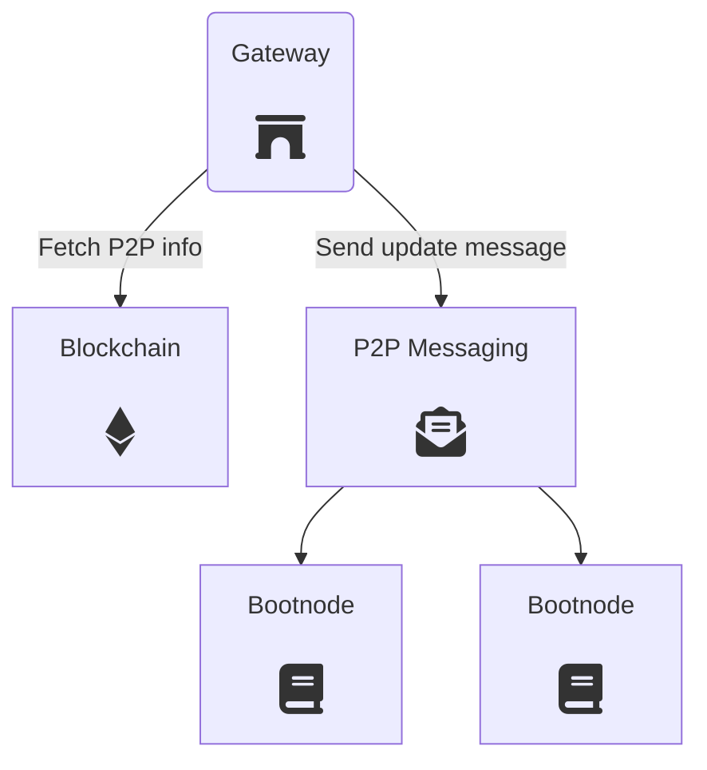

# Gateway

Gateways provide redundant entry points to the P2P networks. They allow clients to reach decentralized services from a simple HTTP/WebSocket endpoint.

The following diagram shows the gateway's overall architecture and components.

<div style="padding: 20px;">
	
</div>

### Discovery mechanism

A Gateway is a neutral piece of the ecosystem which can be contributed by any third party. Any kind of organization might run Gateway instances to improve network access and increase resilence against potential attacks.

To this end, Gateways use an automatic discovery system through a P2P messaging network so that Bootnodes know of their existence. Clients make requests to Bootnodes and fetch a fresh list of working Gateways.


---

## API definition

A Gateway exposes APIs that enable accesing peer-to-peer networks. The currently supported API schemes are the following:

+ `Info API`: details about the gateway
+ `Census API` access to the Census Service
+ `Vote API` access to the Vochain methods for voting
+ `Results API` access to the Vochain methods for computing election results
+ `File API` access to P2P file storage methods

These APIs can be used by web and mobile clients using an HTTP/WS endpoint.

The API methods below follow the [JSON API](/architecture/protocol/json-api) specifications.

## Info API

### Get Gateway Info
Get an overview wabout the own gateway: available APIs, health and whether private methods are available or not.

```json
{
  "id": "req-2345679",
  "request": {
    "method": "getInfo",
    "timestamp": 1556110671 // optional, not required
  }
 }
```

```json
{
  "id": "req-2345679",
  "response": {
	"apiList": ["census","file","vote", "results"],
    "health": 65,  // A number between 1 and 100 that indicates the health of the gateway (resource consumption, network status, etc.)
    "ok": true,
    "request": "req-2345679", // Request ID here as well, to check its integrity
    "timestamp": 1556110672
  },
  "signature": "hexString"
}
```

## Census API

The Census API methods can be found on the [Census Service section](/architecture/services/census-service?id=json-api). 

## Vote API

### Submit Raw Vochain Transaction

Send a [Vote Envelope](/architecture/smart-contracts/process?id=vote-envelope) to the mempool of the [Vochain](/architecture/services/vochain).

```json
{
  "id": "req-2345679",
  "request": {
    "method": "submitRawTx",
    "payload": "base64string", // A raw transaction (protobuf encoded) payload in base64
    "timestamp": 1556110671
  }
}
```

```json
{
  "id": "req-2345679",
  "response": {
    "ok": true,
    "request": "req-2345679",
    "timestamp": 1556110672
  },
  "signature": "hexString"
}
```


### Submit Envelope

Send a [Vote Envelope](/architecture/smart-contracts/process?id=vote-envelope) to the mempool of the [Vochain](/architecture/services/vochain).

```json
{
  "id": "req-2345679",
  "request": {
    "method": "submitEnvelope",
    "payload": "base64string", // Vote envelope (protobuf encoded) payload in base64
    "signature": "hexString", // signature of the payload if the process requires it
    "timestamp": 1556110671
  }
}
```

```json
{
  "id": "req-2345679",
  "response": {
    "ok": true,
    "request": "req-2345679",
    "timestamp": 1556110672
  },
  "signature": "hexString"
}
```

**Used in:**
- [Casting a vote](https://docs.vocdoni.io/#/architecture/sequence-diagrams?id=casting-a-vote)

### Get Envelope Status

Check the status of an already submited [Vote Envelope](/architecture/smart-contracts/process?id=vote-envelope). The envelope is identified by the voter's nullifier.

```json
{
  "id": "req-2345679",
  "request": {
    "method": "getEnvelopeStatus",
    "processId": "hexString",
    "nullifier": "hexString",
    "timestamp": 1556110671
  }
}
```

```json
{
  "id": "req-2345679",
  "response": {
    "registered": true,  // Whether the vote is registered or not
    "blockTimestamp": 1556110672, // only if registered == true
    "height": 1234, // only if registered == true
    "request": "req-2345679",
    "timestamp": 1556110672
  },
  "signature": "hexString"
}
```
**Used in:**
- [Checking a Vote Envelope](https://docs.vocdoni.io/#/architecture/sequence-diagrams?id=checking-a-vote-envelope)

### Get Envelope

Get the content of an existing [Vote Envelope](/architecture/smart-contracts/process?id=vote-envelope). The envelope is identified by the nullifier.

```json
{
  "id": "req-2345679",
  "request": {
    "method": "getEnvelope",
    "processId": "hexString",
    "nullifier": "hexString",
    "timestamp": 1556110671
  }
}
```

```json
{
  "id": "req-2345679",
  "response": {
    "payload": "base64-data", // Payload of the enveolope in base64
    "request": "req-2345679", 
    "timestamp": 1556110672
  },
  "signature": "hexString"
}
```

**Used in:**
- [Checking a Vote Envelope](https://docs.vocdoni.io/#/architecture/sequence-diagrams?id=checking-a-vote-envelope)

### Get Envelope Height

Get the number of envelopes registered on a given process.

```json
{
  "id": "req-2345679",
  "request": {
    "method": "getEnvelopeHeight",
    "processId": "hexString",
    "timestamp": 1556110671
  }
}
```

```json
{
  "id": "req-2345679",
  "response": {
    "ok": true,
    "height": 1234, // Number of envelopes for the process ID
    "request": "req-2345679",
    "timestamp": 1556110672
  },
  "signature": "hexString"
}
```

### Get Block Status

Get details about the current block and the average block time for the last 1m, 10m, 1h, 6h and 24h.

```json
{
  "id": "req-12345678",
  "request": {
    "method": "getBlockStatus",
    "timestamp": 1556110671
  }
}
```

```json
{
  "id": "req-2345679",
  "response": {
    "blockTime": [10000, 12000, 12200, 12500, 12600], // In milliseconds, average for 1 minute, 10m, 1h, 6h, 24h. If no average yet, values are 0
    "blockTimestamp": 1556110672, // in seconds
    "height": 12345,
    "ok": true,
    "request": "req-2345679",
    "timestamp": 1556110672
  },
  "signature": "hexString"
}
```

### Get Block Height

Get the current block number on the [Vochain](/architecture/services/vochain). 

```json
{
  "id": "req-12345678",
  "request": {
    "method": "getBlockHeight",
    "timestamp": 1556110671
  }
}
```

```json
{
  "id": "req-2345679",
  "response": {
    "blockTimestamp": 1556110672,
    "ok": true,
    "height": 12345,
    "request": "req-2345679",
    "timestamp": 1556110672
  },
  "signature": "hexString"
}
```

### Get Process List

Get a list of processes for a specific entity or namespace on the [Vochain](/architecture/services/vochain). There is a hardcoded maximum size of 64 per page. 

The results are ordered from process creation date. So processes created recently will appear first on the list.

The following query filters can be used:

+ `from` can be used to seek specific positions and start from them. So if a call without `from` (`from = 0`) returns 64 values, a second call with `from = 64` will get the next 64 values.
+ `namespace` can be used for querying only a specific namespace. The namespace zero (default value) means all existing namespaces.
+ `entityId` can be used for retreiving the list of processes from a specific entity organization.
+ `status` can be used for querying processes on a specific status (READY, PAUSED, CANCELED, ENDED or RESULTS).
+ `withResults` bool filter can be used for quering only those processes that already have results (open process or finished with revealed keys).

```json
{
  "id": "req-2345679",
  "request": {
    "method": "getProcessList",
    "entityId": "hexString", // Optional
    "namespace": int, // Optional
    "status": "string", // Optional
    "withResults": bool, // Optional
    "from": int,  // Optional
    "timestamp": 1556110671
  }
}
```

```json
{
  "id": "req-2345679",
  "response": {
    "processIds": ["hexString1","hexString2", ...], // List of process ID's
    "request": "req-2345679",
    "timestamp": 1556110672
  },
  "signature": "hexString"
}
```

### Get Process Info

Get the full information from an existing process.

```json
{
  "id": "req-2345679",
  "request": {
    "method": "getProcessInfo",
    "processId": "hexString",
    "timestamp": 1556110671
  }
}
```

```json
{
  "id": "req-2345679",
  "response": {
    "processInfo": {
      "censusOrigin": 1,
      "censusRoot": "7bc6e95b3e4a4e6aedb67a4eef28cbdb5bea2a02398309453015663721d7119f",
      "censusURI": "ipfs://Qmd5gWjB6mDGpZKkqR9CfM3E4KXkrWmnV6bM1C7icHs4BH",
      "creationTime": "2021-03-09T08:51:30+01:00",
      "endBlock": 7422,
      "entityId": "9add080f390c01d6c8421f61aabf311bf5a1d839",
      "envelopeType": {
        "encryptedVotes": true
      },
      "finalResults": true,
      "haveResults": true,
      "namespace": 2,
      "processId": "194451f33542975467c859966f05a6de9b60557e7184998774821389db74a68d",
      "processMode": {
        "autoStart": true,
        "interruptible": true
      },
      "questionIndex": 0,
      "startBlock": 6922,
      "status": 2,
      "voteOptions": {
        "maxCount": 16,
        "maxValue": 8
      }
    },
    "request": "req-2345679",
    "timestamp": 1556110672
  },
  "signature": "hexString"
```


### Get Entity List

Get a list of entities that created at least 1 process into the [Vochain](/architecture/services/vochain). 

The `from` field can be used to seek specific positions and start from them. So if a call without `from` (`from = 0`) returns 64 values, a second call with `from = 64` will get the next 64 values.

```json
{
  "id": "req-2345679",
  "request": {
    "method": "getEntityList",
    "from": int, // Optional
    "timestamp": 1556110671
  }
}
```

```json
{
  "id": "req-2345679",
  "response": {
    "entityIds": ["hexString1","hexString2", ...], // List of entity ID's
    "request": "req-2345679",
    "timestamp": 1556110672
  },
  "signature": "hexString"
}
```


### Get Envelope List

Get a list of nullifiers for votes registered on a given process ID (at most, 64 per request).

The `fromId` field works the same as in [Get Process List](#get-process-list).

```json
{
  "id": "req-2345679",
  "request": {
    "method": "getEnvelopeList",
    "processId": "hexString",
    "fromId": "hexString",
    "timestamp": 1556110671
  }
}
```

```json
{
  "id": "req-2345679",
  "response": {
    "nullifiers": ["hexString1","hexString2", ...], // List of nullifiers already processed by the blockchain
    "request": "req-2345679",
    "timestamp": 1556110672
  },
  "signature": "hexString"
}
```

### Get Process Keys

Get the available encryption keys for the given process ID.

If the process has encrypted votes and it is on-going, `encryptionPubkeys` and `commitmentKeys` should be available. Once the process has ended, `encryptionPrivKeys` and `revealKeys` will be also be available.

[Vote Package](/architecture/smart-contracts/process?id=vote-package) encryption and decryption it is expected to use these keys following the order of their indexes. Smaller indexes are used first and it's important to note that indexes might not be consecutive.

```json
{
  "id": "req-2345679",
  "request": {
    "method": "getProcessKeys",
    "processId": "hexString",
    "timestamp": 1556110671
  }
}
```

```json
{
  "id": "req-2345679",
  "response": {
    "encryptionPubKeys": [ {"idx": 1, "key": "1234567890..."}, {"idx": 6, "key": "2345678901..."}, ... ], 
    "commitmentKeys": [ {"idx": 1, "key": "1234567890..."}, {"idx": 6, "key": "2345678901..."}, ... ],
    "encryptionPrivKeys": [ {"idx": 1, "key": "1234567890..."}, {"idx": 6, "key": "2345678901..."}, ... ],
    "revealKeys": [ {"idx": 1, "key": "1234567890..."}, {"idx": 6, "key": "2345678901..."}, ... ],
    "request": "req-2345679",
    "timestamp": 1556110672
  },
  "signature": "hexString"
}
```

**Used in:**
- [Checking a Vote Envelope](https://docs.vocdoni.io/#/architecture/sequence-diagrams?id=checking-a-vote-envelope)


### Get Process Results

Get the results of the given processId, as indexed by the scrutinizer. If the process doesn't have encrypted votes but it has already started, then returns the **partial results**.

The results of an election are represented in [the following format](/architecture/smart-contracts/process?id=results).

```json
{
  "id": "req-2345679",
  "request": {
    "method": "getResults",
    "processId": "hexString",
    "timestamp": 1556110671
  }
}
```

```json
{
  "id": "req-2345679",
  "response": {
    "request": "req-2345679",
    "type": "poll-vote",
    "status": "RESULTS",
    "results": [ ["12", "2"], ["3", "11", "24"], ["0", "43"] ],
    "timestamp": 1556110672
  },
  "signature": "hexString"
}
```

### Get Results Weight

The results weight is the total amount of voting power that have been cast for a processId. 
For a non-weighted processes the weight will be equal to the number of votes.
This information can be real-time queried on encrypted elections too.

```json
{
  "id": "req-2345679",
  "request": {
    "method": "getResultsWeight",
    "timestamp": 1556110671
  }
}
```

```json
{
  "id": "req-2345679",
  "response": {
    "request": "req-2345679",
    "weight": 500,
    "timestamp": 1556110672
  },
  "signature": "hexString"
}
```

### Get Process Count

Returns the number of processes registered in the Vochain.

```json
{
  "id": "req-2345679",
  "request": {
    "method": "getProcessCount",
    "timestamp": 1556110671
  }
}
```

```json
{
  "id": "req-2345679",
  "response": {
    "request": "req-2345679",
    "size": 198,
    "timestamp": 1556110672
  },
  "signature": "hexString"
}
```

### Get Entity Count

Returns the number of entities registered in the Vochain (those that have at least created one process).

```json
{
  "id": "req-2345679",
  "request": {
    "method": "getEntityCount",
    "timestamp": 1556110671
  }
}
```

```json
{
  "id": "req-2345679",
  "response": {
    "request": "req-2345679",
    "size": 14,
    "timestamp": 1556110672
  },
  "signature": "hexString"
}
```


## File API

### Fetch File

Fetch a file from the P2P network (currently IPFS) and return it encoded in base 64.

```json
{
  "id": "req-2345679",
  "request": {
    "method": "fetchFile",
    "uri": "<content uri>",
    "timestamp": 1556110671
  },
  "signature": "hexString"
}
```

```json
{
  "id": "req-2345679",
  "response": {
    "content": "base64Payload",  // The contents of the file
    "request": "req-2345679",
    "timestamp": 1556110672
  },
  "signature": "hexString"
}
```
  
**Used in:**
- [Entity subscription](https://docs.vocdoni.io/#/architecture/sequence-diagrams?id=entity-subscription)
- [Voting process retrieval](https://docs.vocdoni.io/#/architecture/sequence-diagrams?id=voting-process-retrieval)
- [Vote scrutiny](https://docs.vocdoni.io/#/architecture/sequence-diagrams?id=vote-scrutiny)

**Related:**
- [Content URI](/architecture/protocol/data-origins?id=content-uri)


### Add File

Uploads a file and pins it on an IPFS cluster. This private method is aimed to be used by the election organizer. The Gateway running the API is usually a private server, only used by entity admins.

These methods require authentication, following the [JSON API rules](/architecture/protocol/json-api?id=Authentication).

```json
{
  "id": "req-2345679",
  "request": {
    "method": "addFile",
    "type": "ipfs",
    "content": "base64Payload",  // File contents
    "name": "string",            // Human readable name to help identify the content in the future
    "timestamp": 1556110671
  },
  "signature": "hexString"
}
```

```json
{
  "id": "req-2345679",
  "response": {
    "uri": "<content uri>",
    "request": "req-2345679",
    "timestamp": 1556110672
  },
  "signature": "hexString"
  
}
```

**Used in:**
- [Set Entity metadata](https://docs.vocdoni.io/#/architecture/sequence-diagrams?id=set-entity-metadata)
- [Voting process creation](https://docs.vocdoni.io/#/architecture/sequence-diagrams?id=voting-process-creation)

**Related:**
- [Content URI](/architecture/protocol/data-origins?id=content-uri)

### List pinned files

This method provides private Gateway users with the list of resources that have been pinned on IPFS.

```json
{
  "id": "req-2345679",
  "request": {
    "method": "pinList",
    "timestamp": 1556110671
  },
  "signature": "hexString"
}
```

```json
{
  "id": "req-2345679",
  "response": {
    "files": [
      { "name": "file1.txt", "uri": "<content-uri>" },
      { "name": "file2.png", "uri": "<content-uri>" },
      { "name": "file3.bin", "uri": "<content-uri>" },
      ...
    ],
    "request": "req-2345679",
    "timestamp": 1556110672
  },
  "signature": "hexString"
}
```

**Related:**
- [Content URI](/architecture/protocol/data-origins?id=content-uri)

### Pin a file

This method allows administrators to pin already existing remote content, so it remains available on IPFS.

```json
{
  "id": "req-2345679",
  "request": {
    "method": "pinFile",
    "uri": "<content-uri>", // Multiple origins can be pinned at once
    "timestamp": 1556110671
  },
  "signature": "hexString"
}
```
```json
{
  "id": "req-2345679",
  "response": {
    "ok": true,
    "request": "req-2345679",
    "timestamp": 1556110672
  },
  "signature": "hexString"
}
```


### Unpin a file

This method is the counterpart of `pin` and `addFile`. It allows administrators to unpin and drop content from a Gateway so it doesn't eventually run out of space.


```json
{
  "id": "req-2345679",
  "request": {
    "method": "unpinFile",
    "uri": "<content-uri>",  // Multiple origins can be unpinned at once
    "timestamp": 1556110671
  },
  "signature": "hexString"
}
```
```json
{
  "id": "req-2345679",
  "response": {
    "ok": true,
    "request": "req-2345679",
    "timestamp": 1556110672
  },
  "signature": "hexString"
}
```

**Related:**
- [Content URI](/architecture/protocol/data-origins?id=content-uri)

## Health Status

The health of a DVote Gateway can be checked quite simply:

- Request:
  - `HTTP GET https://<host-name>/ping`
- Response:
  - `HTTP 200` with the text `"pong"` in the body

Example:

```sh
$ curl https://my.gateway.net/ping
pong
```

Clients should check the status before attempting to use a certain Gateway. 

### Coming next

See the [Vochain](/architecture/services/vochain) section.
