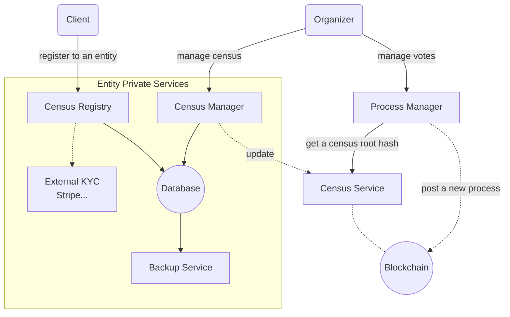

# Global architecture

Electronic voting processes represent a great tech and social challenge. An official binding vote with standard requirements should at least be able to:

+ Enforce vote anonimity
+ Rely on an opensource platform
+ Be 100% transparent, auditable and verifiable
+ Use uncensorable communication channels
+ Ensure that voters from a census can only vote once without revealing anyone's identity

Vocdoni defines an open architechture and the protocols to empower large communities to exercise full democracy with the aforementioned guarantees. 

A fully functional implementation of Vocdoni will typically involve a combination of two types of services. 
- The public blockchain, Gateways, Relays and decentralized storage systems (open and accessible)
- Private custom services so that Entities can maintain a census of users (with personal data that should not be disclosed)

## Service architecture and components

To provide resilence and avoid any kind of censorship, the network architecture should accomplish the following requirements:

+ Do not rely on DNS
+ Do not depend on specific IPs
+ Do not depend on any specific company or cloud infrastructure
+ Use P2P network connections when possible
+ Use static web pages, so they can be replicated
+ Allow third parties to add infrastructure

A Vocdoni voting process makes use of the following components:

+ Data integrity is provided by a public BlockChain such as the Ethereum main net.

+ Data availability is provided by a distributed filesystem such as Swarm or IPFS.

+ Peer messaging is provided by a distributed message protocol such as Whisper, IPFS/PubSub or Swarm/PSS.

+ The client interface (app or webapp) interacts with the P2P network and the Blockchain through Gateways (using WebSockets or HTTP/RPC). 

* Gateways are neutral/agnostic, since the cryptographic layer happens on the peer side. The only intent of a Gateway is about forwarding requests from clients that can't open a socket by themselves (typically web browsers).

## Components

### Relay

The relay pool is a group of nodes which are responsible for handling votes, validating their content, pinning them on P2P filesystems and registering them on the BlockChain. At the moment, only relays whitelisted by the vote organizer Entity will be able to add valid votes. 

### Gateway/Web3
Gateways provide an entry point to the P2P network. They allow clients to reach decentralized services (census, relays, etc.) through a WebSocket or an HTTP interface.

### Census Service
A server handling the public census of an Entity. It stores Merkle trees with user claims, it allows an Entity to trigger updates (using asymmetric key signature authentication) and allows clients to ask for data on a particular Merkle tree.

The Census Service is a critical piece of the overall platform, so its real IP/location should be hidden as much as possible. Ideally, it should only be reachable through the P2P messaging protocol.

Census Service's have to be started with a predefined Entity Resolver instance address, as well as an Entity Address so they know what configuration they need to apply.

### Census Registry
A custom web site provided by the Entity typically used to validate a user before adding him/her to a Census. This web site is loaded on a webview from the client app, once the user decides to register to an Entity. The required steps to pass a validation are dependent on every Entity and need a custom integration.

### Census Manager
A private server allowing Entity administrators to manage the attributes (age, payment status, etc.) of users registered to it. Data from this service typically lives on a private database that will produce updated versions of specific census on demand.

The web site also allows to create new census and define the requirements that users have to accomplish to be included.

### Process Manager
A private server providing the Entity administrators a web site to manage voting processes on the blockchain. 

### Client app
Any mobile app or web site with access to Web3 libraries and cryptographic primitives to compute signatures and blockchain transactions.

### Blockchain
An Ethereum blockchain capable of mining transactions.

### Scrutinizer
Any participant on the system can fetch the scrutiny script and compute the voting process results on his/her own.

## Component relationship

Below is the relationship between publicly accessible and private services that interact within a voting process.

## Platform tools

### DVote JS
Formerly known as `dvote-client`, this library aims to provide utility classes and methods to invoke decentralized operations within a voting process. It covers the typical functionality of Client applications, as well as the Process Manager or the Census Manager. 

The intended functionality is to interact with a public Ethereum blockchain, to fetch data from a decentralized filesystem, to enforce data schema validity, to prepare vote packages and using decentralized messaging networks through Gateways or Relays. 

[More information](/integration/dvote-js)

### Go DVote
Same as DVote JS, this library provides the necessary tools to interact with Vocdoni from components like Gateways, Relays or a Census Service. 

Its intent is to provide communication systems compatible with their JS counterparts, and process data conforming to the standard formats and data structures. 

[More information](/integration/go-dvote)

### DVote Solidity
Formerly known as `dvote-smart-contracts`, this library provides the Smart Contracts that support the integrity transactions involving Entities and Voting Processes.

Much of the work involving metadata is delegated to decentralized filesystems, providing the complete metadata. 

[More information](/protocol/smart-contracts)

### Web runtime (for React Native)
Environments like React Native allow to develop mobile app clients with an efficient and consistent platrofm but lack the support of cryptographic API's present by default on Web browsers or NodeJS. Several crypto libraries rely on such API's, which are not available on RN. 

Until React Native or Expo ship with native support, the current workaround is to mount a virtual web view and load them in a bundle, so the app code can queue operations to a web environment, pretty much like a WebWorker. 

[More information](https://github.com/vocdoni/clientApp/tree/master/web-runtime)

### Snarks validator
(This component will be fully disclosed when the ZK Snarks implementation becomes available)

### Swarm and IPFS
Both systems provide a decentralized channel to pin and distribute data in a censorship resistant and verifiable way. 

### PSS and IPFS PubSub
Both related to Swarm amb IPFS, they provide a decentralized messaging system that provides anonimity and censorship resilience. 
