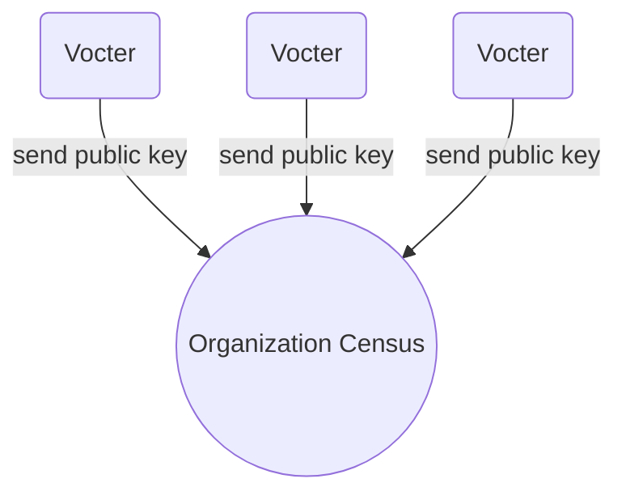

# Franchise Proof

The franchise proof enables user privacy and allows anonymous voting. Currently Vocdoni aims to integrate two different mechanisms to generate zero knowledge proofs (more might be considered in the future):

- Zk-Snarks
- Linkable Ring Signatures

----

## Zk-Snarks

+ Leverages zk-SNARK technology
+ Used to prove two things without revealing critical data
  1. `Voter` is the owner of the `private key` corresponding to the `public key`
  2. `Voter`'s `public key` is included in the `census`
+ Generated in the `user` light-client
+ Is a CPU and memory intensive process
+ Is validated by the `relays` before adding the `voting package` in the blockchain
+ It is validated by the `organizer` once the `process` ends

#### zk-SNARK circuit

+ Used by the `voter` to generate the `franchise proof`
+ Used by the `relay` and `organizer` to validate the `franchise proof`
+ The same circuit can be use for any `process`
+ It relies a **trusted setup**


#### Process

The franchise proof is generated by running the zk-SNARK voting cicuit with several inputs.

+ **private input:** Private Key, Census Merkle-proof, Vote-signature
+ **public input:** Census Merkle-root, Nullifier, ProcessId, Vote
+ **output:** Franchise proof

1. Encrypts the vote
    `encrypted_vote = encrypt( selected_voting_options + random_nonce )`

2. Generates the nullifier
    `nullifier = hash( process_id + user_private_key )`

3. Sign vote
    `signature = Sign(encrypted_vote)`

4. Get census merkle proof
    `census_proof = [list-of-siblings]`

----

## Linkable Ring Signatures

It allows members of a group to sign messages on the group’s behalf such that the resulting signature does not reveal their identity (anonymity). The notion of linkable ring signature, also provides signer anonymity, but at the same time, allows anyone to determine whether two signatures have been issued by the same group member (linkability).

Unlike ZK Snarks, LRS do not rely on a trusted setup. 

Documentation:

- https://medium.com/asecuritysite-when-bob-met-alice/linkable-ring-signatures-stealth-addresses-and-mixer-contracts-cff7057a457

Academic papers:

- https://eprint.iacr.org/2018/379.pdf
- https://dl.acm.org/citation.cfm?id=2103015


Go implementation: https://github.com/noot/ring-go (linkable branch)

`Missing javascript implementation`


## How LRS are used

### Registration to an organization



### Start an election and vote

```mermaid
graph BT;
O((Organizer)) -->|Create new election|B
B[Blockchain] -->|fetch election ID| C((Census))
B -->|fetch election ID| V1(Voter 1)

C-.->Pub1["PubKey V1 + electionID"]
C-.->Pub2["PubKey V2 + electionID"]
C-.->Pub3["PubKey V3 + electionID"]

R[Linkable Ring Signature]
V1-.->Priv1["Privkey V1 + electionID"]
Priv1-->|create election signatre| R

subgraph 
Pub1-.-R
Pub2-.-R
Pub3-.-R
end
```

---

## Implementations

`core i7, 8GB RAM`

```
Time: 0,388s
Signature size: 100
Signature bytes: 9735
```

```
Time: 2,567s
Signature size: 1000
Signature bytes: 96114
```
