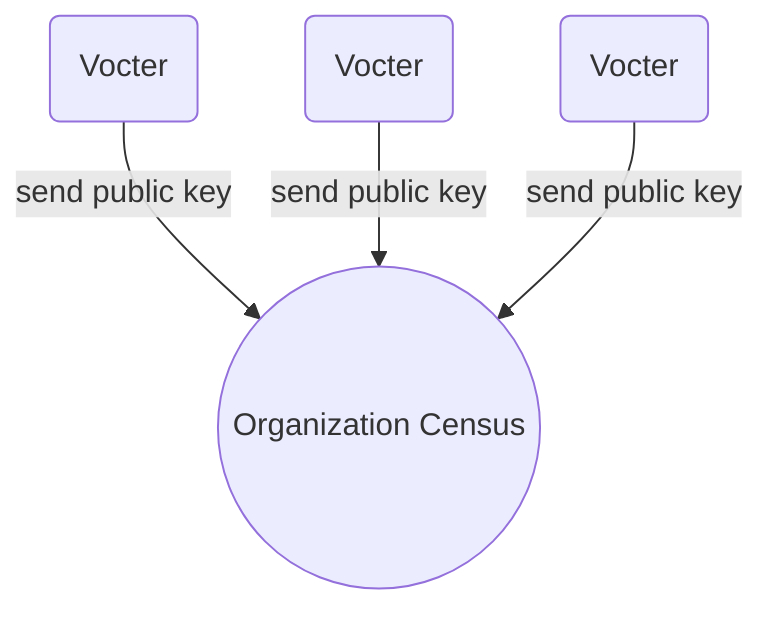

# Franchise Proof

The franchise proof enables user privacy and allows anonymous voting. Currently Vocdoni aims to integrate two different mechanisms to generate zero knowledge proofs (more might be considered in the future):

- ZK-Snarks
- Linkable Ring Signatures

----

## ZK-Snarks

+ Leverages ZK-SNARK technology
+ Used to prove two things without revealing critical data
  1. `Voter` is the owner of the `private key` corresponding to the `public key`
  2. `Voter`'s `public key` is included in the `census`
+ Generated in the `user` light-client
+ Is a CPU and memory intensive process
+ Is validated by the `relays` before adding the `voting package` in the blockchain
+ It is validated by the `organizer` once the `process` ends

### ZK-SNARK circuit

+ Used by the `voter` to generate the `franchise proof`
+ Used by the `relay` and `organizer` to validate the `franchise proof`
+ The same circuit can be use for any `process`
+ It relies on a **trusted setup**


### Process

The franchise proof is generated by running the ZK-SNARK voting cicuit.

+ **Private inputs:** Private Key, Census Merkle-proof, Vote-signature
+ **Public inputs:** Census Merkle-root, Nullifier, ProcessId, Vote
+ **Output:** Franchise proof

Steps:

1. Vote encryption<br/>
    `encrypted_vote = encrypt( selected_voting_options + random_nonce )`

2. Nullifier generation<br/>
    `nullifier = hash( process_id + user_private_key )`

3. Vote signature<br/>
    `signature = Sign(encrypted_vote)`

4. Fetching the census Merkle proof<br/>
    `census_proof = [list-of-siblings]`

----

## Linkable Ring Signatures

LRS allow members of a group to sign messages on the group's behalf. The resulting signature does not reveal the signer's identity (preserving anonymity) but at the same time, it is possible to determine whether two signatures have been issued by the same group member or not (linkability).

Unlike ZK Snarks, **LRS do not rely on a trusted setup**.

**Documentation**

- https://medium.com/asecuritysite-when-bob-met-alice/linkable-ring-signatures-stealth-addresses-and-mixer-contracts-cff7057a457

**Academic papers**

- https://eprint.iacr.org/2018/379.pdf
- https://dl.acm.org/citation.cfm?id=2103015

**Libraries**
- Go implementation: https://github.com/noot/ring-go (linkable branch)
- `Missing JavaScript implementation on ECDSA`


### How LRS are used

### Registration to an organization



### Start an election and vote

```mermaid
graph BT;
O((Organizer)) -->|Create new election|B
B[Blockchain] -->|fetch election ID| C((Census))
B -->|fetch election ID| V1(Voter 1)

C-.->Pub1["PubKey V1 + electionID"]
C-.->Pub2["PubKey V2 + electionID"]
C-.->Pub3["PubKey V3 + electionID"]

R[Linkable Ring Signature]
V1-.->Priv1["Privkey V1 + electionID"]
Priv1-->|create election signatre| R

subgraph 
Pub1-.-R
Pub2-.-R
Pub3-.-R
end
```

---

### Performance

ECDSA Linkable Ring Signature test using Go on a Core i7 with 8GB of RAM

```
Time: 0,388s
Signature size: 100
Signature bytes: 9735
```

```
Time: 2,567s
Signature size: 1000
Signature bytes: 96114
```


### Javascript example (using RSA)

The Vocdoni platform is designed to work on Ethereum public blockchains, so its users are meant to be using ECDSA key pairs.

As a reference, you can have a look at an RSA implementation: https://github.com/MaiaVictor/lrs

Install via npm
```sh
npm install lrs
```

On `test-node.js` add the following lines and run the script:

```javascript
const lrs = require("lrs");
const NUM_ACCOUNTS = 1000;
const accounts = [];

// parties generate their public/private key pairs
console.time("Generate keys");
for (let i = 0; i < NUM_ACCOUNTS; i++) {
	accounts.push(lrs.gen());
}
console.timeEnd("Generate keys");

// first key is for alice (the real signer)
const alice = accounts[0];

// The list of public key is known and distributed
var group = accounts.map((m) => m.publicKey);
console.log("Group data length:", JSON.stringify(group).length, "bytes");

// Alice signs a message in behalf of one of the group
console.time("Sign ring")
var signed = lrs.sign(group, alice, "The body is buried on the backyard.");
console.timeEnd("Sign ring")

console.log("Signature data length:", signed.length, "bytes");

// Anyone is able to verify *some* of them signed that message
console.time("Verify")
console.log(lrs.verify(group, signed, "The body is buried on the backyard."));
console.timeEnd("Verify")

console.time("Check double sign")
// If that same person signs another message...
var signed2 = lrs.sign(group, alice, "Just kidding, he is alive.");
console.timeEnd("Check double sign")

// We are able to tell the signature came from the same person
console.log(lrs.link(signed, signed2));
```
### On browser

Edit an HTML container:

```html
<!DOCTYPE html>
<html>

<head></head>

<body>
	<h3>Linkable ring signature</h3>
	<pre id="content"></pre>

	<script src="./test-browser.js"></script>
</body>

</html>
```

And then edit the `test-browser.js` file:

```javascript
const lrs = require("lrs");
const NUM_ACCOUNTS = 100;
const accounts = [];

// LOGGING SCREEN UTILS

const logMap = {}

function log(text, ...rest) {
	const node = document.querySelector("#content")
	if (node) node.innerText += text + " " + rest.join(" ") + "\n"
	console.log(text, ...rest)
}

function logStart(key) {
	const node = document.querySelector("#content")
	if (logMap[key]) {
		console.warn(`logStart(${key}) is already defined. Overwriting.`)

		logMap[key] = Date.now()
		if (node) node.innerText += key + " [restarted]\n"
	}
	else {
		logMap[key] = Date.now()
		if (node) node.innerText += key + " [started]\n"
		console.log(key + " [started]")
	}
}

function logEnd(key) {
	if (!logMap[key]) {
		const node = document.querySelector("#content")
		if (node) node.innerText += key + " [unstarted]\n"
		console.warn(`logStart(${key}) not started.`)
		return
	}

	const diff = (Date.now() - logMap[key]) / 1000
	const node = document.querySelector("#content")
	if (node) node.innerText += `${key} [done in ${diff.toFixed(1)}s]\n`
	log(`${key} [done in ${diff.toFixed(1)}s]`)
	delete logMap[key]
}

// CODE

function main() {
	// parties generate their public/private key pairs
	logStart("Generate keys");
	for (let i = 0; i < NUM_ACCOUNTS; i++) {
		accounts.push(lrs.gen());
	}
	logEnd("Generate keys");

	// first key is for alice (the real signer)
	const alice = accounts[0];

	// The list of public key is known and distributed
	var group = accounts.map((m) => m.publicKey);

	// Alice signs a message in behalf of one of the group
	logStart("Sign ring")
	var signed = lrs.sign(group, alice, "The body is buried on the backyard.");
	logEnd("Sign ring")

	log("Signature", signed.length);

	// Anyone is able to verify *some* of them signed that message
	logStart("Verify")
	log(lrs.verify(group, signed, "The body is buried on the backyard."));
	logEnd("Verify")

	logStart("Check double sign")
	// If that same person signs another message...
	var signed2 = lrs.sign(group, alice, "Just kidding, he is alive.");
	logEnd("Check double sign")

	// We are able to tell the signature came from the same person
	log(lrs.link(signed, signed2));
}

main();

```

You can use ParcelJS to run the example:

```
npx parcel index.html -p 8080
```

### Run test.js

```
$ size=100 node test.js
Generate keys: 854.913ms
Sign ring: 812.574ms
Signature 19675
true
Verify: 721.555ms
Check double sign: 773.458ms
true

$ size=1000 node test.js
Generate keys: 7043.474ms
Sign ring: 7106.234ms
Signature 193240
true
Verify: 6933.126ms
Check double sign: 7318.286ms
true

$ size=5000 node test.js
Generate keys: 36035.585ms
Sign ring: 38174.756ms
Signature 964723
true
Verify: 37611.042ms
Check double sign: 37604.330ms
true
```

Time and size scales linearly. 

* 100 ring size signature needs 0.8s to be signed and have a size of 19kBytes
* 1000 ring size signaure needs 7s to be signed and have a size of 193kBytes
* 5000 ring size signaure needs 38s to be signed and have a size of 964kBytes
