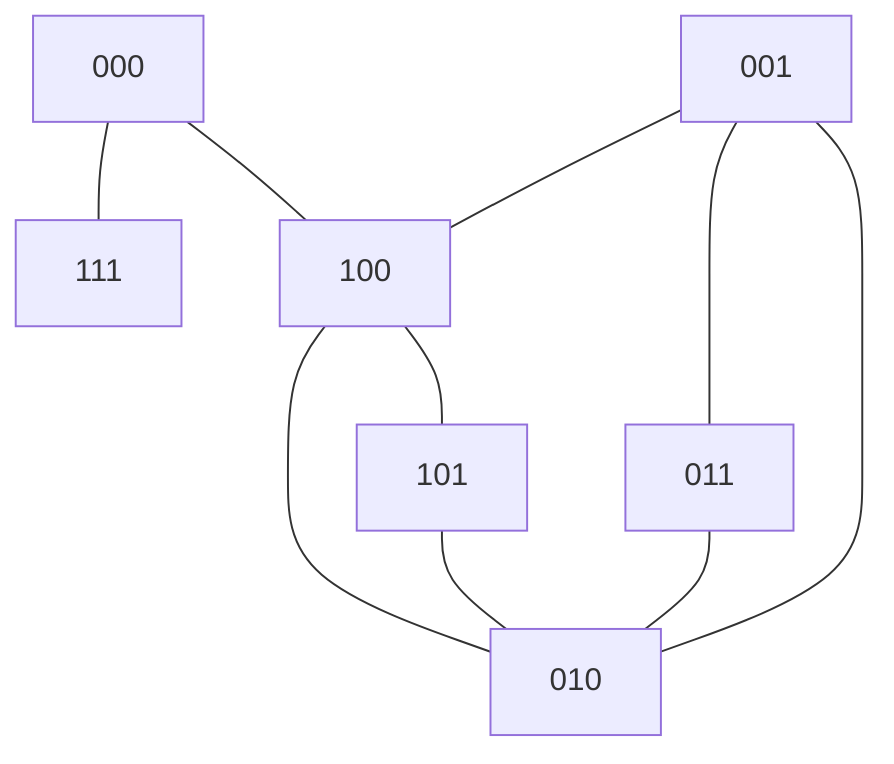

# Messaging Protocol
An overview of the evaluation criteria and performance tradeoffs for various p2p messaging protocols.

## Applications
The need for inter-party messaging arises in several places in the vocdoni architecture. The user gateway, process manager, census service and voting relay need to be able to interact reliably during a voting process, even in the face of intentional interference. Additionally, these channels should be as resistant as possible to meaningful external surveillance, even from an adversary that controls the underlying network.

## Protocol overview

### IPFS Pubsub
* No built-in encryption
* One-to-many (topic based)
* higher convergence time

### Whisper
* Designed for plausible deniability against perfect network analysis
* One-to-many (topic based)
* Intended for messages <64KB

### Swarm PSS
* Various Encryption modes (sym, asym, raw)
* Kademlia message routing
* One-to-one, one-to-some, one-to-many via topics and variable-length addressing
* Forward secrecy possible via handshake/initiation protocol

## Swarm Features
After exploring the protocols listed above, we have decided to leverage PSS for the time being. Below you will find high-level explanations of some of PSS's features.
 
### Routing/Addressing
Addresses in PSS, though often given in hex notation, actually make use of their binary representation. In the following, we'll shorten the address length to three bits, for purposes of illustration. Let's assume we have a variously connected network of peers, as follows:

All messages have a topic, to which recipients must be subscribed. Senders can specify a specific address, a neighborhood (address mask) or no address at all to broadcast to all subscribers. Messages are routed using a kademlia-style distance metric (XOR of addresses, interpereted as an integer). 

As an example, let's say the node with address 001 wants to send a unicast message to the node with address 101. If we evaluate all of the nodes to which 001 is directly connected, 001->100 (257), 001->011 (27), 001->010 (17), we see that the message will be routed through node 010.
