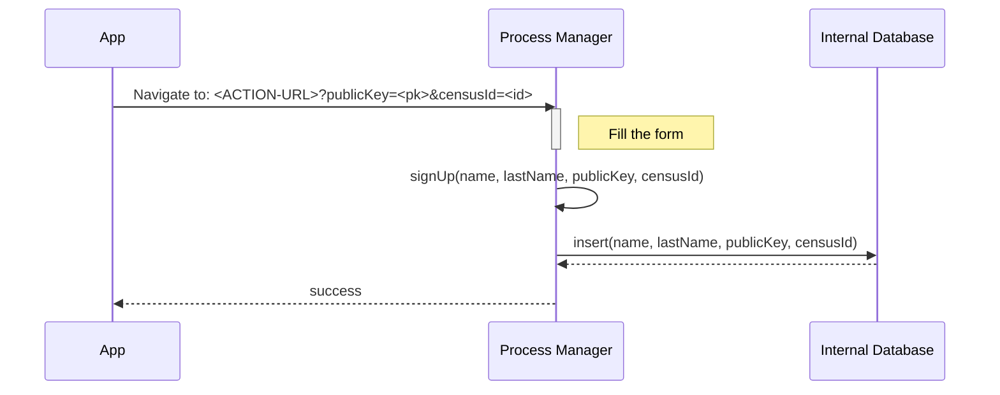
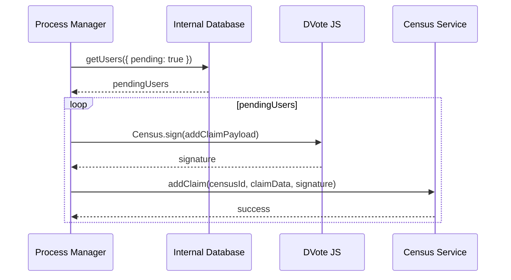
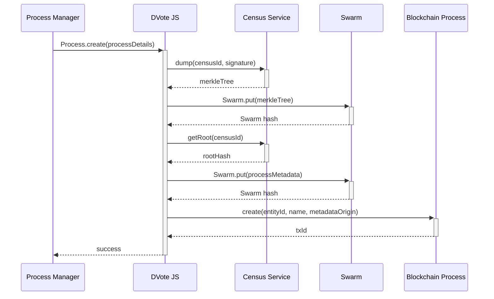

# Sequence diagrams

## Prior to voting
---

### Contract deployment (Entity)

### Contract deployment (Process)

### Entity creation

**Used schemes:**
* [Entity metadata](/protocol/data-schema.md?id=entity-metadata)
* `metadataOrigin` should be as [stated here](/protocol/data-schema?id=content-uri)

**Notes:** 
* Swarm is not a service by itself. Data pinned in the local Swarm repository of the Process Manager becomes available through a P2P network.

<!-- ### Identity creation -->

### Entity subscription

**Used schemes:**
* [Entity metadata](/protocol/data-schema.md?id=entity-metadata)

**Notes:** 
* `metadataOrigin` should be as [stated here](/protocol/data-schema?id=content-uri)
* In the case of React Native apps, DVote JS will need to run on the WebRuntime component

### Custom requests to an Entity

Actions like creating an Entity or subscribing to it are standard processes. However every Entity will probably have specific requirements on what users have to accomplish in order to join a census.

Some may require filling a simple form. Some others may ask to log in from an existing HTTP service. Uploading ID pictures, selfies or even making payments need custom implementations that decide that a user must eventually be added to a census.

Below are some examples:

#### Sign up

The user selects an action from the entityMetadata > actions available.

**Used schemes:**
* [Entity metadata](/protocol/data-schema.md?id=entity-metadata)

**Notes:** 
* `ACTION-URL` is defined on the metadata of the contract. It is expected to be a full URL to which GET parameters will be appended (`publicKey` and optionally `censusId`)

#### Submit a picture
#### Make a payment
#### Resolve a captcha

#### Adding users to a census

Depending on the activity of users, an **Entity** may decide to add public keys to one or more census.

**Used schemes:**
* [addClaimPayload](/protocol/data-schema?id=census-service-request-payload)

## Voting
---

### Voting process creation

**Used schemes:**
* [processMetadata](/protocol/data-schema?id=process-metadata)
* `processDetails` parameter is defined [on the dvote-js library](https://github.com/vocdoni/dvote-client/blob/master/src/dvote/process.ts)
