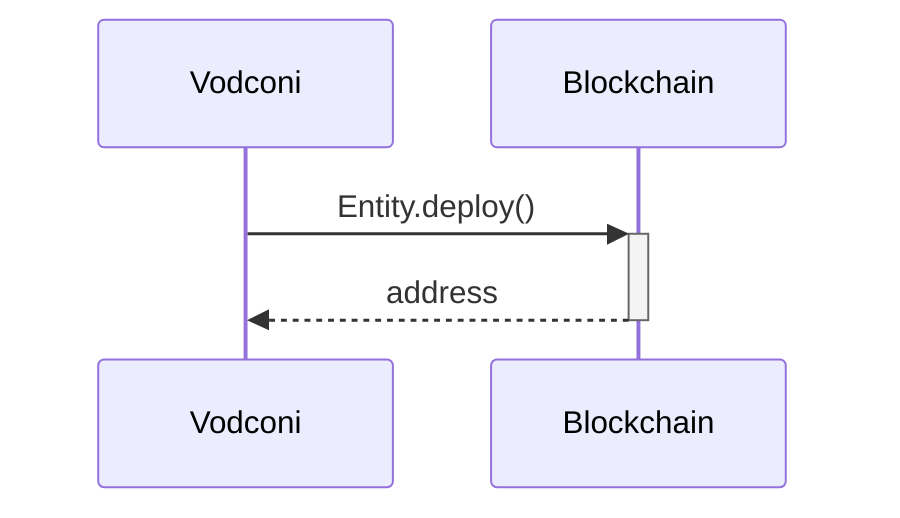
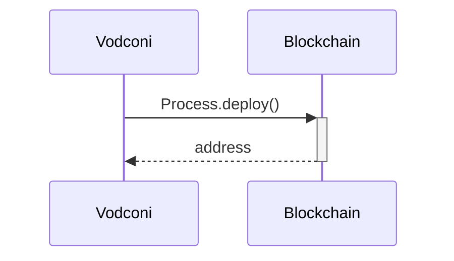
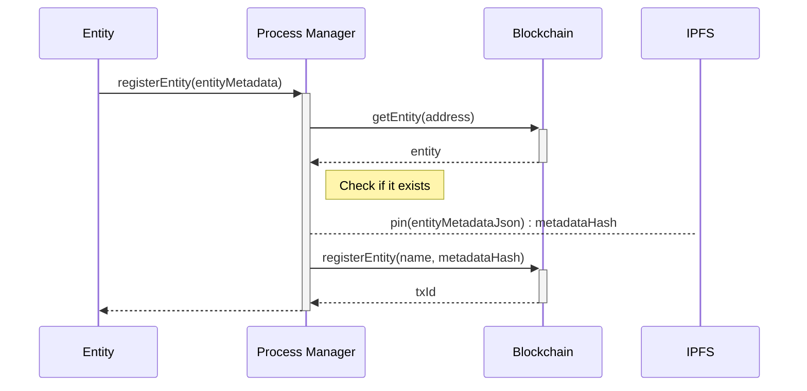

# Sequence diagrams

### Contract deployment (Entity)

### Contract deployment (Process)

### Register an entity

**Note:** IPFS is not an external service. Data is pinned in the local IPFS repository of the Process Manager, but from this point, data becomes available through the P2P network.

[Related data schema](/protocol/data-schema.md?id=entity-metadata) `(TODO)`
