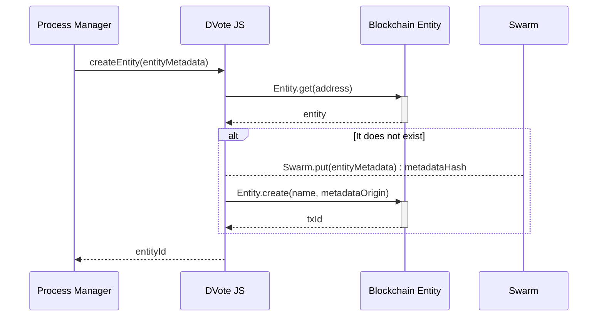
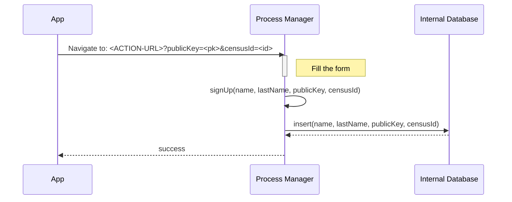
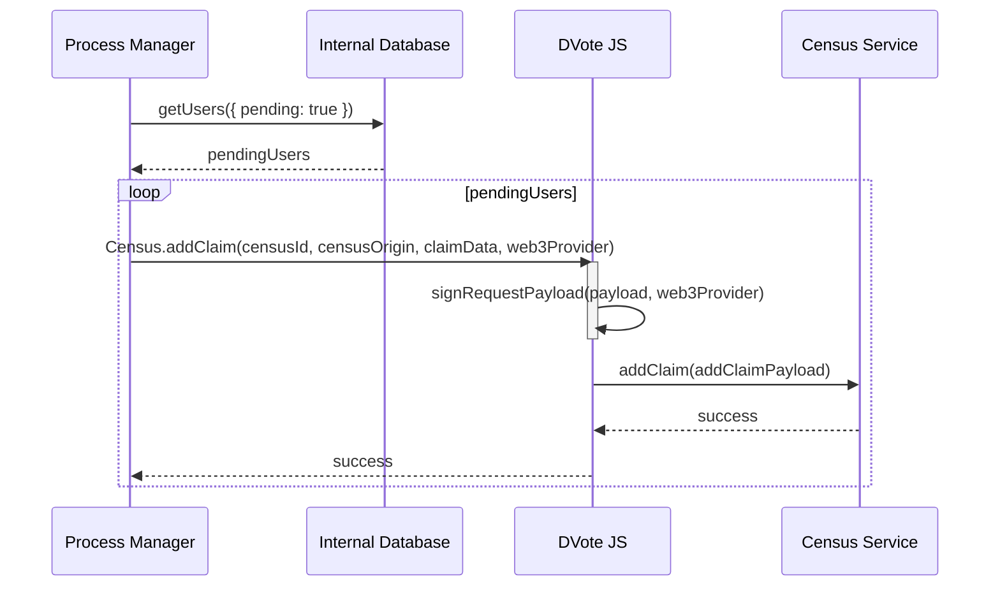
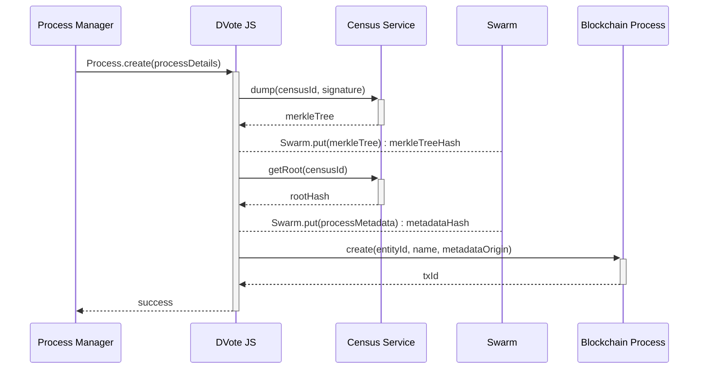
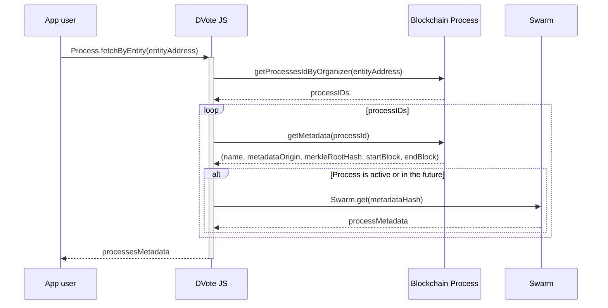
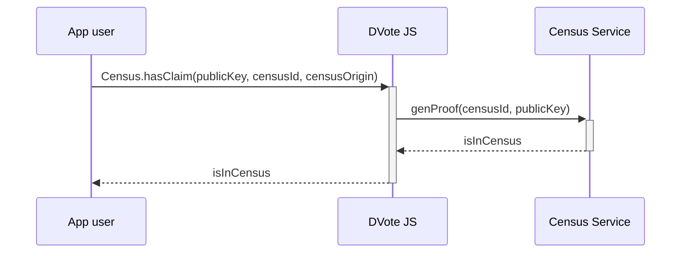
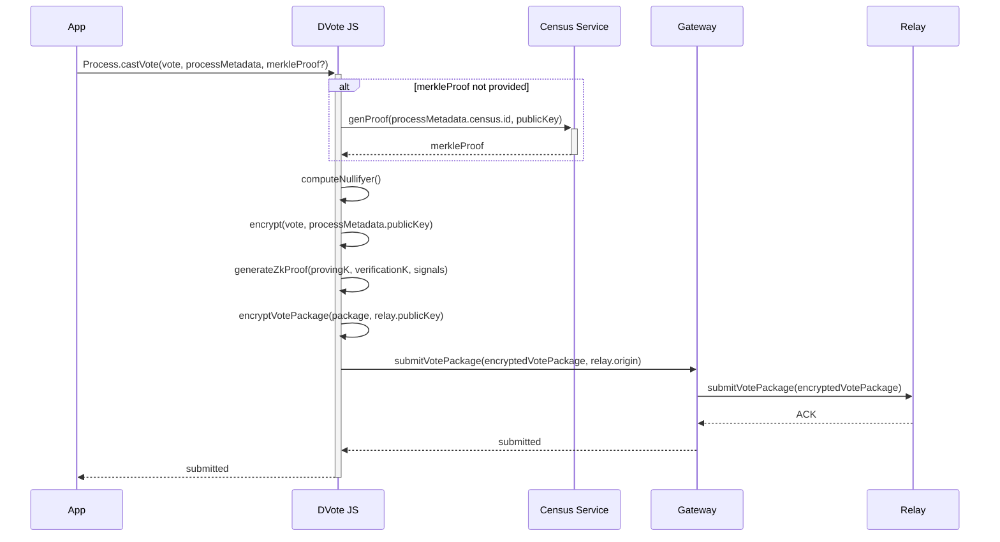
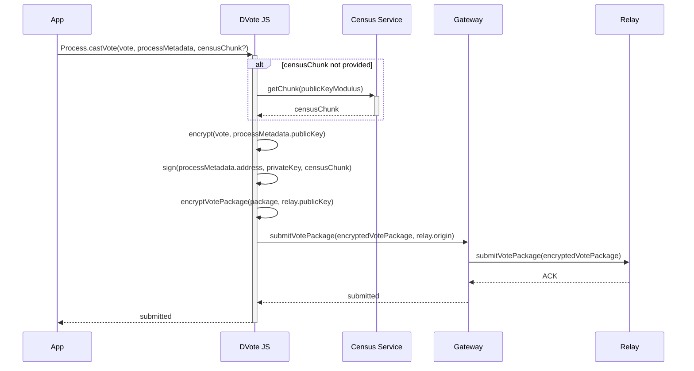

# Sequence diagrams

## Prior to voting
---

### Contract deployment (Entity)

### Contract deployment (Process)

### Entity creation

**Used schemes:**
* [Entity metadata](/protocol/data-schema.md?id=entity-metadata)
* `metadataOrigin` should be as [stated here](/protocol/data-schema?id=content-uri)

**Notes:** 
* Swarm is not a service by itself. Data pinned in the local Swarm repository of the Process Manager becomes available through a P2P network.

<!-- ### Identity creation -->

### Entity subscription

**Used schemes:**
* [Entity metadata](/protocol/data-schema.md?id=entity-metadata)

**Notes:** 
* `metadataOrigin` should be as [stated here](/protocol/data-schema?id=content-uri)
* In the case of React Native apps, DVote JS will need to run on the WebRuntime component

### Custom requests to an Entity

Actions like creating an Entity or subscribing to it are standard processes. However every Entity will probably have specific requirements on what users have to accomplish in order to join a census.

Some may require filling a simple form. Some others may ask to log in from an existing HTTP service. Uploading ID pictures, selfies or even making payments need custom implementations that decide that a user must eventually be added to a census.

Below are some examples:

#### Sign up

The user selects an action from the entityMetadata > actions available.

**Used schemes:**
* [Entity metadata](/protocol/data-schema.md?id=entity-metadata)

**Notes:** 
* `ACTION-URL` is defined on the metadata of the contract. It is expected to be a full URL to which GET parameters will be appended (`publicKey` and optionally `censusId`)

#### Submit a picture
#### Make a payment
#### Resolve a captcha

#### Adding users to a census

Depending on the activity of users, an **Entity** may decide to add public keys to one or more census.

**Used schemes:**
* [addClaimPayload](/protocol/data-schema?id=census-addclaim)

## Voting
---

### Voting process creation

**Used schemes:**
* [processMetadata](/protocol/data-schema?id=process-metadata)
* [getRootPayload](/protocol/data-schema?id=census-getroot)
* The `processDetails` parameter is specified [on the dvote-js library](https://github.com/vocdoni/dvote-client/blob/master/src/dvote/process.ts)

### Voting process retrieval

A user wants to retrieve the voting processes of a given Entity

**Used schemes:**
* [processMetadata](/protocol/data-schema?id=process-metadata)

### Check census inclusion

A user wants to know whether he/she belongs in the census of a process or not.

The request can be sent through HTTP/PSS/PubSub. The response may be fetched by subscribing to a topic on PSS/PubSub.

**Used schemes:**
* [genProofPayload](/protocol/data-schema?id=census-genproof)

**Notes:** 
- `genProof` may be replaced with a call to `hasClaim`, for efficiency
- The `censusId` and `censusOrigin` should have been fetched from a the metadata of a process

## Casting a vote with ZK Snarks

Requests can be sent through HTTP/PSS/PubSub. Responses may be fetched by subscribing to a topic on PSS/PubSub.

**Used schemes:**
* [processMetadata](/protocol/data-schema?id=process-metadata)
* [genProofPayload](/protocol/data-schema?id=census-genproof)
* [Vote Package - ZK Snarks](/protocol/data-schema?id=vote-package-zk-snarks)

**Notes:**
- The Merkle Proof could be retrieved and stored beforehand

## Casting a vote with Linkable Ring Signatures

Requests can be sent through HTTP/PSS/PubSub. Responses may be fetched by subscribing to a topic on PSS/PubSub.

**Used schemes:**
* [processMetadata](/protocol/data-schema?id=process-metadata)
* [getChunk](/protocol/data-schema?id=census-getchunk)
* [Vote Package - Ring Signature](/protocol/data-schema?id=vote-package-ring-signature)

**Notes:**
- The `publicKeyModulus` allows to segment the whole census into `N` polling stations. Every public key is assigned to exactly one, depending on the modulus that yields a division by `processMetadata.census.modulusSize`.

## Registering a Vote Batch

**Used schemes:**
* [Vote Batch](/protocol/data-schema?id=vote-batch)

