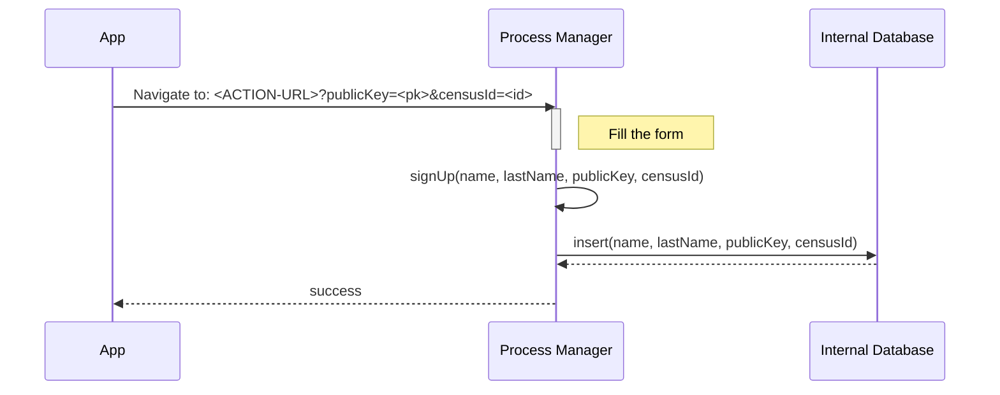
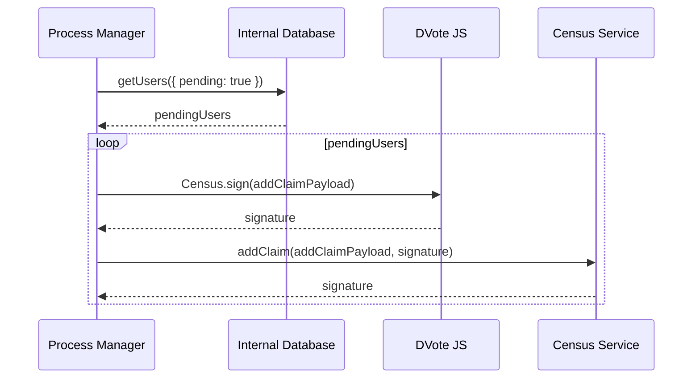

# Sequence diagrams

## Prior to voting
---

### Contract deployment (Entity)

### Contract deployment (Process)

### Entity creation

**Used schemes:**
* [Entity metadata](/protocol/data-schema.md?id=entity-metadata)

**Notes:** 
* `metadataOrigin` can be in the form of `swarm:<metadataHash>` `ipfs:<metadataHash>` or `https://<host>/<path-to-json>`
* Swarm is not an external service. Data is pinned in the local Swarm repository of the Process Manager, and from this point, data becomes available through the P2P network.

<!-- ### Identity creation -->

### Entity subscription

**Used schemes:**
* [Entity metadata](/protocol/data-schema.md?id=entity-metadata)

**Notes:** 
* `metadataOrigin` can be in the form of `swarm:<metadataHash>` `ipfs:<metadataHash>` or `https://<host>/<path-to-json>`
* In the case of React Native apps, DVoteJS will need to run on the WebRuntime component

### Custom requests to an Entity

Below are some examples:

#### Sign up

The user selects an action from the entityMetadata > actions available.

**Used schemes:**
* [Entity metadata](/protocol/data-schema.md?id=entity-metadata)

**Notes:** 
* `ACTION-URL` is defined on the metadata of the contract. It is expected to be a full URL to which GET parameters will be appended (`publicKey` and optionally `censusId`)

#### Submit a picture
#### Make a payment
#### Resolve a captcha

#### Adding users to a census

Depending on the activity of users, an **Entity** may decide to add their public keys to a census.

**Used schemes:**
* [addClaimPayload](/protocol/data-schema?id=census-service-request-payload)
