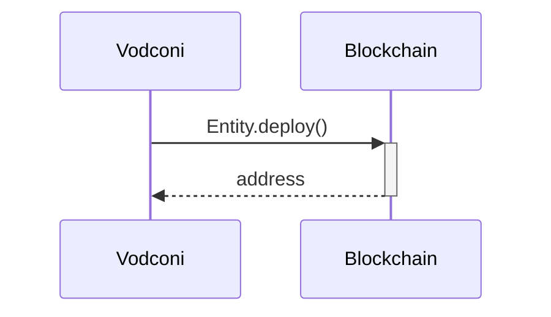
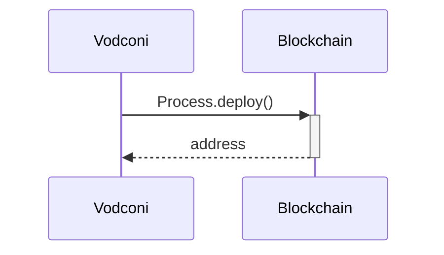
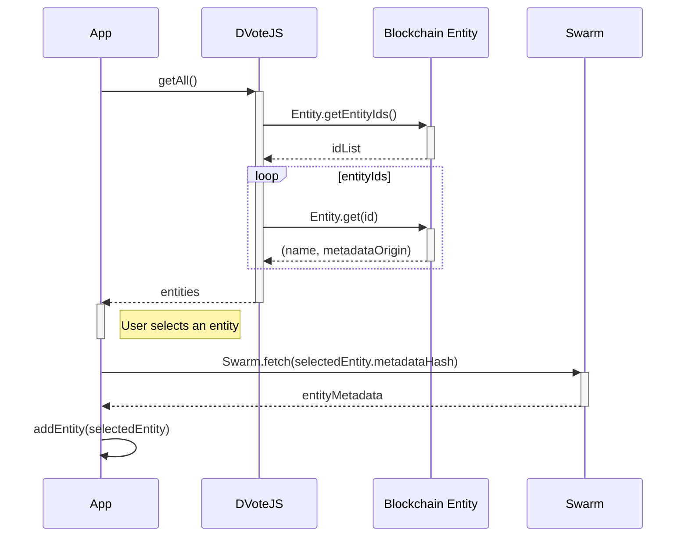

# Sequence diagrams

### Contract deployment (Entity)

### Contract deployment (Process)

### Entity creation

**Used schemas:**
* [Entity metadata](/protocol/data-schema.md?id=entity-metadata)

**Notes:** 
* `metadataOrigin` can be in the form of `swarm:<metadataHash>` `ipfs:<metadataHash>` or `https://<host>/<path-to-json>`
* Swarm is not an external service. Data is pinned in the local Swarm repository of the Process Manager, and from this point, data becomes available through the P2P network.

### Identity creation

-

### Entity subscription

**Used schemas:**
* [Entity metadata](/protocol/data-schema.md?id=entity-metadata)

**Notes:** 
* `metadataOrigin` can be in the form of `swarm:<metadataHash>` `ipfs:<metadataHash>` or `https://<host>/<path-to-json>`

