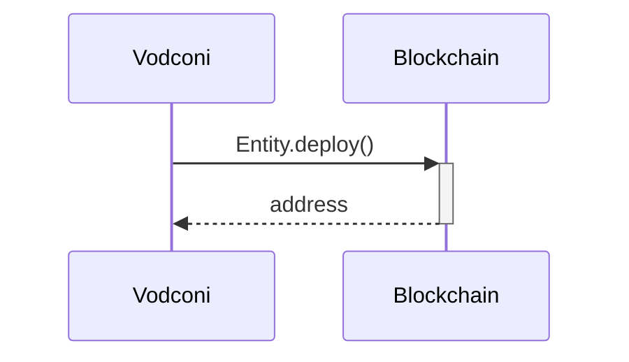
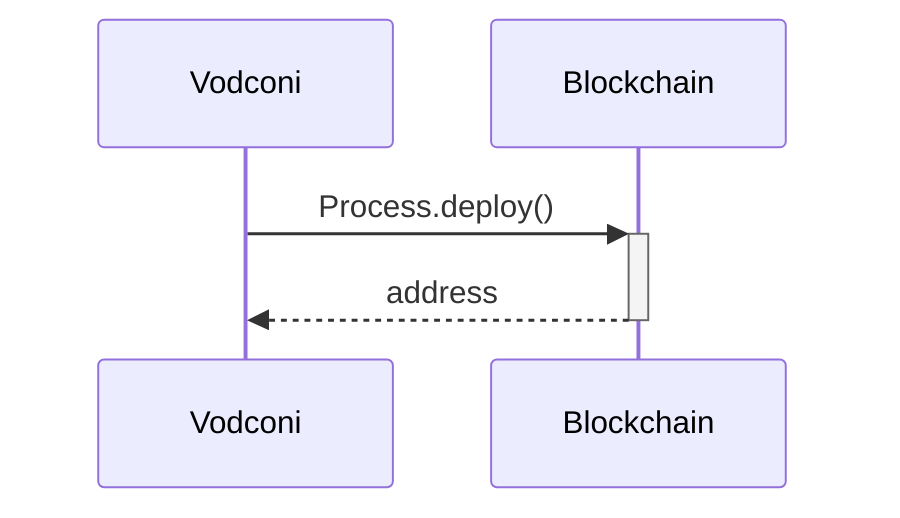
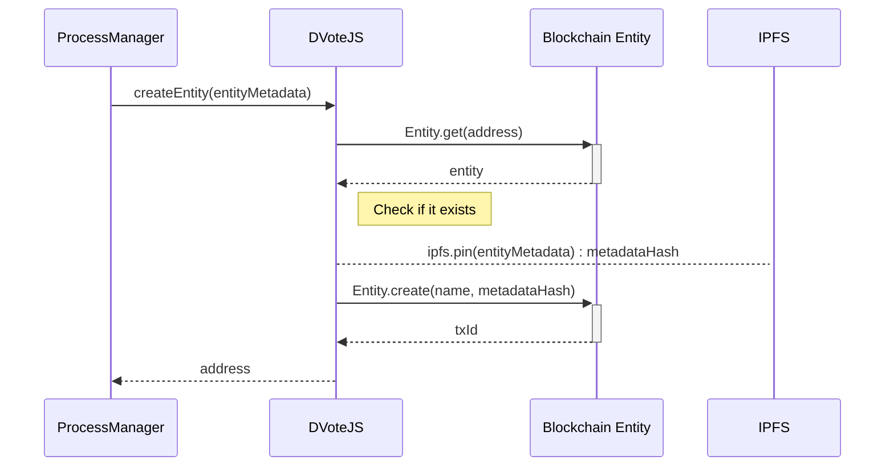
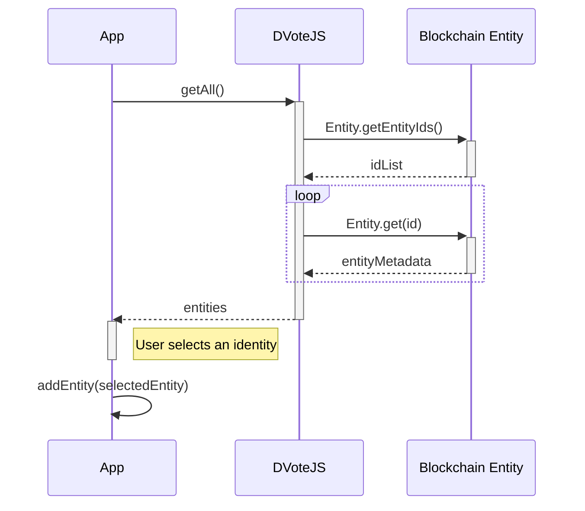

# Sequence diagrams

### Contract deployment (Entity)

### Contract deployment (Process)

### Entity creation

Used schemas:
* [Entity metadata](/protocol/data-schema.md?id=entity-metadata)

**Note:** <small>IPFS is not an external service. Data is pinned in the local IPFS repository of the Process Manager, but from this point, data becomes available through the P2P network.</small>

### Identity creation

-

### Entity subscription

