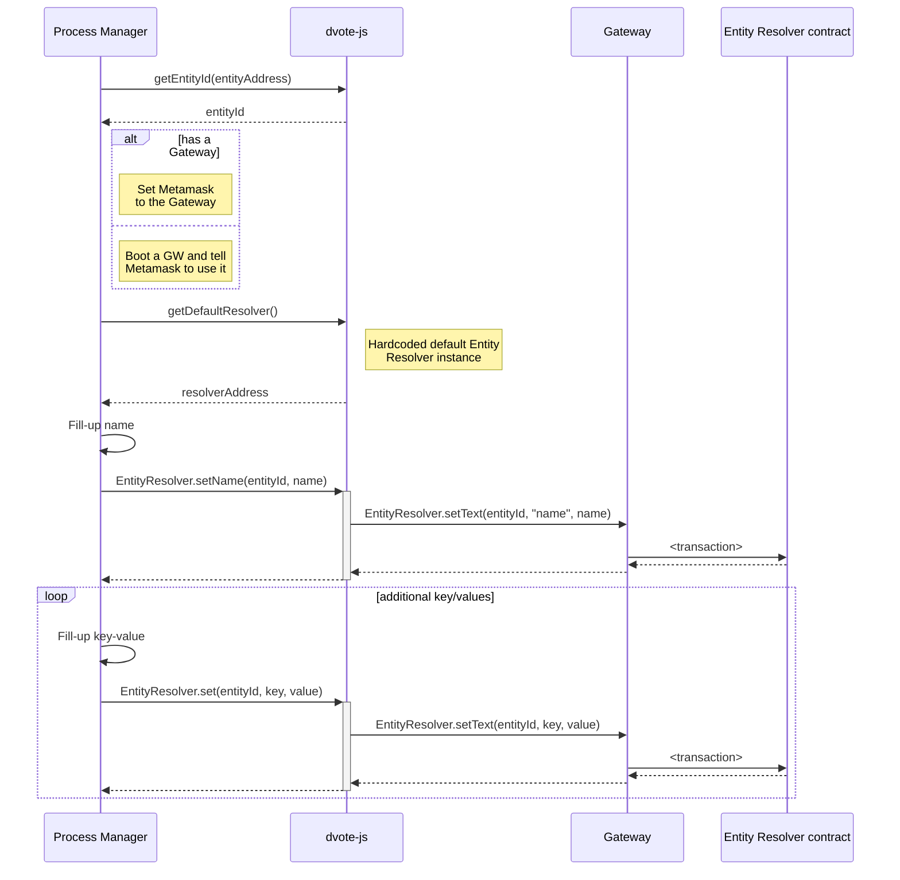

# Sequence diagrams

- [Sequence diagrams](#sequence-diagrams)
  - [Prior to voting](#prior-to-voting)
    - [Contract deployment (Entity)](#contract-deployment-entity)
    - [Contract deployment (Process)](#contract-deployment-process)
    - [Set Entity metadata](#set-entity-metadata)
    - [Entity subscription](#entity-subscription)
    - [Custom requests to an Entity](#custom-requests-to-an-entity)
      - [Sign up](#sign-up)
      - [Submit a picture](#submit-a-picture)
      - [Make a payment](#make-a-payment)
      - [Resolve a captcha](#resolve-a-captcha)
      - [Adding users to a census](#adding-users-to-a-census)
  - [Voting](#voting)
    - [Voting process creation](#voting-process-creation)
    - [Voting process retrieval](#voting-process-retrieval)
    - [Check census inclusion](#check-census-inclusion)
    - [Casting a vote with ZK Snarks](#casting-a-vote-with-zk-snarks)
    - [Casting a vote with Linkable Ring Signatures](#casting-a-vote-with-linkable-ring-signatures)
    - [Registering a Vote Batch](#registering-a-vote-batch)
  - [After voting](#after-voting)
    - [Checking a submitted vote](#checking-a-submitted-vote)
    - [Closing a Voting Process](#closing-a-voting-process)
    - [Vote Scrutiny](#vote-scrutiny)

## Prior to voting

--------------------------------------------------------------------------------

### Set Entity metadata
An Entity starts existing at the moment it has certain metadata stored on the [EntityResolver](/protocol/entity-metadata?id=entityresolver) smart contract. 

**Used schemas:**

- [Entity metadata](/protocol/entity-metadata.md)

<!-- ### Identity creation -->

### Entity subscription

**Used schemas:**

- [Entity metadata](/protocol/entity-metadata.md)

**Notes:**

- In the case of React Native apps, DVote JS will need to run on the WebRuntime component

### Custom requests to an Entity

An Entity may have specific requirements on what users have to accomplish in order to join a be part of its user registry.

Some may require filling a simple form. Some others may ask to log in from an existing HTTP service. Uploading ID pictures, selfies or even making payments need custom implementations that decide that a user must eventually be added to a census.

Below are some examples:

#### Sign up

The user selects an action from the entityMetadata > actions available.

**Used schemas:**

- [Entity metadata](/protocol/data-schema.md?id=entity-metadata)

**Notes:**

- `ACTION-URL` is defined on the metadata of the contract. It is expected to be a full URL to which GET parameters will be appended (`publicKey` and optionally `censusId`)

#### Submit a picture

#### Make a payment

#### Resolve a captcha

#### Adding users to a census

Depending on the activity of users, an **Entity** may decide to add public keys to one or more census.

**Used schemas:**

- [addClaimPayload](/protocol/data-schema?id=census-addclaim)

## Voting

--------------------------------------------------------------------------------

### Voting process creation

**Used schemas:**

- [processMetadata](/protocol/data-schema?id=process-metadata)
- [getRootPayload](/protocol/data-schema?id=census-getroot)
- The `processDetails` parameter is specified [on the dvote-js library](https://github.com/vocdoni/dvote-client/blob/master/src/dvote/process.ts)

### Voting process retrieval

A user wants to retrieve the voting processes of a given Entity

**Used schemas:**

- [processMetadata](/protocol/data-schema?id=process-metadata)

### Check census inclusion

A user wants to know whether he/she belongs in the census of a process or not.

The request can be sent through HTTP/PSS/PubSub. The response may be fetched by subscribing to a topic on PSS/PubSub.

**Used schemas:**

- [genProofPayload](/protocol/data-schema?id=census-genproof)

**Notes:**

- `genProof` may be replaced with a call to `hasClaim`, for efficiency
- The `censusId` and `censusOrigin` should have been fetched from a the metadata of a process

### Casting a vote with ZK Snarks

Requests can be sent through HTTP/PSS/PubSub. Responses may be fetched by subscribing to a topic on PSS/PubSub.

**Used schemas:**

- [processMetadata](/protocol/data-schema?id=process-metadata)
- [genProofPayload](/protocol/data-schema?id=census-genproof)
- [Vote Package - ZK Snarks](/protocol/data-schema?id=vote-package-zk-snarks)

**Notes:**

- The Merkle Proof could be retrieved and stored beforehand

### Casting a vote with Linkable Ring Signatures

Requests can be sent through HTTP/PSS/PubSub. Responses may be fetched by subscribing to a topic on PSS/PubSub.

**Used schemas:**

- [processMetadata](/protocol/data-schema?id=process-metadata)
- [getChunk](/protocol/data-schema?id=census-getchunk)
- [Vote Package - Ring Signature](/protocol/data-schema?id=vote-package-ring-signature)

**Notes:**

- The `publicKeyModulus` allows to segment the whole census into `N` polling stations. Every public key is assigned to exactly one, depending on the modulus that yields a division by `processMetadata.census.modulusSize`.

### Registering a Vote Batch

**Used schemas:**

- [Vote Batch](/protocol/data-schema?id=vote-batch)

## After voting

### Checking a submitted vote

The sequence diagram applies to both **ZK Snarks** and **LRS** Vote Packages. `nullifierOrSignature` will be interpreted according to the process' `type` on its metadata.

**Used schemas:**

- [Vote Batch](/protocol/data-schema?id=vote-batch)

**Notes:**

- `nullifierOrSignature` is expected to contain a nullifier when the process `type` is `zk-snarks`
- `nullifierOrSignature` is expected to contain a ring signature when the process `type` is `lrs`

### Closing a Voting Process

### Vote Scrutiny

Anyone with internet access can compute the scrutiny of a given processAddress. However, the vote batch data needs to be pinned online for a certain period of time.

**Used schemas:**

- [processMetadata](/protocol/data-schema?id=process-metadata)
- [Vote Package - ZK Snarks](/protocol/data-schema?id=vote-package-zk-snarks)
- [Vote Package - Ring Signature](/protocol/data-schema?id=vote-package-ring-signature)
- [Vote Batch](/protocol/data-schema?id=vote-batch)
- [Vote Summary](/protocol/data-schema?id=vote-summary)
- [Vote List](/protocol/data-schema?id=vote-list)
