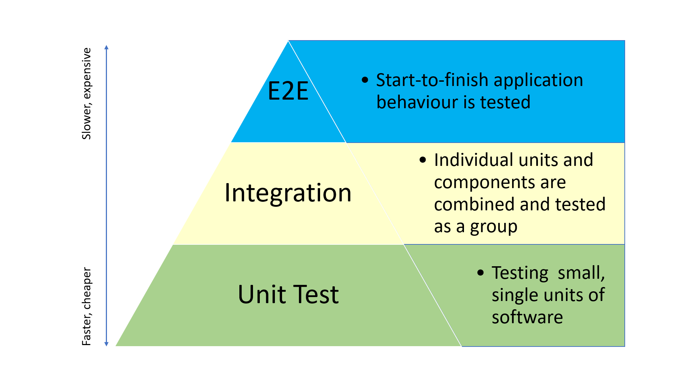

# Development guidelines

> 💡 *There is a 'development guidelines' doc being worked together with Aragon, this
> current page is what we are using while the shared doc with Aragon gets done.*

## Intro
- The 'motto' is: **keep it simple**
    - If we over-extend the explanations or the 'rules', these guidelines will be harder to read and therefore harder to follow.
    - Development guidelines can easily fall into the trap of being very opinionated and subjective. To avoid this, we aim to specify a *'minimum common base layer'* for our development. If a specific team wants to add some extra concrete steps particular to their area of expertise, they are free to do so. 

## Tasks management
- Description of current status:
    - Currently:
        - Product teams are currently using Jira
        - The Protocol team is still using Linear
    - Concrete tasks are defined in `Github issues`
    - General tasks are defined in
        - `Linear`: *Will be replaced by Jira eventually*
        - `Jira` 
        - `Notion`: *document: 'Monday commitments' (priorities of the week & forecast for month)*
    
## Docs/Specs strategy
- Code should be well documented (following the specific language guidelines)
- New features should be documented before being implemented
    - Reasons:
        - Avoid inefficiencies due incompatibilities on the client & server sides
        - Make it easier for the reviewer to verify that the implementation follows the spec
    - **Product features** need to be well described before being implemented.
       - A description of **why** this change is being made, is expected.
       - A clear "definition of done" is expected.
    - **Protocol changes** need to be documented on a docs PR, following suit of a discussion
       - Use the discussions on the `protocol` repo when the topic is relevant to the community
       - Use a Notion page or a HackMD if the topic is relevant to the team only

[discuss.vocdoni.io](https://discuss.vocdoni.io) is used for discussing new features and protocol proposals.

### Layers of documentation
- **Tasks related to PR discussions**: discuss the problem, possible solutions, ideas, agreements, related issues
- **Commit message**: describe what the commit adds & why
- **Inline code documentation**: describe the method & logic of the code, to help the future reader of the code
- **Package README.md**: if needed, add global description of the package
- **docs.vocdoni.io**: document the spec & architecture. If a new protocol/feature is being added, should appear here before the implementation starts.

## Testing strategy

- **Unit**: test the unit in full isolation from any other code part. Usually within a unique package.
- **Integration**: where individual units and components are combined and tested as a group with a clear scope. Usually using multiple packages.
    - example:
        - https://github.com/vocdoni/vocdoni-node/tree/master/test
- **End-to-end**: uses a service that is not in the repo, and performs the full flow. Can test the user behavior.
    - examples:
        - The docker-compose test suite on vocdoni-node: https://github.com/vocdoni/vocdoni-node/tree/master/dockerfiles/testsuite

Priority of test layers:
1. Add **unit tests** of the feature being added
2. When a group of features enables a new flow, add **integration test** for that flow (which combines the features)
3. If possible, implement the same flow from the integration test into an **end-to-end test**

When fixing a **bug**:
1. Add the tests that make the bug appear
2. Then fix the bug
3. Execute the test and check that the bug no longer lives
The idea is to be able prove with code that the bug is fixed: to create a test that fails, and after the code fix the test passes.

### Code reviews
- It is responsability of the PR creator & PR reviewers to ensure that the *Testing strategy* is followed. No PR should be merged if there are missing tests of the newly added code.
- Each repository has a list of people with enough knowledge about it to review PRs.
    - TODO: Define code 'owner'/'default reviewer' concept
    - TODO: Agree on who is knowledgable of each repository package, and write it down --> 'code owner' (enforced by Github)
- When creating a PR the PR creator needs to `require` at least 1 PR reviewer
    - Take in mind that the PR reviewer may be receiving lots of emails of notifications of Github, so the PR creator should decide if it's needed to send a private message to that person to notify of the PR

#### Automated Code Review
- PRs can be merged once:
    - the tests pass
    - the linters pass (if activated)
- It's the responsability of the repo creator/owner to configure the Github Actions with the automated Tests & Linters for each commit & PR

## Linters
There will be an 'official' minimum linter configuration file, that all the repos of each language must include in the automated tests.

## Git branching model
Git branching model can be found at: https://github.com/vocdoni/protocol/wiki/Repository-branching-and-guideline

<!--
# Topics to be defined in the near future
*These are topics that will be discussed in the following days, but that don't block the advance of this document.*
- Which tool to use for tasks/issues
    - current: Github issues + Linear app + Jira + Notion
- Which tool to use for Test Coverage
    - if we agree to use one
- Define code 'owner'/'default reviewer' concept & Github feature of codeowner usage
- Go repo template
    - `.golangci.yml`
        - current examples:
            - https://github.com/vocdoni/vocdoni-node/blob/master/.golangci.yml
            - https://github.com/vocdoni/arbo/blob/master/.golangci.yml
-->
