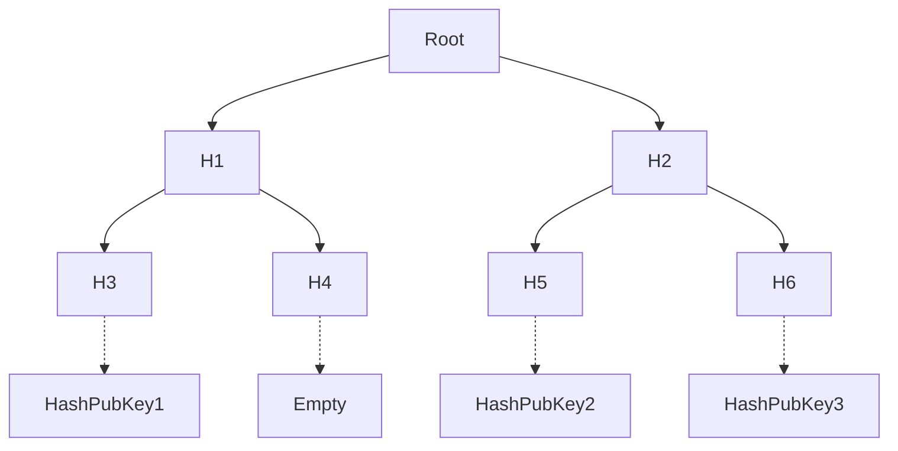
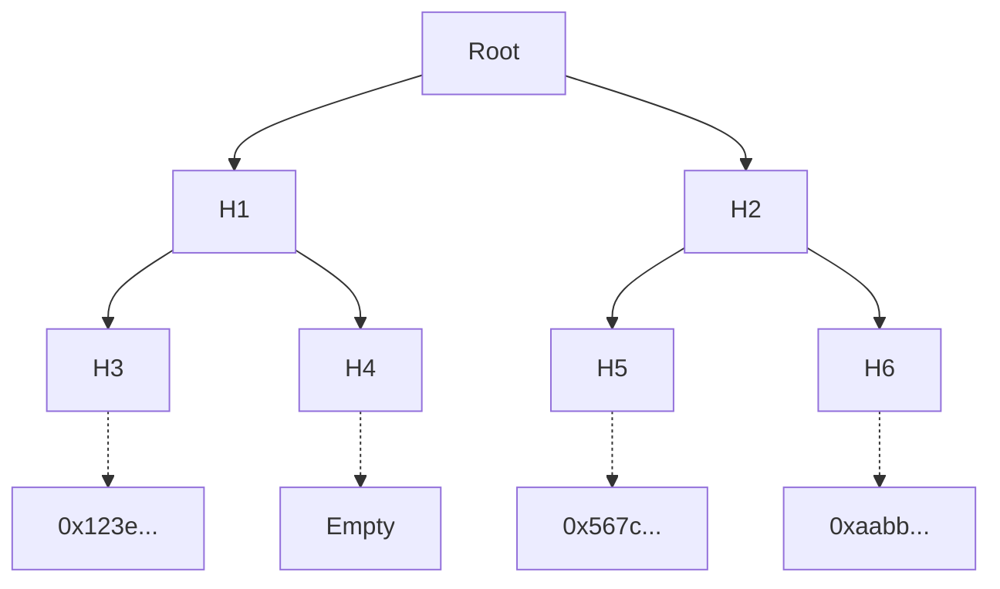

# The Census

In Vocdoni, a census of identities is represented as a binary [Merkle Tree](https://en.wikipedia.org/wiki/Merkle_tree). The leaves of the tree contain the public key of all eligible voters, hashed.

A Merkle Tree allows to efficiently prove that a leave belongs to the tree. For a tree of size `N` elements, only `log(N)` elements are needed to generate a proof. As an example, a tree with 1 million leaves would only need 20 hashes to prove the inclusion of any leave.

The tree structure is made of nodes. Terminal nodes contain the actual values and the rest of them contain the hash of their two children. If a leaf is updated, all its parent nodes are affected.

+ The **verifier** only needs to know the Root Hash
+ The **prover** only needs to provide the Leaf and its Siblings

The owner of PubKey1 only needs `HashPubKey1 + H4 + H2` to prove anyone that the key is part of the Merkle Tree (census).

The verifier then will compute `hash( hash( hash(HashPubKey1) + H4 ) + H2 )` and compare the result with the Root hash that he/she already knows.

Vocdoni stores a hash of public keys instead of public keys themselves to provide an additional privacy layer when publishing the census.

### Census creation

Organizations have to publish their census before launching any governance process. They may generate a census with one of many methods. The current recommended methods are Registry DB and CSV census.

#### Registry DB

The user registry is a private component used by entities to manage and generate census of voters. The registry may have a standard database with the private details of the entity's members and their public keys. Users must secure their own private keys (this is best suited for a mobile application with encrypted memory) and sign-up to the entity by sending their public key hash along with their identifiable information to this private database. 

| id  | name     | age | country     | pubkeyHash |
| --- | -------- | --- | ----------- | ---------- |
| 0   | John     | 27  | Winterfell  | 0x123e...  |
| 1   | Tyrion   | 36  | Lannisport  | 0x567c...  |
| 2   | Daenerys | 22  | Dragonstone | 0xaabb...  |
| 3   | Jorah    | 65  | Bear Island | 0xcc11...  |

When the entity wants to create a governance process, the administrator will use the registry to select the group of users matching a certain criteria. For example `age < 40`. The backend would select users `0,1,2` and create a Merkle tree with the corresponding public key hashes.

#### CSV Registry

The CSV registry enables organizations to host voting processes without requiring users to store their own private keys, best used for a light-weight frontend with minimal user sign-up. The entity generates a CSV file including user information:

| name     | age | country     | favorite color |
| -------- | --- | ----------- | ----------     |
| John     | 27  | Winterfell  | red            |
| Tyrion   | 36  | Lannisport  | blue           |
| Daenerys | 22  | Dragonstone | fuchsia        |
| Jorah    | 65  | Bear Island | brown          |

This information is normalized, concatenated, and then hashed to create a public key for each user. The public keys are added to the census Merkle Tree and then discarded, and only the Merkle Tree is stored. Users can then generate their ephemeral private key in the future by entering their correct information in a web client. 

Note that this method is only as secure as the information used to generate the keys. If the CSV fields contain only publicly-available information, anyone could maliciously generate another user's key pair. 

### Exporting the census

The registry backend will finally:

+ Export the Merkle tree of pubkey hashes and make them available via IPFS or similar
+ Publish the Root Hash on the Process Smart Contract
+ Publish the IPFS URI of the Merkle tree on the Process Smart Contract

With the census details and the rest of parameters, a process is ready to be created by the manager.

### Accessing the census

The Gateways deployed by Vocdoni and third parties will be monitoring the Process Smart Contract. As they see a new process and a census, they will fetch and import the Merkle Tree. At this point, users can use any available Gateway to check whether they are eligible for voting and then fetch their Merkle Proof.

Users with a valid Merkle Proof can efficiently show that their key belongs to a large census by providing a very small fraction of the whole tree.
