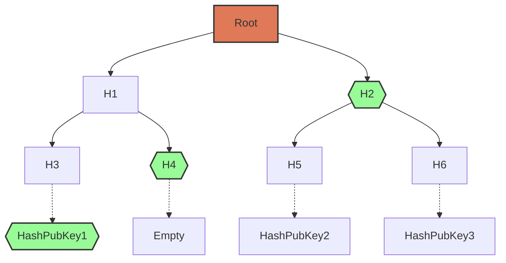

# The Census

In Vocdoni, a census of identities is represented as a binary [Merkle Tree](https://en.wikipedia.org/wiki/Merkle_tree). The leaves of the tree contain the public keys of all eligible voters, hashed.

A Merkle Tree can efficiently prove that a leaf belongs to the tree. For a tree of size `N` elements, only `log(N)` elements are needed to generate a proof. A tree with 1 million leaves, for example, would only need 20 hashes to prove the inclusion of any one leaf. 

The tree structure is made of nodes. Terminal nodes contain the actual values; every other node contains the hash of its two children. If a leaf is updated, all its parent nodes are affected.

A **prover** is able to prove the inclusion of any leaf of the Merkle Tree to a **verifier**:
+ The **verifier** only needs to know the Root Hash
+ The **prover** only needs to provide the Leaf and its Sibling, as well as the sibling of each of its ancestors (hence, `log(N)` elements).

This means that, in the case of our example Voting Merkle Tree, the owner of PubKey1 only needs `HashPubKey1 + H4 + H2` (highlighted in green on the graph below) to prove that their key is part of the Merkle Tree, and therefore that their public key is in the voter census. 

To verify this proof, the verifier simply computes `hash( hash( hash(HashPubKey1) + H4 ) + H2 )` and compares this result with the known Root hash of the Merkle Tree.

This Merkle Proof design allows voters to prove census inclusion without knowing any other voters' keys, and with a computation time that is logarithmically proportionate to the census size. 

Vocdoni stores a hash of public keys instead of public keys themselves to provide an additional privacy layer when publishing the census.

### Creating & publishing the census

Any organization is required to generate and publish a census Merkle Tree in order to host a voting process on the [Voting Blockchain](services/vochain.md). The method for managing and filtering users and generating the Merkle Tree, however, is up to integrators of the Voting Protocol. For users of [Vocdoni.app](https://vocdoni.app) and [Aragon Voice](https://voice.aragon.org), this is handled automatically by the client layer. The census module is further documented on the [census integration](../integration/census/general.md) page.

### Accessing the census

The Gateways deployed by Vocdoni and third parties constantly monitor the [Process Smart Contract](smart-contracts/process.md). Upon identifying a new process, they will fetch and import that process' Census Merkle Tree. At this point, users can use any available Gateway to check whether they are eligible for voting and then fetch their Merkle Proof (this as well may be handled by the client implementation)

Users with a valid Merkle Proof can efficiently show that their key belongs to a large census by providing a very small fraction of the whole tree.
