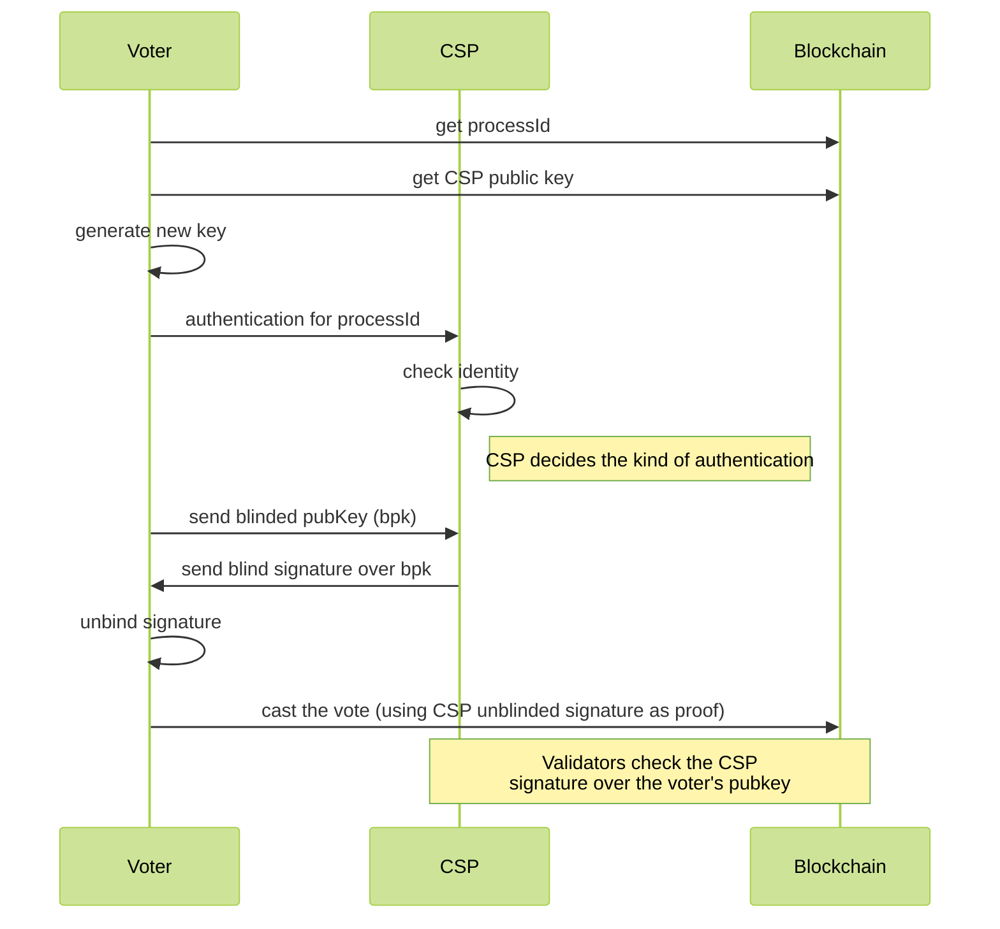

# Off-Chain CSP Census

A census approach based on Credential Service Providers (CSPs) allows organizations to validate users manually and based off of any arbitrary criteria. Rather than a static census published before-hand, CSP census allows each user to be evaluated for voting eligibility individually, throughout the duration of the voting process.

In order to prove they are a member of the census, a voter needs to retrieve a certificate of eligibility from the CSP for that process. The CSP first verifies the user's validity (eg. `resident of Istanbul` or `human being standing in front of me`) and then provides this certificate by signing the voter's public key.

### Blind Signatures

In order to preserve the anonymity of each voter, the CSP server will perform a blind signature. Blind signatures were first suggested by David Chaum, who designed a cryptographic scheme that allows for signatures over disguised (blinded) messages. The blinder (voter in our scenario) can then un-blind the signature and use it as a standard one. This protocol was designed for RSA, but we will use it over EC secp256k1 (Ethereum and Vocdoni standard).



In order to ensure that each CSP voter approval is valid only for one specific election process (processId), a deterministic key derivation is be used. Thus, the CSP is only required to publish a single root public key. The specific per-election keys are computed independently by all parties (CSP will derive its election private key and the election organizers will derive the election public key). To this end we use the following simple approach (G is the elliptic curve generator):

```
PubKeyRoot = PrivKeyRoot * G
PrivKey2 = PrivkeyRoot + ProcessId
PubKey2 = PubKeyRoot + ProcessId
```

Following this derivation, $PubKey2$ becomes the election public key. Thus, there is no way the CSP can share claims before the ProcessId is known and there is no way to reuse a CSP signature for a different election process.

<div style="padding: 20px; background-color: white; text-align: center;">
	
</div>