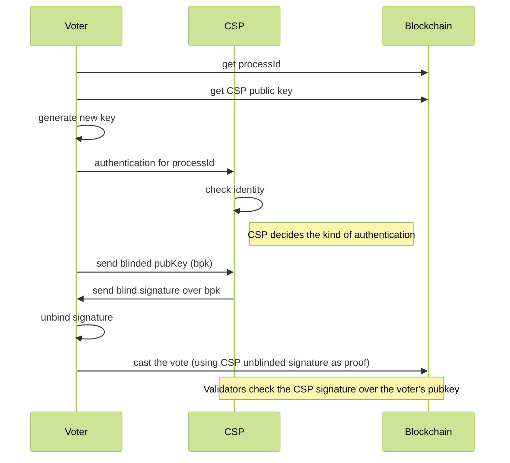

# Off-Chain CSP Census

```mermaid
%%{init: {'theme':'forest'}}%%

sequenceDiagram
    participant Voter
    participant CSP 
    participant BC as Blockchain

    Voter->>BC: get processId
    Voter->>BC: get CSP public key
    Voter->>Voter: generate new key
    Voter->>CSP: authentication for processId
    CSP->>CSP: check identity
    Note right of CSP: CSP decides the kind of authentication

    Voter->>CSP: send blinded pubKey (bpk)
    CSP->>Voter: send blind signature over bpk
    Voter->>Voter: unbind signature
    Voter->>BC: cast the vote (using CSP unblinded signature as proof)
    Note over CSP, BC: Validators check the CSP signature over the voter's pubkey

```

	

