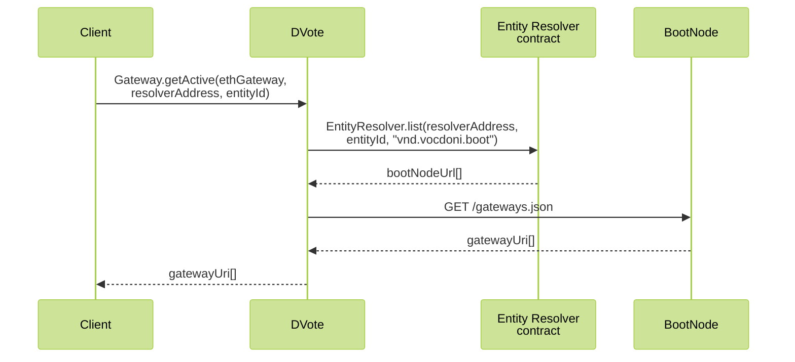
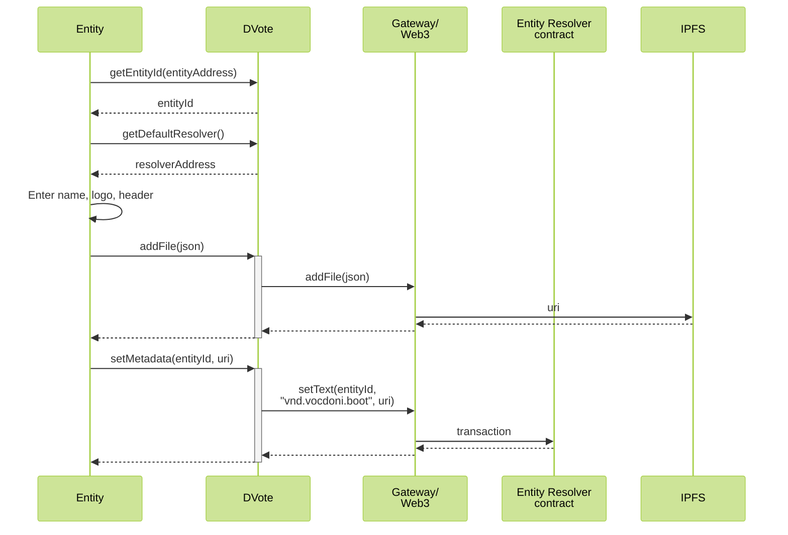
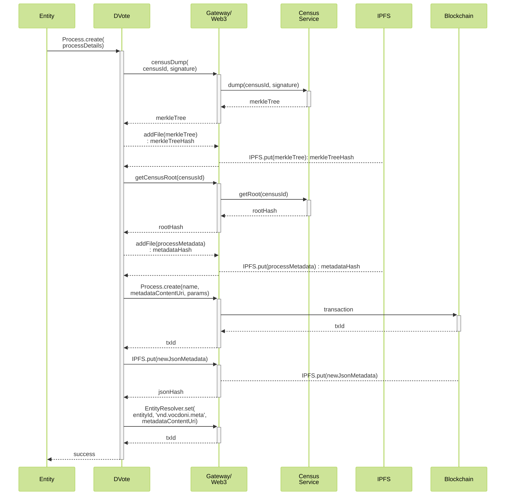
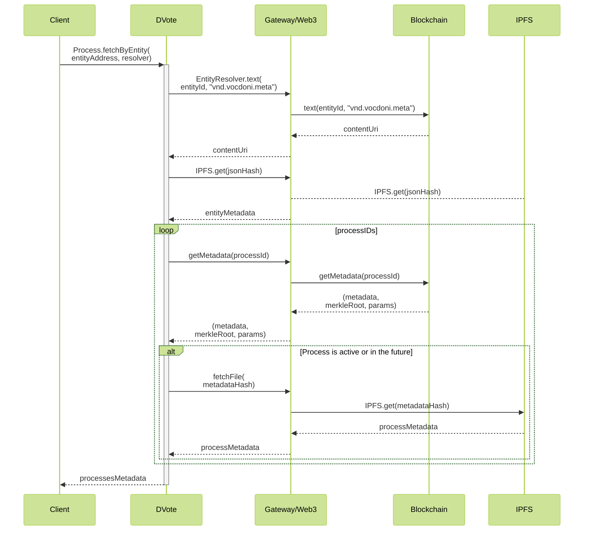
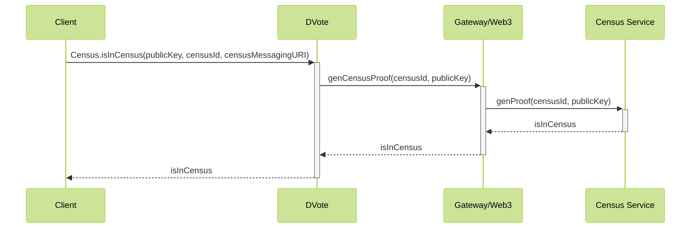
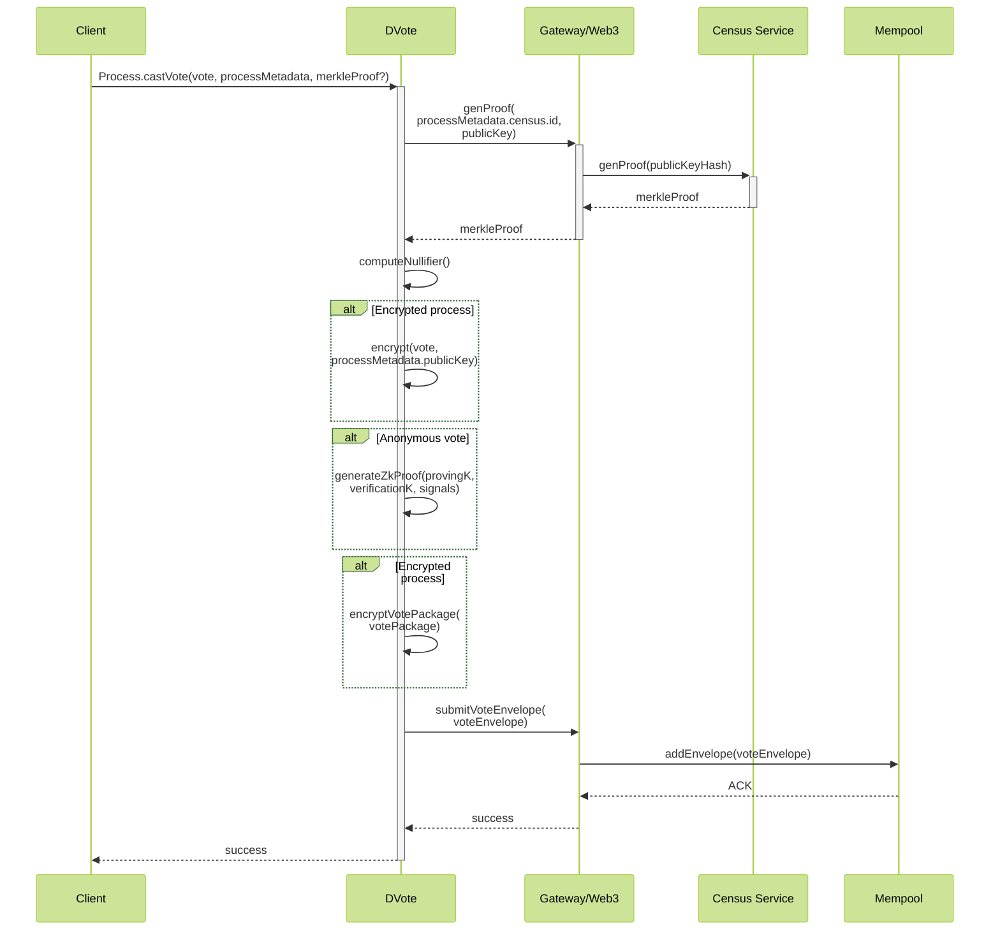
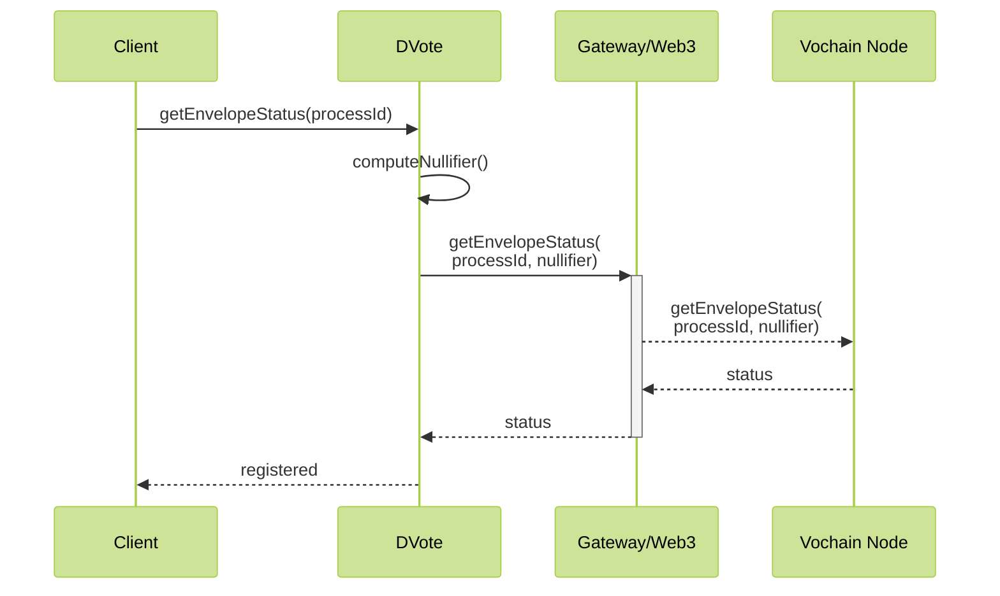
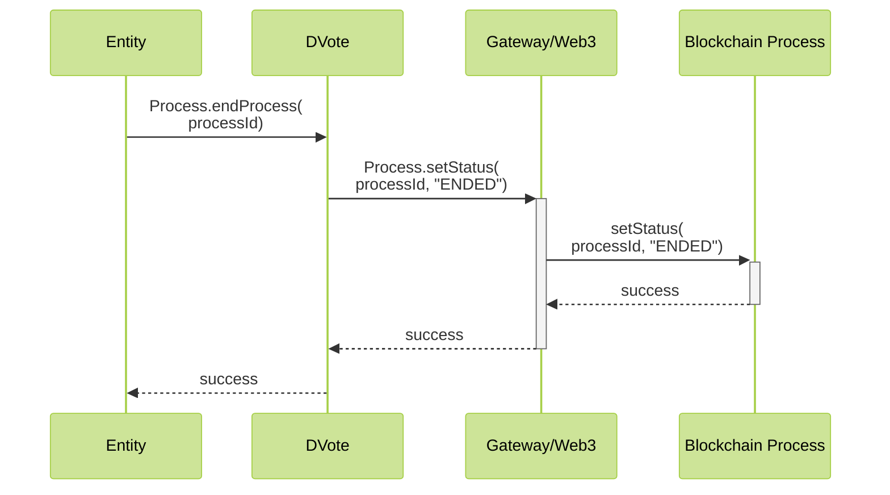
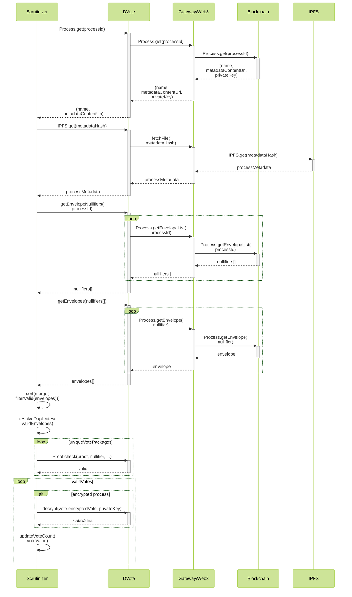

# Component Interaction

Traditional systems like APIs present simple scenarios, in which a centralized service define how data should be encoded. However, decentralized ecosystems like a distributed voting system need much stronger work on defining every interaction between any two peers on the network.

- [Component Interaction](#component-interaction)
  - [Prior to voting](#prior-to-voting)
    - [Overview](#overview)
    - [Initial Gateway discovery](#initial-gateway-discovery)
    - [Set Entity metadata](#set-entity-metadata)
  - [Voting](#voting)
    - [Overview](#overview-1)
    - [Voting process creation](#voting-process-creation)
    - [Voting process retrieval](#voting-process-retrieval)
    - [Check census inclusion](#check-census-inclusion)
    - [Casting a vote](#casting-a-vote)
  - [After voting](#after-voting)
    - [Overview](#overview-2)
    - [Checking a Vote Envelope](#checking-a-vote-envelope)
    - [Closing a Voting Process](#closing-a-voting-process)
    - [Vote Scrutiny](#vote-scrutiny)

---

## Prior to voting

### Overview

Before a voting process can take place, the following four general steps must occur:

1. Vocdoni deploys the [smart contracts](https://github.com/vocdoni/dvote-solidity#contracts) to Ethereum
2. The **organizer** registers an [Entity](/architecture/smart-contracts/entity-resolver) to the blockchain
	- The metadata of the entity is pinned on IPFS
	- The reference is declared on the ENS resolver of the entity
3. A public key is registered  for each user
    - *Either*:
      - The **voter** creates a self-sovereign identity and registers to an organization with their public key
      - The **organizer** keeps a list of registered public keys of eligible voters
    - *Or*:
      - The **organizer** creates a spreadsheet containing private information of each eligible voter. Each voter's public key for a specific voting process is derived from their private information.
4. The **organizer** published a census Merkle Tree containing all voters' public keys

### Initial Gateway discovery

The client wants to get initial connectivity with the available gateways.

1. Using a well-known Ethereum Gateway, we query for an initial boot node on the ENS Resolver. The following is defined:
    - Well-known Ethereum blockchain gateways
    - Entity Resolver contract address
    - Vocdoni's Entity ID
2. From one of the boot nodes, we get a list of Gateways provided by Vocdoni

Eventually:

- One of Vocdoni's Gateways is used to query the ENS resolver of a certain Entity

### Set Entity metadata
An Entity starts existing at the moment it has certain metadata stored on the [Entity Resolver](/architecture/smart-contracts/entity-resolver.html#entityresolver) smart contract. 

**Used schemas:**

- [Entity metadata](/architecture/data-schemes/entity-metadata)

---

## Voting

### Overview

The voting process as a whole is as follows:

1. The **organizer** creates a voting process
	- Select the voter census or voter csv to use
	- Get the census Merkle Root
	- Pin the Merkle Tree on IPFS or similar
	- Pin the [Process Metadata](/architecture/data-schemes/process) on IPFS
	- Send a transaction to the process smart contract, including [Content URI](/architecture/protocol/data-origins.html#content-uri)s pointing to the [Process Metadata](/architecture/data-schemes/process) and the [Census Merkle Tree](census/census-overview.md), along with the rest of parameters
	- Update the list of voting processes on the [ENS Resolver](/architecture/smart-contracts/entity-resolver.html#entity-resolver) contract for the entity
2. The **voter** fetches the active processes for an **Entity**, or is sent a link directly to a process
	- Read the description and review the voting options
3. The **voter** verifies that they belong in the census:
   - *Either*: 
     - Decrypt their self-managed key and check its inclusion in the census
   - *Or*:
     - Enter their private information to the client, which generates their ephemeral key pair for this process, and check that key's inclusion in the census
4. The **voter** casts a vote
	- The client generates a proof that the voter's key belongs in the census Merkle Tree
	- The client computes the user's nullifier for the vote
	- The client generates the [Vote Package](/architecture/smart-contracts/process.html#vote-package-zk-snarks) with the election choices
	- *If the process is encrypted*:
		- The client fetches the encryption public keys from the **Gateway**
		- The client encrypts the [Vote Package](/architecture/smart-contracts/process.html#vote-package-zk-snarks) with the public keys of the voting process
	- *If the process is anonymous*:
		- The client fetches the proving and verification keys and then generates the **Zero-Knowledge Proof**
		- The ZK Proof proves that:
			- The voter knows a private key, whose public key belongs to the census
			- The provided nullifier matches the current process ID and the user's private key
	<!-- - ~POW~ -->
	- The client generates the [Vote Envelope](/architecture/data-schemes/process.html#vote-envelope-zk-snarks) containing the Vote Package
	- The client selects a **Gateway** among the available ones and submits the [Vote Envelope](/architecture/data-schemes/process.html#vote-envelope-zk-snarks)
	- The **Gateway** submits the [Vote Envelope](/architecture/data-schemes/process.html#vote-envelope-zk-snarks) to the mempool of the Vochain
5. A **Vochain miner** processes an incoming [Vote Envelope](/architecture/data-schemes/process.html#vote-envelope)
	- The **Vochain miner** checks that the current block is within the process start/end blocks
	- The **Vochain miner** checks that the given nullifier has not been used before
	- *If the process is anonymous*:
		- The **Vochain miner** checks that the **ZK Proof** of the [Vote Envelope](/architecture/data-schemes/process.html#vote-envelope) is valid
	- *If the process is not anonymous*:
		- The **Vochain miner** checks that the **Merkle Proof** of the [Vote Envelope](/architecture/data-schemes/process.html#vote-envelope) matches the vote signature and the Merkle root
	- The **Vochain miner** adds the [Vote Envelope](/architecture/data-schemes/process.html#vote-envelope) to the next block

### Voting process creation

**Used schemas:**

- [Process Metadata](/architecture/data-schemes/process.html#process-metadata)
- [Census Service addClaimBulk](/architecture/services/census-service.html#addclaimbulk)
- [Census Service getRoot](/architecture/services/census-service.html#getroot)
- [Census Service dump](/architecture/services/census-service.html#dump)

### Voting process retrieval

A user wants to retrieve the voting processes of a given Entity

**Used schemas:**

- [Process Metadata](/architecture/data-schemes/process.html#process-metadata)

### Check census inclusion

A user wants to know whether he/she belongs in the census of a process or not.

**Used schemas:**

- [Census Service generateProof](/architecture/services/census-service.html#generateproof)

**Notes:**

- `generateProof` may be replaced with a call to `hasClaim`, for efficiency
- The `censusId` and `censusMessagingURI` should have been fetched from the [Process Metadata](/architecture/smart-contracts/process)

### Casting a vote

A user wants to submit a vote for a given governance process.

**Used schemas:**

- [Process Metadata](/architecture/data-schemes/process.html#process-metadata)
- [Census Service generateProof](/architecture/services/census-service.html#generateproof)
- [Vote Package](/architecture/smart-contracts/process.html#vote-package)

**Notes:**
- The Merkle Proof could be retrieved and stored beforehand

## After voting

### Overview

- The **voter** checks that their vote is registered
	- The client asks a **Gateway** for the envelope status of his/her nullifier
- The process ends
  - *Either the **organizer** ends the process*:
  	- The **organizer** sends a transaction to the process contract and sets the state of the process as ended
  	- An oracle relays the transaction to the Vochain
  - *Or the process end block is reached*: 
  	- An oracle sends a transaction to the Vochain to signal that a process has ended
  - Further envelope submissions are rejected
  - *On encrypted processes*:
    - Miners create a transaction revealing their private key for the process
- The **indexer** computes the results, as well as any third-party **observer** who wishes to do so
	- The **indexer** fetches the [Process Metadata](/architecture/data-schemes/process) from the process contract and IPFS
	- *On encrypted processes*:
    	- The **indexer** requests the encryption private keys from the **Gateway**
	- The **indexer** fetches all the [Vote Envelopes](/architecture/data-schemes/process.html#vote-envelope) registered for the process
	- *On encrypted processes*:
      - The **indexer** decrypts each [Vote Package](/architecture/smart-contracts/process.html#vote-package-zk-snarks)
	- The **indexer** checks their ZK Proofs or Merkle Proofs, the [Vote Package](/architecture/smart-contracts/process.html#vote-package-zk-snarks) contents and the restrictions imposed by the process flags
	- The **indexer** counts the number of appearances of every single vote value
    	- Any vote value beyond the ones defined in the [Process Metadata](/architecture/data-schemes/process) is discarded
<!-- - The **indexer** and any third-party **observers** publish the vote results
	- The **indexer** computes a ZK Rollup, proving that the given results have been correctly computed from valid vote envelopes and that the results include the choices of `N` valid voter
	- The **observer** submits a transaction to the process smart contract, including the results and the ZK Rollup proof of the computation results -->

### Checking a Vote Envelope

A user wants to check the status of an envelope by its nullifier.

### Closing a Voting Process

### Vote Scrutiny

Anyone with network access can compute the scrutiny of a given processId. 
<!-- The node can even compute a ZK Rollup proof to let the contract verify the correctness of the provided results on-chain. -->

**Used schemas:**

- [Process Metadata](/architecture/data-schemes/process.html#process-metadata)
- [Vote Package](/architecture/smart-contracts/process.html#vote-package)

