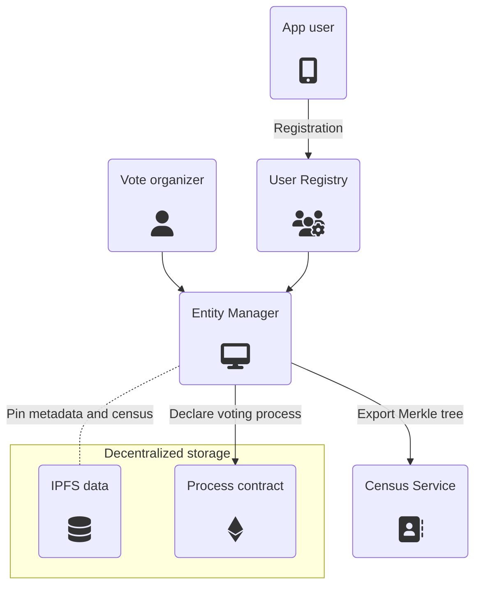
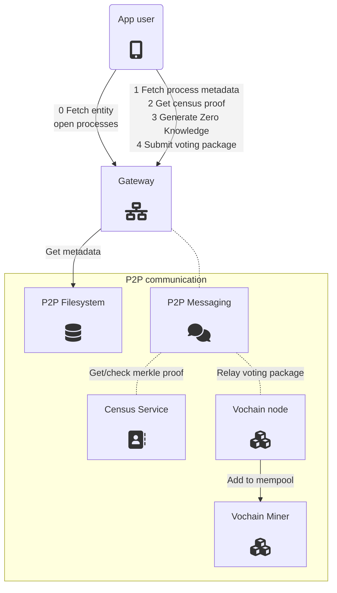
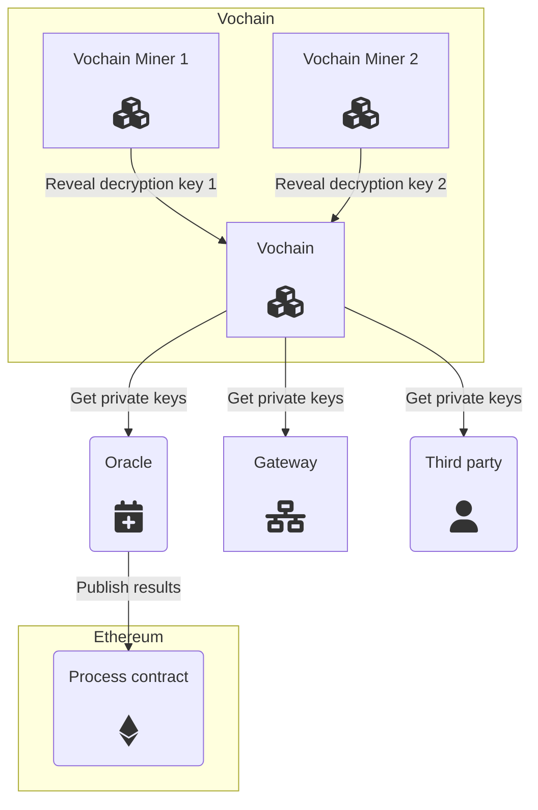

# Process overview

Similarly to an operating system, Vocdoni also **runs processes**. An OS process traditionally starts with a system call to the kernel, requesting the execution of a program with flags and permissions.

A voting process looks familiar. An Ethereum transaction (syscall) is made to the [process smart contract](https://github.com/vocdoni/dvote-solidity#process) (kernel), with parameters that define how the election will behave. The transaction will include metadata, the root of the census and [dozens of flags](https://github.com/vocdoni/dvote-solidity#types-and-values) that allow to run processes with powerful features.

An oracle will relay the transaction with the same parameters (and signature) to the Voting blockchain. At this point, the process has been created on the Vochain and valid votes will be accepted from users who belong to the given census.

From a component's perspective, the system can be decoupled in three stages.

## Process creation

Given a user database, the organizer builds a Merkle Tree with the public keys (census) that are eligible to vote on a process.

To create one, its metadata is pinned on a decentralized filesystem and a transaction is sent to the blockchain to persist the vote details.

## Voting

Users need to fetch the metadata of the process, choose the vote options and request a Merkle Proof to generate the vote package. If the process is private, clients also need to fetch the public keys to use for vote encryption. With all the required data, the user computes a Zero Knowledge proof. 

The client submits a Vote envelope (containing the ZK-Proof and the voting choices) to one or several Gateways. These are connected to the Vochain P2P network, so Gateways will relay the envelope to the blockchain mempool.

The Vochain nodes and miners validate the Zero Knowledge proof. If valid, the vote package is added to the next block and becomes available for computing the results.

## Results

When an encrypted process ends, encryption keys are revealed by the blockchain miners so that scrutiny can take place. From this moment, any node on the network can start counting and validating votes.

At the same time, an Oracle computes the results and submits them with a ZK Rollup to the Process Smart Contract, so that results become available on-chain.

**Note**: The ZK-Rollups functionality may need heavy computation resources and development time until it is available. For this reason, intermediary approaches like Optimistic Rollups may be implemented first and iterated later.
