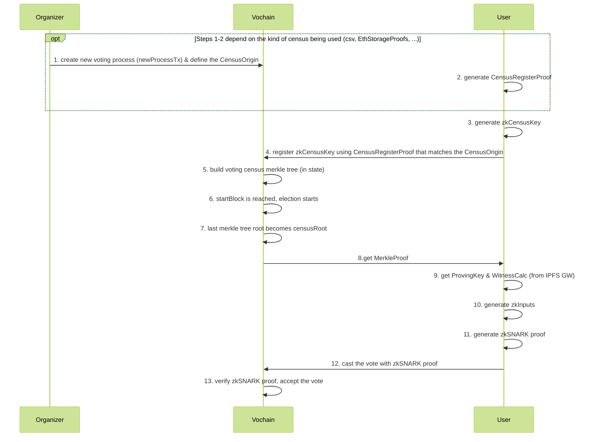
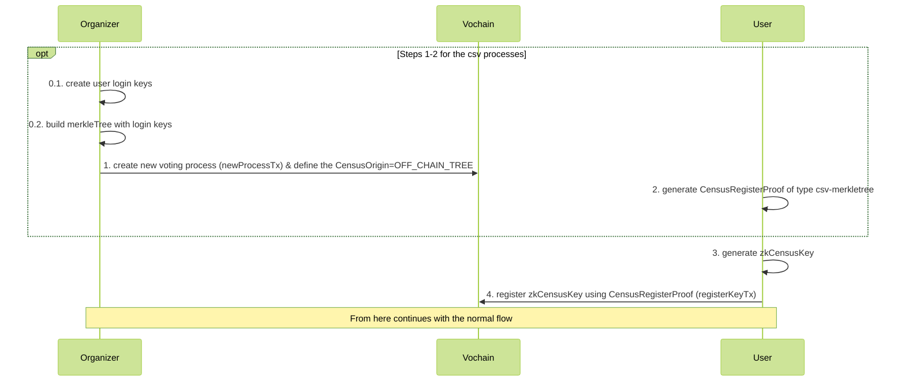
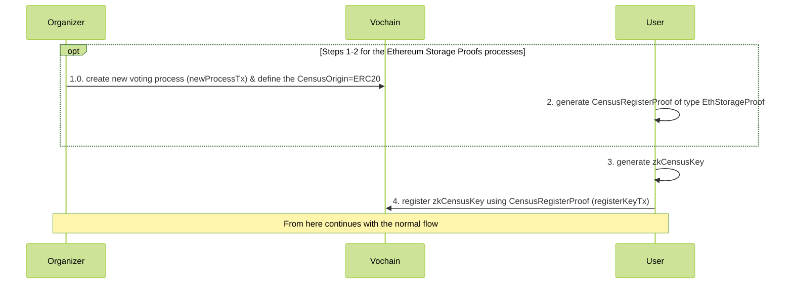

# ZK Census Proof

This document is divided in two sections:
- **[Protocol design](#protocol-design)**: high level overview of the protocol.
- **[Implementation spec](#implementation-spec)**: detailed specification, featuring the relevant data structures, hash functions, etc.

## Protocol design

The census proof (also called franchise proof) enables user privacy and allows for fully anonymous voting.

The starting point is a [Merkle Proof](/architecture/census/census-overview.md), which efficiently proves that a voter's *zkCensusKey* belongs to a Merkle Tree (census). However, using this proof alone would allow the organizer of a process to correlate each vote envelope with its voter's the *zkCensusKey* on the database, so votes wouldn't be secret.

To this end, Vocdoni achieves voting anonymity by the use of ZK-Snarks.

### zkSNARKs for anonymous voters

Snark stands for *Succinct non-interactive argument of knowledge*. In our case, this means proving to someone that we know something, but without revealing the contents of what we know.

In our case:
  1. `Voter` is the owner of the `secret key` corresponding to a certain `zkCensusKey`
  2. `Voter`'s `zkCensusKey` is included in the `census` Merkle Tree
  3. The nullifier provided by `Voter` uniquely corresponds to their `secret key` and the `process ID` for a specific voting process

Although the computation is CPU and memory intensive, ZK Proofs can be generated from the user client running on modest hardware. The proof is validated by the Vochain Nodes, Miners, and any Third Party monitoring the process.

### zkSNARK circuit

Voters use the proving key generated for the circuit below to generate a ZK Proof. The circuit receives both private and public inputs.

Data that could reveal the identity of the voter are kept private (gray boxes in the diagram). Public inputs are submitted within the Vote Envelope, so that validators can check them against the proof and make sure that the user hasn't voted twice.

+ The same circuit can be used for any `process` with a census size of the same range (10k, 100k, 1M, etc).
+ It relies on a [**trusted setup ceremony**](https://medium.com/qed-it/diving-into-the-snarks-setup-phase-b7660242a0d7)

<div style="padding: 20px; background-color: white;">
	
</div>

The circuit above verifies that:
- the prover is the owner of the secret key
- the `zkCensusKey` of the secret key is inside a Hash, which is inside the Merkle Tree with the CensusRoot (`key=Poseidon(secretKey), value=0`)
- `H(secretKey, electionID) == nullifier`

#### Proof generation

The franchise proof is generated by running the zkSNARK circuit.

+ **Private inputs:** Index, Secret Key, Census Merkle-proof
+ **Public inputs:** Census Merkle-root, Nullifier, ProcessId, Vote
+ **Output:** Franchise proof

Steps:
1. **Vote encryption**
    - `encrypted_vote = encrypt( selected_voting_options + random_nonce )`
2. **Nullifier generation**
    - `nullifier = hash( process_id + user_secret_key )`
3. **Fetch merkle proof**
    - From any source that has the census merkle tree such as a Vocdoni Gateway or directly from IPFS.


## Implementation spec

### Flow
  *The following flow describes the *csv census* flow.*



#### Steps description
::: tip
 - *[O]* = Organizer
 - *[U]* = User
 - *[V]* = Vochain
 - *[G]* = Gateway
:::

0. Circom [circuit](https://github.com/vocdoni/zk-franchise-proof-circuit) is compiled & **Trusted Setup** generated
1. *[O+V]* Create new voting process (newProcessTx) & define the **CensusOrigin**
    - The **CensusOrigin** could be for example:	
        - Using **csv file**: Generate MerkleTree from a `csv` data file, where the **CensusOrigin** determines the verification of the MerkleProof of that MerkleTree (check [flow-for-csv-votations section](#flow-for-csv-votations) for more details)
        - Using **Ethereum storage proofs**: The MerkleTree is the root of the EthereumTree at a certain block, and the **CensusOrigin** determines the verification of the MerkleProof of that Ethereum MerkleTree (check [flow-for-ethereumstorageproofs-votations section](#flow-for-ethereumstorageproofs-votations) for more details)
2. *[U]* Generate CensusRegisterProof, more details:
    - [flow for csv votations](#flow-for-csv-votations)
    - [flow for ethereumstorageproofs votations](#flow-for-ethereumstorageproofs-votations)
3. *[U]* Generate **zkCensusKey** (used as leaf key)
    - User's *zkCensusKey*: `zkCensusKey = Hash(userSecret)`
    - This is the key that will be added into the *CensusTree*
4. *[U+V]* **Register zkCensusKey** using **CensusRegisterProof** (registerKeyTx)
  - Vochain checks that the **CensusRegistryProof** can be validated for the **CensusOrigin**
5. *[V]* Build voting **census merkle tree** (in state)
    - Where each leaf contains the hash of each user's `secretKey` (*zkCensusKey*)
    - MerkleTree type: circom compatible
        - Hash function: [Poseidon](https://github.com/iden3/go-iden3-crypto/blob/master/poseidon/poseidon.go)
        - Tree [Go impl](https://github.com/vocdoni/vocdoni-node/blob/master/censustree/arbotree/wrapper.go)
6. *[V]* StartBlock is reached, **election starts**
7. *[V]* Last merkle tree root becomes **censusRoot**
8. *[V+U]* **Get MerkleProof**
    - Vochain will send the *'compressed MerkleProof'* (which are the siblings compressed)
    - Client side will need to 'decompress' it
        - The logic to decompress the siblings [can be found here](https://github.com/vocdoni/arbo/blob/master/tree.go#L606)
        - And [here](https://github.com/vocdoni/arbo/blob/master/tree.go#L577) the explaination of the encoding
9. *[U+G]* **Get ProvingKey & WitnessCalc**
    - *Proving Key & Witness Calc* depend on the circuit being used
10. *[U]* **Generate zkInputs**
    - check the [zkInputs generation](#zkInputs-generation) section for more details
11. *[U]* **Generate zkSNARK proof**
    - using: *zkInputs + Proving Key + Witness Calculator*
12. *[U]* **Cast the vote** with zkSNARK proof
    - contains:
        - *public inputs*
        - *zkProof*
        - *vote*
13. *[V]* **Verify zkSNARK proof**, accept the vote
    - Needs to know:
        - ElectionID
        - Verification Key (depends on the circuit being used (census size))
        - User's *public inputs* + *zkProof*

#### Flow for csv voting
::: tip
**Important**: This scheme assumes fully trusting the *organization*, as the
*organization* could add non-real users to the census that later can be used
to issue valid votes.

This use case would set the flag `preRegister=true` and the `CensusOrigin` would be `OFF_CHAIN_TREE` or `OFF_CHAIN_TREE_WEIGHTED`.
:::



- 0.1. *[O]* Create user **login keys**
    - from csv data
- 0.2. *[O]* Build **MerkleTree** with login keys
- 1. *[O+V]* Create **new voting process** (newProcessTx) & define the `CensusOrigin=OFF_CHAIN_TREE`
    - **CensusOrigin** determines the checks:
      - the given *MerkleProof* matches with the defined *Census Root*
- 2. *[U]* Generate **CensusRegisterProof**
    - which is the MerkleProof that the user 'login key' is in the tree 
- 3. *[U]* Generate **zkCensusKey** (used as leaf key)
    - User's *zkCensusKey*: `zkCensusKey = Hash(userSecret)`
        - Here `userSecret` can be `csv user's data + secret from user`
        - This is the key that will be added into the *CensusTree*
- 4. *[U+V]* **Register zkCensusKey** using **CensusRegisterProof** (registerKeyTx)
  - Vochain checks that the **CensusRegistryProof** can be validated for the **CensusOrigin**

::: tip
The organization could also directly register *Users'* secret keys to the Vochain, avoiding the need for a registration phase. This option would use the `ProcessMode` flags 

This use case would set the flag `preRegister=false` and the `CensusOrigin` would be `OFF_CHAIN_TREE` or `OFF_CHAIN_TREE_WEIGHTED` with the `CensusRoot` determined by the Organization.
:::

#### Flow for EthereumStorageProofs votations


- 1. *[O+V]* Create **new voting process** (newProcessTx) & define the `CensusOrigin=ERC20` (or one of the others available such as `ERC777`, `MINI_ME`, etc)
    - CensusOrigin: determines to check that:
      - the given *MerkleProof* matches with the defined *Ethereum Root*
      - the sender of the *MerkleProof* is the owner of that address (check eth-signature)
    - *[O]* Define the *EthTreeRoot* for the **CensusOrigin**
- 2. *[U]* Generate **CensusRegisterProof**
    - which is the EthereumStorageProof + an ethereum signature by the address of the EthereumStorageProof (to prove ownership of the proof)
- 3. *[U]* Generate **zkCensusKey** (used as leaf key)
    - User's *zkCensusKey*: `zkCensusKey = Hash(userSecret)`
	- Here `userSecret` can be the value of the signature of a public known constant made by the user's EthereumKey (where the output is only known by the user, as it is used as a 'secret key'). This is the approach that Hermez zkRollup uses to derive 'snark friendly' keys from Metamask's Ethereum Keys
        - This is the key that will be added into the *CensusTree*
- 4. *[U+V]* **Register zkCensusKey** using **CensusRegisterProof** (registerKeyTx)
  - Vochain checks that the **CensusRegistryProof** can be validated for the **CensusOrigin**


### Merkle Tree
The MerkleTree used for building the *anonymous census* needs to be a zkSNARK-friendly implementation. As currently we are using [Circom](https://github.com/iden3/circom) for the zkSNARK circuits, we need to be compatible with the [circomlib](https://github.com/iden3/circomlib/tree/master/circuits/smt) MerkleTree implementation. A specification of the MerkleTree [can be found here](https://docs.iden3.io/publications/pdfs/Merkle-Tree.pdf).

In the Vochain, we're using the [arbo](https://github.com/vocdoni/arbo) MerkleTree, which is a Go implementation compatible with the Circom spec.

The MerkleTree uses the Poseidon hash, which is a 'snark-friendly' hash function that later on can be proved inside a circuit without requiring too many constraints.

The following diagram contains a visual representation of the data structure of the Leaves of the MerkleTree being used in the scheme of the zk-census-proof.

<div style="padding: 20px; background-color: white;">
	
</div>

The `index` value is determined by the *CensusTree* builder, which has an `index` value for each *CensusTree*. This value increments with the addition of each new leaf.

The *Leaves* are structured in this way in order to use the MerkleTrees more efficiently, allowing more user keys to fit inside a smaller tree and therefore reducing the zk circuit size. This is because the value of any given leaf's *key* determines that leaf's *position* on the tree. If the leaf key were determined by the `zkCensusKey`, rather than an incremental `index`, each new leaf would have a significant chance of collision before filling all the available leaf spots for a given height. Trees would therefore be less balanced and require larger circuits for the same census size due to inefficient use of tree space. With the incremental index approach, on the other hand, all the leaf spots can be filled without a single collision. This produces much smaller circuits for the same number of users.


### zkInputs generation
```json
// Example of zkInputs
{
	"censusRoot": "51642541620950251760298704744678482162425252475654827255045491135352807540162",
	"censusSiblings": ["0","0","0","0"],
	"index": "30",
	"secretKey": "6190793965647866647574058687473278714480561351424348391693421151024369116465",
	"voteValue": ["100964581237483263846637432502620436451", "278307331411790712608582894981321409946"],
	"electionId": "10",
	"nullifier": "1938187656076799017313903315498318464349291455761501098436114043715056719301",
}
```

Origin of each zkInput parameter:
::: tip
*all the parameters are `string` or `[]string` that represent `bigInt` or `[]bigInt`*
:::

- *censusRoot*: computed by the *CensusAuthority* from the *Census Tree*
- *censusSiblings*: computed by the *CensusAuthority*, is the *Merkle Proof*
    - the *User* retrieves the *siblings* from the *Vochain* through the *Gateway*
    - the length of *censusSiblings* will depend on the *zkCircuit*:
        - The design of the *MerkleTree* used in circomlib provokes different lengths in the siblings returned when generating a *MerkleProof*
	  - This is due the design of the *MerkleTree* defines a tree in which the deep of the tree (from the root to the leafs) will depend on each leaf and its neighbors. More details can be found in the [*MerkleTree* spec](https://docs.iden3.io/publications/pdfs/Merkle-Tree.pdf).
        - In order to input those siblings into the circuit, the `nLevels` of the circuit is fixed, so the length of *siblings* needs to be fixed also.
        - So, the len(siblings) will depend on the *zkCircuit* being used, specifically from the `nLevels` parameter of the circuit
        - The logic needed to be implemented in the User side can be found [here (go) lines 67-70](https://github.com/vocdoni/zk-franchise-proof-circuit/blob/feature/go-code-inputs-generation/test/go-inputs-generator/census_test.go#L67), and [here (js) line 23](https://github.com/vocdoni/zk-franchise-proof-circuit/blob/feature/go-code-inputs-generation/src/franchise.js#L33):
            - `while (siblings.length < this.levels) siblings.push(BigInt(0));`
- *index*: determined by the Vochain when adding the *User*'s *zkCensusKey* into the *CensusTree*
- *secretKey*: generated by the *User*
- *voteValue*: hashed value of the *User* vote, composed by two big integers.
  - The raw user vote is a variable-length array of values and its values do not need to be checked in the circuit. Furthermore, the values can be encrypted.
  - Since the encoded vote values may not fit into a constant number of circuit inputs, we calculate a summary of the raw user vote using an EVM-friendly hash function: `sha256(vote_bytes)`.  The output of the sha256 hash is slightly larger than the field used in SNARKS, so we split the hash output (32-bytes) into 2 16-byte arrays, take them as integers (in little-endian), and use them as circuit inputs.
    - `sha256` hash is used, as if necessary in the future it can be [verified inside](https://github.com/iden3/circomlib/blob/master/circuits/sha256/sha256.circom) the circuit. This usage has two characteristics to keep in mind:
      - `sha256` is twice as expensive as `keccak256` in terms of gas in EVM, but it is implemented in `circom`, so it can be checked inside a circuit
      - checking the `sha256` inside a circom circuit is expensive in terms of number of constraints (in the current version of this spec, this is not checked inside the circuit)
  - example:
    ```go
    h := sha256.Sum256(voteBytes) // voteBytes can be the votes array converted to bytes, or the encrypted votes
    b1 := new(big.Int).SetBytes(swapEndianness(h[:16])) // swap endianness, as golang big int package works in big-endian, and we use little-endian
    b2 := new(big.Int).SetBytes(swapEndianness(h[16:]))
    ```
    And the json input of the `voteValue` for the circuit would be: `"voteValue": [b1, b2]`
- *electionId*: the election ID in which the *User* is participating
- *nullifier*: computed by *User*
    - `nullifier = poseidon.Hash(sk, electionID)`

### Circuit identification
There will be different circuits of the `zk-census-proof` depending on the census size, also there could be more use cases with different circuit designs.
Both the client and the Vochain need a way to univocally identify those circuits, in order to user the proper `Proving key`, `Witness calculator` and `Verification key` for each circuit.

Circuits are identified across the stack by using a Protobuf enum type. Each `ProofZkSNARK` protobuf package will have a `Type` identifier indicating which circuit the proof belongs to, so the Vochain knows which `Verification Key` to use for verifying the proof.

Format: `CIRCUITNAME_PARAMETER1_PARAMETER2`

List of current types:
- `ZKCENSUSPROOF_NLEVELS`
    - Circuit name: [`ZKCENSUSPROOF`](https://github.com/vocdoni/zk-franchise-proof-circuit/blob/master/circuits/census.circom)
    - Parameters: `nLevels`
    - Example:
        - `ZKCENSUSPROOF_100`
        - `ZKCENSUSPROOF_1000`


# Annex
#### Examples of flags combinations
Below there are listed some common combinations of flags used when created a new process:
- Census MerkleTree (from CSV file or private database) with pre-register: `preRegister=true`, `CensusOrigin=OFF_CHAIN_TREE`
- Census MerkleTree (from CSV file or private database) with the Organization defining the `CensusRoot` (creating the user's keys, without pre-register phase): `preRegister=false`, `CensusOrigin=OFF_CHAIN_TREE`
- Ethereum Storage Proofs with an ERC20 token: `preRegister=false`, `CensusOrigin=ERC20`

#### KeyKeepers reveal and commit keys

A set of commitment keys are generated for each election process by a set of trusted identities named `keykeepers`. Only if all `keykeepers` are malicious could they tamper with the election, so it is crucial to distribute these special identities well. Once all these keys are revealed, anyone can generate a valid proof. This mechanism is added to the circuit in order to avoid vote buying when the election is over. Since anyone can now generate a valid proof, a voter will no longer be able to prove that they are the owner of a specific vote nullifier.

<div style="padding: 20px; background-color: white;">
	
</div>

zkInputs of this alternative scheme:
```json
// Example of zkInputs
{
	"censusRoot": "51642541620950251760298704744678482162425252475654827255045491135352807540162",
	"censusSiblings": ["0","0","0","0"],
	"secretKey": "6190793965647866647574058687473278714480561351424348391693421151024369116465",
	"voteValue": ["100964581237483263846637432502620436451", "278307331411790712608582894981321409946"],
	"electionId": "10",
	"nullifier": "1938187656076799017313903315498318464349291455761501098436114043715056719301",
	"relayerPublicKey": "100",
	"relayerProof": "21349690342514405503176665977362532634490340702670001813783738965751319356478",
	"revealKey": ["0"],
	"commitKey": ["19014214495641488759237505126948346942972912379615652741039992445865937985820"]
}
```

- *relayerPublicKey*: given by the *KeyKeeper*
- *relayerProof*: computed by the *User*
    - `relayerProof = poseidon.Hash(nullifier, relayerPublicKey)`
- *revealKey*: not known by the user at the proof generation moment
    - the length of this array is determined by the `nMiners` parameter of the circuit
- *commitKey*: given by the *KeyKeeper*
    - the length of this array is determined by the `nMiners` parameter of the circuit
    - `poseidon.Hash(relayerPublicKey)`
