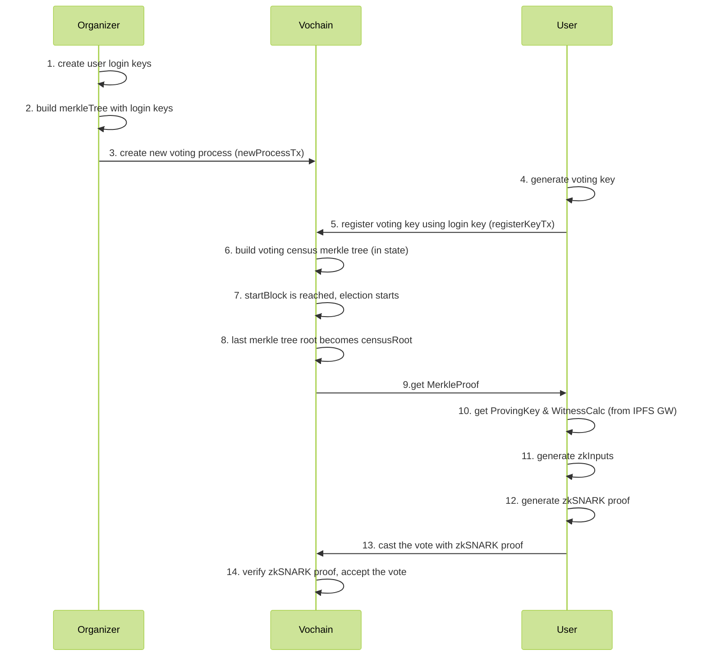

# ZK Census Proof

This document is splitted in two main sections:
- **Protocol design**: high level overview of the protocol, without giving much specific details, but showing the main idea.
- **Implementation spec**: step by step specification, explaining all the details, the data structures used, how things are hashed, etc. With the aim to avoid leaving any ambiguous concept.

## Protocol design

The census proof (also called franchise proof) enables user privacy and allows anonymous voting.

The starting point is a [Merkle Proof](/architecture/census-overview?id=the-census), which efficiently proves that a public key belongs to a Merkle Tree (census). However, using this proof alone would allow the organizer to correlate the vote envelopes with the public key on the database, so that votes wouldn't be secret.

To this end, Vocdoni achieves voting anonymity by the use of ZK-Snarks.

### zkSNARKs for anonymous voters

Snark stands for *Succinct non-interactive argument of knowledge*. In our case, this means proving to someone that we know something, but without revealing it.

In our case:
  1. `Voter` is the owner of the `private key` corresponding to a certain `public key`
  2. `Voter`'s `public key` is included in the `census` Merkle Tree
  3. The nullifier provided by `Voter` uniquely corresponds to his/her `private key` and the `process ID`

Although the computation is CPU and memory intensive, ZK Proofs can be generated from the user client running on modest hardware. The proof is validated by the Vochain Nodes, Miners and any Third Party monitoring the process.

### zkSNARK circuit

Voters use the proving key generated for the circuit below to generate a ZK Proof. The circuit receives both private and public inputs.

Data that could reveal the identity of the voter are kept private (gray boxes in the diagram). Public inputs are submitted within the Vote Envelope, so that validators can check them against the proof and make sure that the user hasn't voted twice.

+ The same circuit can be used for any `process` with the same census (max) size
+ It relies on a **trusted setup ceremony**

<div style="padding: 20px; background-color: white; text-align: center;">
	
</div>

The circuit is to check that:
- the prover is the owner of the private key
- the public key of the private key is inside a Hash, which is inside the Merkletree with the CensusRoot (key=Poseidon(pk.X, pk.Y), value=0)
- H(privateKey, electionID) == nullifier
- H(nullifier, relayerPublicKey) == relayerProof
- n times (for each Miner) * {H(revealKey) == commitKey} OR the rest of the circuit


#### Proof generation

The franchise proof is generated by running the ZK-SNARK cicuit.

+ **Private inputs:** Private Key, Census Merkle-proof, Vote-signature
+ **Public inputs:** Census Merkle-root, Nullifier, ProcessId, Vote
+ **Output:** Franchise proof

Steps:
1. **Vote encryption**
    - `encrypted_vote = encrypt( selected_voting_options + random_nonce )`
2. **Nullifier generation**
    - `nullifier = hash( process_id + user_private_key )`
3. **Vote signature**
    - `signature = Sign(encrypted_vote)`
	- This signature is required in order to attach the vote to the zk-Proof.
4. **Fetch merkle proof**
    - From any source that have the census merkle tree such as a Vocdoni Gateway or directly from IPFS.

#### KeyKeepers reveal and commit keys

A set of commitment keys are generated for each election process by a set of trusted identities named `keykeepers`. Only if all `keykeepers` are malicious they might tamper the election, so it is important to make a good distribution of these special identities. Once all these keys are revealed, anyone can generate a valid proof. This mechanism is added to the circuit in order to avoid vote buying when the election is over since a voter will not be able to proof anymore that she is the owner of a specific vote nullifier.


## Implementation spec

### Flow
> The following flow describes the *csv census* flow.



#### Steps description
> - *[O]* = Organizer
> - *[U]* = User
> - *[V]* = Vochain
> - *[G]* = Gateway

0. Circom [circuit](https://github.com/vocdoni/zk-franchise-proof-circuit) is compiled & **Trusted Setup** generated
1. *[O]* Create user **login keys**
    - from csv data (+ user_secret?)
2. *[O]* Build **merkleTree** with login keys
3. *[O+V]* Create **new voting process** (newProcessTx)
4. *[U]* Generate **voting key** (used as leaf key)
    - User's *private key*: `sk = Hash(login_key | user_secret)`
    - User's *public key*: `pk = eddsa.prv2pub(sk)`
        - method: [`eddsa.prv2pub(sk)`](https://github.com/iden3/circomlib/blob/master/src/eddsa.js#L34)
    - User's *voting key* (censustree leaf key): `leafKey = poseidon(pk.x, pk.y)`
        - This is the key that will be added into the *CensusTree*
5. *[U+V]* **Register voting key** using **login key** (registerKeyTx)
6. *[V]* Build voting **census merkle tree** (in state)
    - Where each leaf contains each hash of user's `pk` (*voting key*)
    - MerkleTree type: circom compatible
        - Hash function: [Poseidon](https://github.com/iden3/go-iden3-crypto/blob/master/poseidon/poseidon.go)
        - Tree [Go impl](https://github.com/vocdoni/vocdoni-node/blob/master/censustree/arbotree/wrapper.go)
7. *[V]* StartBlock is reached, **election starts**
8. *[V]* Last merkle tree root becomes **censusRoot**
9. *[V+U]* **Get MerkleProof**
    - Vochain will send the *'compressed MerkleProof'* (which are the siblings compressed)
    - Client side will need to 'decompress' it
        - The logic to decompress the siblings [can be found here](https://github.com/vocdoni/arbo/blob/master/tree.go#L606)
        - And [here](https://github.com/vocdoni/arbo/blob/master/tree.go#L577) the explaination of the encoding
10. *[U+G]* **Get ProvingKey & WitnessCalc**
    - *Proving Key & Witness Calc* depend on the circuit being used
11. *[U]* **Generate zkInputs**
    - check the [zkInputs generation](#zkInputs-generation) section for more details
12. *[U]* **Generate zkSNARK proof**
    - using: *zkInputs + Proving Key + Witness Calculator*
13. *[U]* **Cast the vote** with zkSNARK proof
    - contains:
        - *public inputs*
        - *zkProof*
        - *vote*
14. *[V]* **Verify zkSNARK proof**, accept the vote
    - Needs to know:
        - ElectionID
        - Verification Key (depends on the circuit being used (census size))
        - User's *public inputs* + *zkProof*


### Merkle Tree
The MerkleTree needs to be a zkSNARK friendly implementation. As currently we are using [Circom]() for the zkSNARK circuits, we need to be compatible with the [circomlib](https://github.com/iden3/circomlib/tree/master/circuits/smt) MerkleTree implementation. A specification of the MerkleTree [can be found here](https://docs.iden3.io/publications/pdfs/Merkle-Tree.pdf).

In the Vochain, we're using the [arbo](https://github.com/vocdoni/arbo) MerkleTree, which is a Go implementation compatible with the Circom spec.

The MerkleTree uses the Poseidon hash, which is a 'snark-friendly' hash function that later on can be proved inside a circuit without requiring too many constraints.

In the following diagram there is a visual representation of the data structure of the Leafs of the MerkleTree being used in the scheme of the zk-census-proof.


### zkInputs generation
```json=
// Example of zkInputs
{
	"censusRoot": "51642541620950251760298704744678482162425252475654827255045491135352807540162",
	"censusSiblings": ["0","0","0","0"],
	"privateKey": "6190793965647866647574058687473278714480561351424348391693421151024369116465",
	"voteSigS": "2093461910575977345603199789919760192811763972089699387324401771367839603655",
	"voteSigR8x": "8553678144208642175027223770335048072652078621216414881653012537434846327449",
	"voteSigR8y": "5507837342589329113352496188906367161790372084365285966741761856353367255709",
	"voteValue": "1",
	"electionId": "10",
	"nullifier": "1938187656076799017313903315498318464349291455761501098436114043715056719301",
	"relayerPublicKey": "100",
	"relayerProof": "21349690342514405503176665977362532634490340702670001813783738965751319356478",
	"revealKey": ["0"],
	"commitKey": ["19014214495641488759237505126948346942972912379615652741039992445865937985820"]
}
```

Origin of each zkInput parameter:
> *all the parameters are `string` or `[]string` that represent `bigInt` or `[]bigInt`*
- *censusRoot*: computed by the *CensusAuthorithy* from the *Census Tree*
- *censusSiblings*: computed by the *CensusAuthorithy*, it's the *Merkle Proof*
    - the length of *censusSyblings* will depend on the *zkCircuit*:
        - The design of the *MerkleTree* used in circomlib provokes different lengths in the siblings returned when generating a *MerkleProof*
        - In order to input those siblings into the circuit, the `nLevels` of the circuit is fixed, so the length of *siblings* needs to be fixed also.
        - So, the len(siblings) will depend on the *zkCircuit* being used, specifically from the `nLevels` parameter of the circuit
        - The logic needed to be implemented in the User side can be found [here (go) lines 67-70](https://github.com/vocdoni/zk-franchise-proof-circuit/blob/feature/go-code-inputs-generation/test/go-inputs-generator/census_test.go#L67), and [here (js) line 23](https://github.com/vocdoni/zk-franchise-proof-circuit/blob/feature/go-code-inputs-generation/src/franchise.js#L33):
            - `while (siblings.length < this.levels) siblings.push(BigInt(0));`
- *privateKey*: generated by the *User*
    - code sample: [franchise.js#L48](https://github.com/vocdoni/zk-franchise-proof-circuit/blob/master/src/franchise.js#L48):
        ```js
        const rawpvkHash = eddsa.pruneBuffer(createBlakeHash("blake512").update(rawpvk).digest().slice(0, 32));
        const privateKey = Scalar.shr(ffutils.leBuff2int(rawpvkHash),3);
        ```
- *voteSigS*: parameter *S* from the signature computed by the *User*
    - `voteSig = sk.SignPoseidon(vote)`
- *voteSigR8x*: coordinate *X* from the signature point *S* (computed by the *User*)
- *voteSigR8y*: coordinate *Y* from the signature point *S* (computed by the *User*)
- *voteValue*: value of the *User* vote
- *electionId*: the election ID in which the *User* is participating
- *nullifier*: computed by *User*
    - `nullifier = poseidon.Hash(sk, electionID)`
- *relayerPublicKey*: given by the *KeyKeeper*
- *relayerProof*: computed by the *User*
    - `relayerProof = poseidon.Hash(nullifier, relayerPublicKey)`
- *revealKey*: not known by the user at the proof generation moment
- *commitKey*: given by the *KeyKeeper*
    - `poseidon.Hash(relayerPublicKey)`

### Circuit identification
There will be different circuits of the `zk-census-proof` depending on the census size, also there might be more use cases with different circuit designs.
The client & Vochain need a way to unequivocally identify those circuits, in order to user the proper `Proving key`, `Witness calculator` and `Verification key` for each circuit.

The following defines the way how the circuits are identified in the client and also inside the Vochain through a Protobuf enum type. Each `ProofZkSNARK` protobuf packet will have a `Type` identifier that states to which circuit belongs the proof, so the Vochain knows which `Verification Key` to use to verify the proof.

Format: `CIRCUITNAME_PARAMETER1_PARAMETER2`

List of current types:
- `ZKCENSUSPROOF_NLEVELS_NMINERS`
    - Circuit name: [`ZKCENSUSPROOF`](https://github.com/vocdoni/zk-franchise-proof-circuit/blob/master/circuits/census.circom)
    - Parameters: `nLevels`, `nMiners`
    - Example:
        - `ZKCENSUSPROOF_100_5`
        - `ZKCENSUSPROOF_1000_20`


