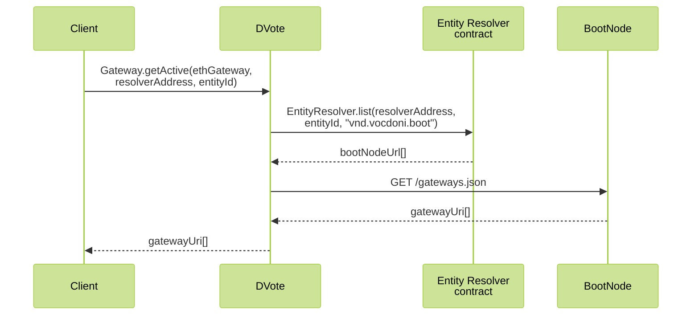
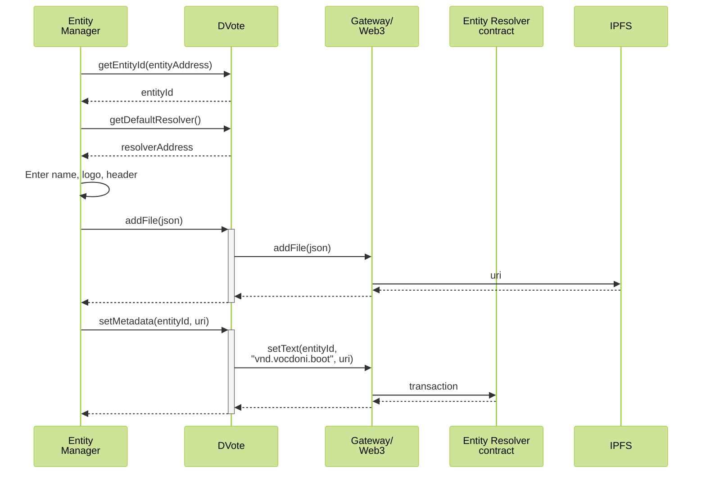
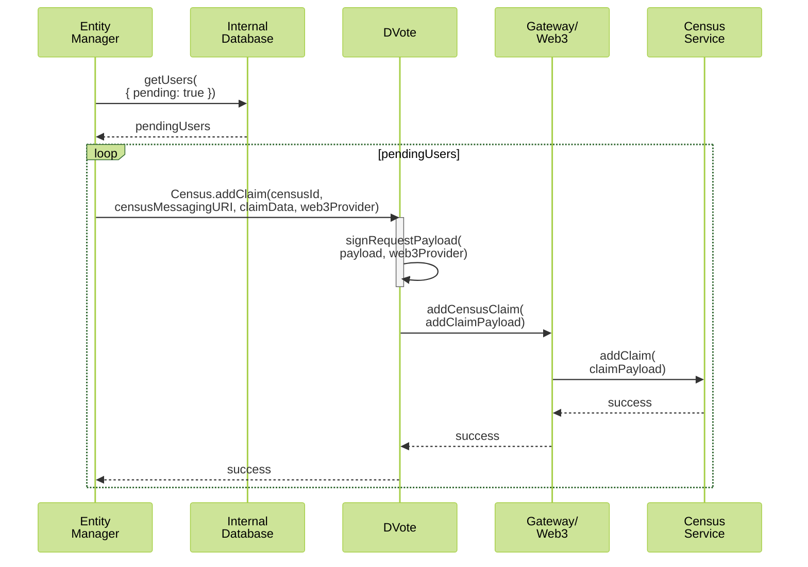
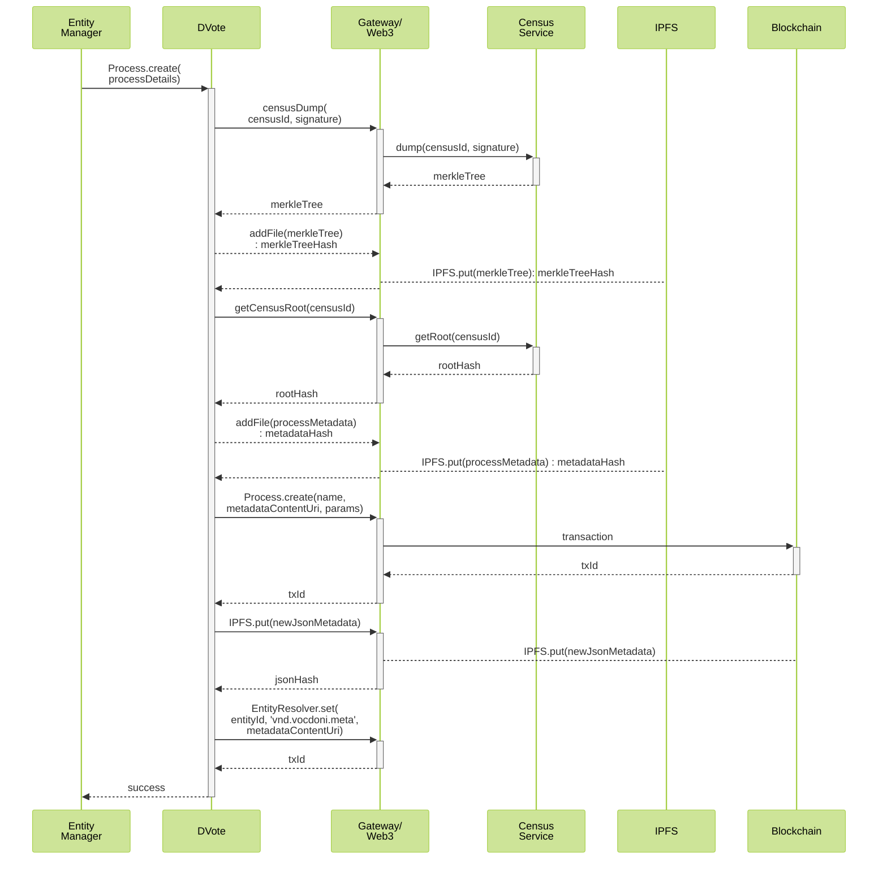
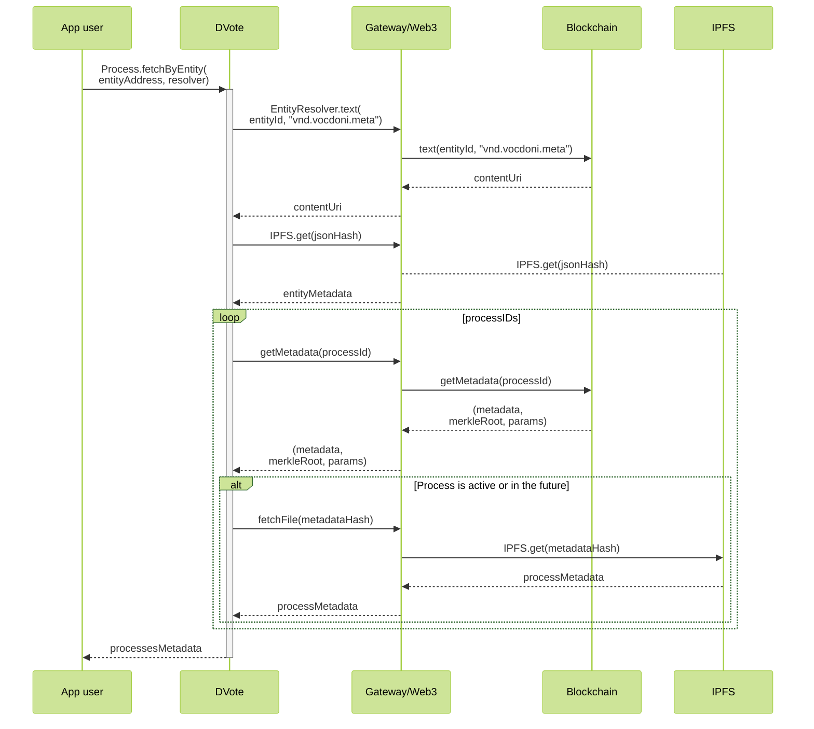
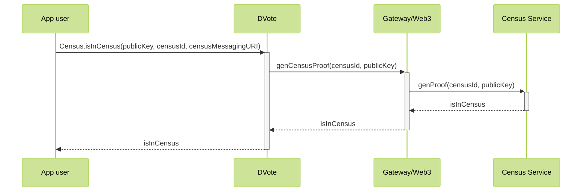
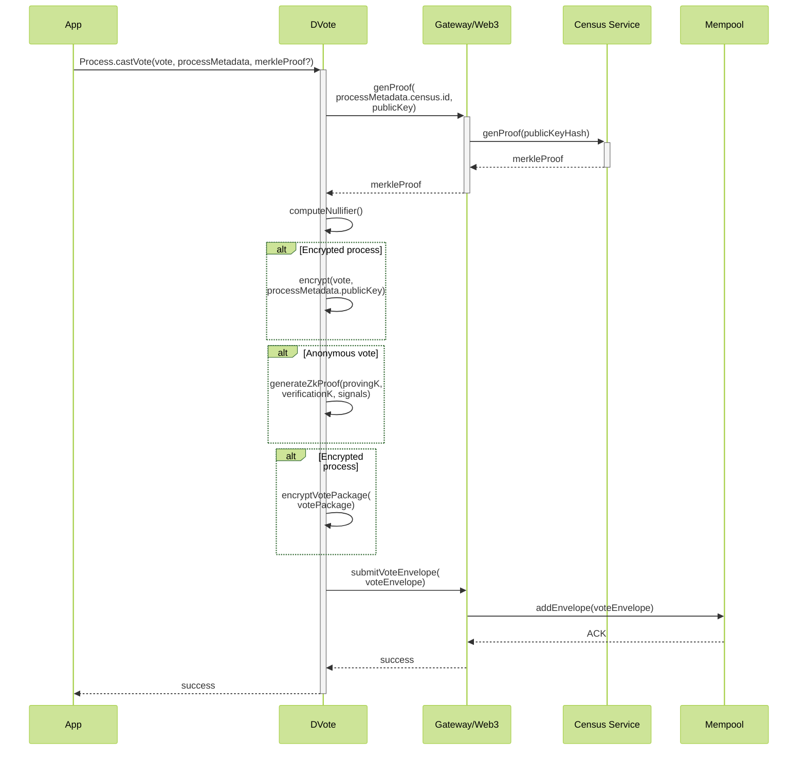
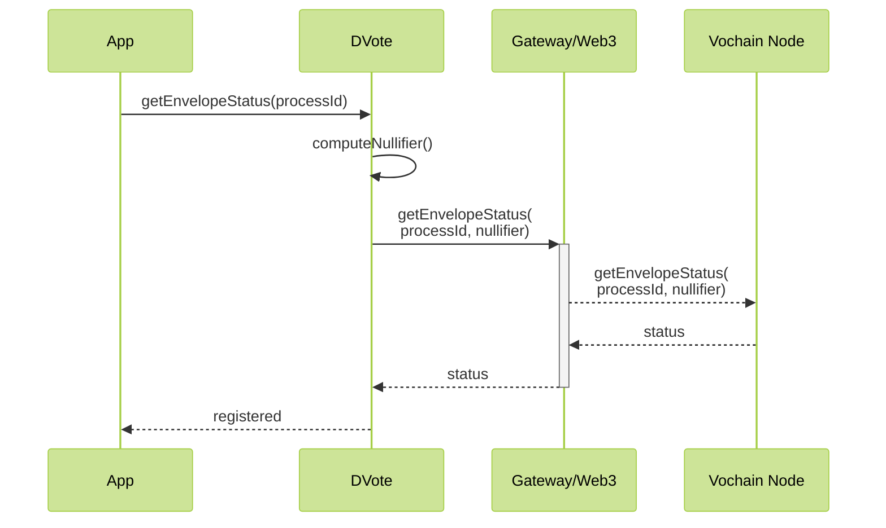
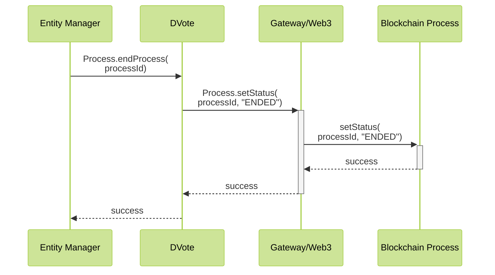
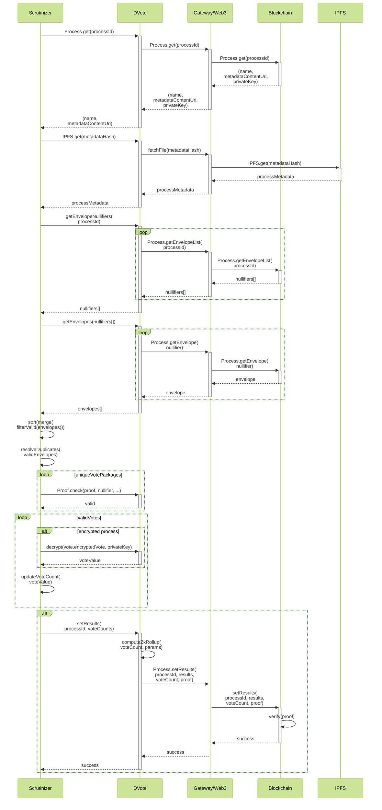

# Sequence diagrams

Traditional systems like APIs present simple scenarios, in which a centralized service define how data should be encoded. However, decentralized ecosystems like a distributed vote system need much stronger work on defining every interaction between any two peers on the network.

- [Sequence diagrams](#sequence-diagrams)
  - [Prior to voting](#prior-to-voting)
    - [Initial Gateway discovery](#initial-gateway-discovery)
    - [Set Entity metadata](#set-entity-metadata)
      - [Adding users to a census](#adding-users-to-a-census)
  - [Voting](#voting)
    - [Voting process creation](#voting-process-creation)
    - [Voting process retrieval](#voting-process-retrieval)
    - [Check census inclusion](#check-census-inclusion)
    - [Casting a vote](#casting-a-vote)
  - [After voting](#after-voting)
    - [Checking a Vote Envelope](#checking-a-vote-envelope)
    - [Closing a Voting Process](#closing-a-voting-process)
    - [Vote Scrutiny](#vote-scrutiny)

---

## Prior to voting

### Initial Gateway discovery

The app wants to get initial connectivity with the available gateways.

- Using a well-known Ethereum Gateway, we query for an initial boot node on the ENS Resolver. The following is defined:
    - Well-known Ethereum blockchain gateways
    - Entity Resolver contract address
    - Vocdoni's Entity ID
- From one of the boot nodes, we get a list of Gateways provided by Vocdoni

Eventually:

- One of Vocdoni's Gateways is used to query the ENS resolver of a certain Entity

### Set Entity metadata
An Entity starts existing at the moment it has certain metadata stored on the [Entity Resolver](/architecture/smart-contracts/entity-resolver.html#entityresolver) smart contract. 

**Used schemas:**

- [Entity metadata](/architecture/data-schemes/entity-metadata)

#### Adding users to a census

Depending on the activity of users, an **Entity** may decide to add public keys to one or more census.

**Used schemas:**

- [Census Service addClaim](/architecture/services/census-service.html#addclaim)
- [Census Service addClaimBulk](/architecture/services/census-service.html#addclaimbulk)

---

## Voting

### Voting process creation

**Used schemas:**

- [Process Metadata](/architecture/data-schemes/process.html#process-metadata)
- [Census Service addClaimBulk](/architecture/services/census-service.html#addclaimbulk)
- [Census Service getRoot](/architecture/services/census-service.html#getroot)
- [Census Service dump](/architecture/services/census-service.html#dump)

### Voting process retrieval

A user wants to retrieve the voting processes of a given Entity

**Used schemas:**

- [Process Metadata](/architecture/data-schemes/process.html#process-metadata)

### Check census inclusion

A user wants to know whether he/she belongs in the census of a process or not.

**Used schemas:**

- [Census Service generateProof](/architecture/services/census-service.html#generateproof)

**Notes:**

- `generateProof` may be replaced with a call to `hasClaim`, for efficiency
- The `censusId` and `censusMessagingURI` should have been fetched from the [Process Metadata](/architecture/smart-contracts/process)

### Casting a vote

A user wants to submit a vote for a given governance process.

**Used schemas:**

- [Process Metadata](/architecture/data-schemes/process.html#process-metadata)
- [Census Service generateProof](/architecture/services/census-service.html#generateproof)
- [Vote Package](/architecture/smart-contracts/process.html#vote-package)

**Notes:**
- The Merkle Proof could be retrieved and stored beforehand

## After voting

### Checking a Vote Envelope

A user wants to check the status of an envelope by its nullifier.

### Closing a Voting Process

### Vote Scrutiny

Anyone with network access can compute the scrutiny of a given processId. The node can even compute a ZK Rollup proof to let the contract verify the correctness of the provided results on-chain.

**Used schemas:**

- [Process Metadata](/architecture/data-schemes/process.html#process-metadata)
- [Vote Package](/architecture/smart-contracts/process.html#vote-package)

