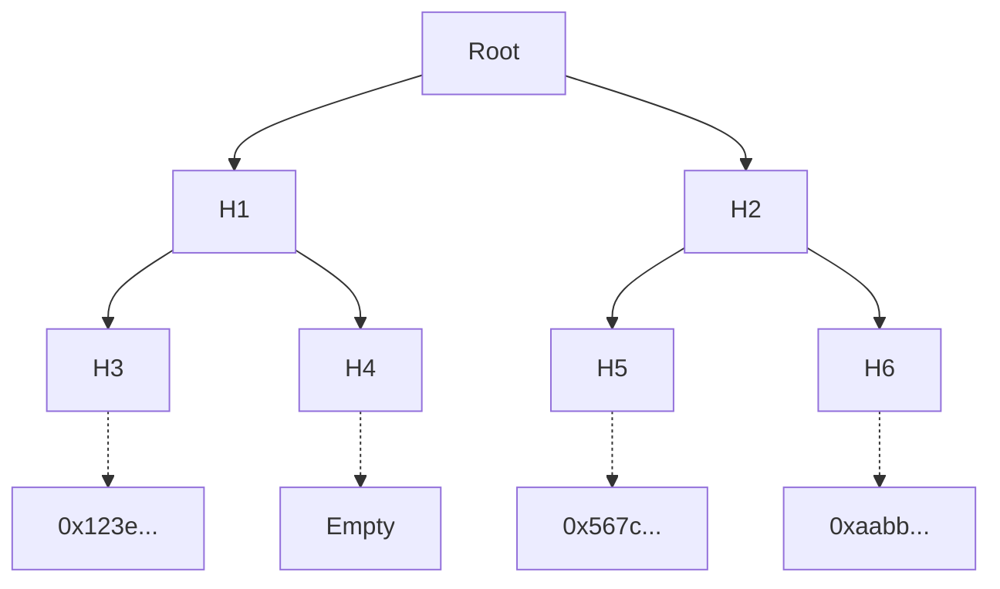

#### Registry DB

The user registry is a private component used by entities to manage and generate census of voters. The registry may have a standard database with the private details of the entity's members and their public keys. Users must secure their own private keys (this is best suited for a mobile application with encrypted memory) and sign-up to the entity by sending their public key hash along with their identifiable information to this private database. 

| id  | name     | age | country     | pubkeyHash |
| --- | -------- | --- | ----------- | ---------- |
| 0   | John     | 27  | Winterfell  | 0x123e...  |
| 1   | Tyrion   | 36  | Lannisport  | 0x567c...  |
| 2   | Daenerys | 22  | Dragonstone | 0xaabb...  |
| 3   | Jorah    | 65  | Bear Island | 0xcc11...  |

When the entity wants to create a governance process, the administrator will use the registry to select the group of users matching a certain criteria. For example `age < 40`. The backend would select users `0,1,2` and create a Merkle tree with the corresponding public key hashes.

### Exporting the census

The registry backend will finally:

+ Export the Merkle tree of pubkey hashes and make them available via IPFS or similar
+ Publish the Root Hash on the Process Smart Contract
+ Publish the IPFS URI of the Merkle tree on the Process Smart Contract

With the census details and the rest of parameters, a process is ready to be created by the manager.